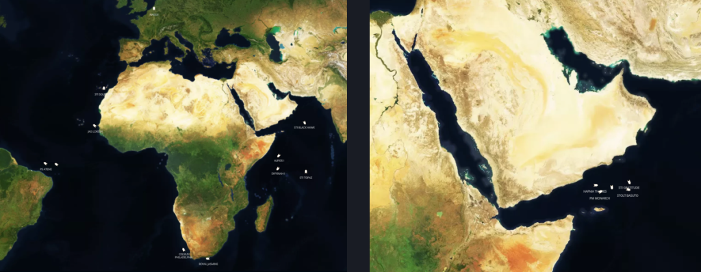
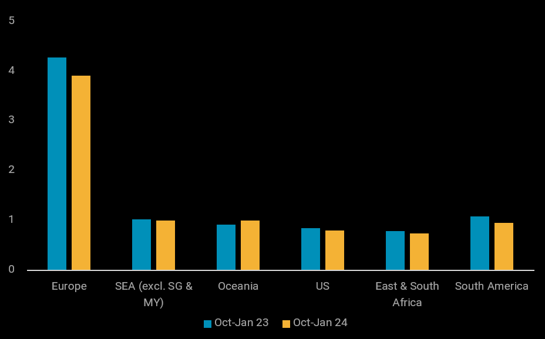

# The global oil demand slowdown: East versus West

**Date:** January 19, 2024  
**Publisher:** Breakwave Advisors | **Category:** Market Insights  
**Original URL:** [https://www.breakwaveadvisors.com/insights/2024/1/19/the-global-oil-demand-slowdown-east-versus-west](https://www.breakwaveadvisors.com/insights/2024/1/19/the-global-oil-demand-slowdown-east-versus-west)  

---

## While Global Oil Demand Has Been Blanketed by Bearish Sentiments, This Downturn Is Notably More Pronounced in the West Than the East of Suez Market.

*By*[*Serena Huang*](https://www.linkedin.com/in/serena-huang-2466b489/)

Rising geopolitical tensions set against a backdrop of global economic challenges and fading seasonal demand has cast much uncertainty on global oil demand growth this year, at least in the first half. Arbitrage economics for several key clean product trade routes are either closed or narrowly workable, signalling ample supply arising from demand weakness, among other factors.

This demand slowdown, however, has been uneven across the globe. Seaborne imports, which provide a proxy to demand in destination markets, reveal that South America and Europe have seen the sharpest year-on-year declines in transportation fuel imports between last October and mid-January, down 12% and 9% respectively, compared to other regions. Higher supplies from the US and the Middle East to Europe have crowded out volumes from Asia, which have reached a 10-month low in the first two weeks of this month.

Rising tensions in the Red Sea have added another hurdle for Asia and Middle East exports to Europe and the US, which could start tightening supplies in the destination markets. At least[11 vessels laden](https://analytics.vortexa.com/?filtersEnabled=%5B%22l%22%2C%22s%22%2C%22v_cg_st%22%2C%22v%22%2C%22l_c%22%2C%22o%22%2C%22d%22%2C%22sts_o%22%2C%22c_o%22%2C%22v_t%22%2C%22v_a%22%5D&metric=t&page=Map&tabId=23d0b2b3-0baa-41c6-a76f-e8e943b5b74a&v=3&vessels=%5B%224300092f9bb8a811f8cc7089e7fa97d7d306f91cab8ea07cba2af4db458c938b%22%2C%22339f73d315beb8a9d172323df92b84f30e1c66b167c090da5aa792e4ba07c446%22%2C%220fdc959baec99e2514bb1f0c63bba3a1134b2c96b66b8cca4078d737bf14cfe7%22%2C%22f15d7a52511c3bbd8b6ff47bef19913ceb4454947712f072b10fa63ccabaf30e%22%2C%22712b70c5fee99bdd7eca91f45af54bf6c6df78d097dc6aebe877222e9e19767c%22%2C%2282fbb4b78814d74293b9faf2e28b7b61d2210c566234b7c80592200db0208a1d%22%2C%22131f07c2c29056cc46143a738b55f21d5450dcf2b73801bc940baa12a5c76802%22%2C%22a36057aadf2cd661a40541d92599d8c12c90610bc1a3a0ba47069d03b7180eca%22%2C%220f7ef808cc0a1c735dd50e5244afb358d1ead6e5f8945f55477d7c79d0cd6ef3%22%2C%222ca4c555ce54a868e637c8c2c2738f657d7d45dc370375b8da81acc38f0c19e3%22%2C%22f6cbbfa409d9f34aa87cb15fd2c3ceb72293cada322b3b8da82e5812683020ee%22%5D)with clean products from Asia and the Middle East have opted to take the longer route via the Cape of Good Hope to travel West as of mid-December, while[another 5 vessels are waiting near the Gulf of Aden](https://analytics.vortexa.com/?filtersEnabled=%5B%22l%22%2C%22s%22%2C%22v_cg_st%22%2C%22v%22%2C%22l_c%22%2C%22o%22%2C%22d%22%2C%22sts_o%22%2C%22c_o%22%2C%22v_t%22%2C%22v_a%22%5D&metric=t&page=Map&tabId=23d0b2b3-0baa-41c6-a76f-e8e943b5b74a&v=3&vessels=%5B%228019399e40361b692b867a93a621d25e18db49e5f6abd2ec5bba5a16d8a845de%22%2C%221cd029b64c13a6865d7189dd9386cc2630661e75b3c72ce6d5482f01e3307df1%22%2C%22574c4567111efa39b8ac65eb9722d805f223a048a81f916f4fc5f317c1154264%22%2C%22b2cf6860f5cb33048f5ee08544002d2b1afc23f36fb125ec107e44adb33e849e%22%2C%229123e30e6f7b4502b57662a432dd80ce2dad8fe4569845d4818cb9e3e5121a54%22%5D&voyageStatus=%5B%22laden%22%5D)taking a wait-and-see approach before firming up their route. While the current volume of diverted cargoes represents a small fraction of total imports into Europe and the US, more diversions and supply disruptions could take place if tensions in the Red Sea escalate.

> **Figure 1: Clean Tankers Transiting Via Cape of Good Hope to Europe and The**  
> *Clean tankers transiting via Cape of Good Hope to Europe and the US (LHS)andthose waiting near Gulf of Aden (RHS)*  
> **Interactive Data & Source:** [Analytics Vortexa](https://analytics.vortexa.com/?filtersEnabled=%5B%22l%22%2C%22s%22%2C%22v_cg_st%22%2C%22v%22%2C%22l_c%22%2C%22o%22%2C%22d%22%2C%22sts_o%22%2C%22c_o%22%2C%22v_t%22%2C%22v_a%22%5D&metric=t&page=Map&tabId=23d0b2b3-0baa-41c6-a76f-e8e943b5b74a&v=3&vessels=%5B%224300092f9bb8a811f8cc7089e7fa97d7d306f91cab8ea07cba2af4db458c938b%22%2C%22339f73d315beb8a9d172323df92b84f30e1c66b167c090da5aa792e4ba07c446%22%2C%220fdc959baec99e2514bb1f0c63bba3a1134b2c96b66b8cca4078d737bf14cfe7%22%2C%22f15d7a52511c3bbd8b6ff47bef19913ceb4454947712f072b10fa63ccabaf30e%22%2C%22712b70c5fee99bdd7eca91f45af54bf6c6df78d097dc6aebe877222e9e19767c%22%2C%2282fbb4b78814d74293b9faf2e28b7b61d2210c566234b7c80592200db0208a1d%22%2C%22131f07c2c29056cc46143a738b55f21d5450dcf2b73801bc940baa12a5c76802%22%2C%22a36057aadf2cd661a40541d92599d8c12c90610bc1a3a0ba47069d03b7180eca%22%2C%220f7ef808cc0a1c735dd50e5244afb358d1ead6e5f8945f55477d7c79d0cd6ef3%22%2C%222ca4c555ce54a868e637c8c2c2738f657d7d45dc370375b8da81acc38f0c19e3%22%2C%22f6cbbfa409d9f34aa87cb15fd2c3ceb72293cada322b3b8da82e5812683020ee%22%5D) | [Local Asset](file:///C:/Users/Dell/Github/Shipping/corpus/03-breakwave/insights/2024/assets/2024-01-19_the-global-oil-demand-slowdown-east-versus-west_img_red-sea-vessel-diversion-map-1024x39_b6c4e4996210.png)

Elsewhere, South and East Africa’s transportation fuel demand, marred by fuel price hikes last year and agriculture demand slowdown this quarter, has shown a marked decline of nearly 25% month-on-month in the first two weeks of January, and is on-track to reach a multi-year low. Despite recent fuel price cuts providing some relief, a full recovery in demand may not be imminent.

Perhaps the only bright spot currently is Oceania’s demand robustness, where its imports have risen by 9% year-on-year between last October and mid-January. Even Southeast Asia’s imports, excluding Singapore and Malaysia, have at best maintained a stable year-on-year import volume with preliminary data showing a potential slowdown this month. A gasoline oversupply in the US Gulf Coast has led to two gasoline cargoes headed for Australia last month, while another vessel – TORM HILDE – has been provisionally fixed for a similar journey.

> **Figure 2: Transportation Fuel Import by Destination 1**  
> **Interactive Data & Source:** [Analytics Vortexa](https://analytics.vortexa.com/?dateRange=2022-01-01T00%3A00%3A00.000Z__2024-01-15T23%3A59%3A59.999Z&filtersEnabled=%5B%22p%22%2C%22o%22%2C%22d%22%2C%22d_r%22%2C%22v%22%2C%22intra_d%22%2C%22sts_o%22%2C%22c_o%22%2C%22w%22%2C%22c%22%2C%22v_o%22%2C%22sts%22%5D&geoBreakdownOriginGlobal=region&metric=bpd&movementEvent=unloading_start&page=Flows&products=%5B%229256907ba7e4ed11ff03aa297a7e62e14484ce5a85c8118c7495b9120ad0e268%22%2C%22d72edbab2b5e2e249d8c216909945922a02eb017dd200f90876fee6fa180c743%22%2C%22deda35eb9ca56b54e74f0ff370423f9a8c61cf6a3796fcb18eaeeb32a8c290bb%22%5D&tabId=ccb91766-9c10-4158-9930-ffb75a0bb743&timeSeriesProperty=destination_region&to=%5B%221020a49b41b8d5180b49f12abfb8932fe1ef56ca254755a34a0f96fec1d6b6d0%22%2C%225ad0e75a5119ff6de36d3fab783202c0224e685aa48461aed16aa72aa3960d21%22%2C%2213b1475cbe243903914ceaa33c2335db2d7e0c23c79e0df8a0da7d8d311944ee%22%2C%22612eeab9024bfb733a1bb626524d40d7ace1c637097bf76d36d9395e269f4170%22%2C%22a17c19d4f322a201c1d136e828f69673ed2a7428f28f217f330379c5decefd1d%22%2C%22065aab207e6fe875caf93419bd6cfedcbb0933098c75e52a6702b75bdfe71c53%22%2C%22e1638e7a3cb9bd9c9b75f8903770c6fb3abe09f3aebca59447b2750c73b77fd5%22%2C%22833d6983cdb9e4c6c12bf3022bdae163f91a51f1cf9876c955137e5f996f9763%22%2C%22eb51f8315cf769b317615f7fcbdad3ff8612baaea0e9a39d3a63550c44784658%22%2C%222d92cc08f22524dba59f6a7e340f132a9da0ce9573cca968eb8e3752ef17a963%22%2C%2211a213e88d9f4978177fdcf19a518a527f71616f5810aa775926ba4ba0383703%22%2C%221f8e97e58a685c489d2151255f385f60cba887e99edea0311c57b744556e46b5%22%2C%22f39d455f5d38907394d6da3a91da4e391f9a34bd6a17e826d6042761067e88f4%22%2C%22b746356b9c2afdce96197d490c00d864c54c432d61f49dd99f70520ce199f8e8%22%5D&v=3) | [Local Asset](file:///C:/Users/Dell/Github/Shipping/corpus/03-breakwave/insights/2024/assets/2024-01-19_the-global-oil-demand-slowdown-east-versus-west_img_transportation-fuel-import-by-destin_38419bbf8dd4.png)

A recovery in global oil demand would depend on several factors, with Fed’s interest rate adjustments taking centre stage, accompanied by a rebound in consumer spending sentiments which would boost manufacturing, and sustained growth in air travel continuing from last year. Amidst a bearish demand outlook, some refineries are already reducing runs, and others may follow. While crude demand may lag, the fragility in crude supply arising from weather-related and geopolitical disruptions, off the back of extended OPEC+ supply curtailment, is likely to keep a floor on oil prices this year.

Data Source:[Vortexa](https://www.vortexa.com//oil-gas-data-traders-analysts-data-scientists?gclid=Cj0KCQjw8_qRBhCXARIsAE2AtRZKOvMnbilZ_6_91d7huSFFy71pWLrnPwGwOHVzXsmsG-1a1mZnQw8aAt89EALw_wcB&hsa_acc=1782073842&hsa_ad=548425387665&hsa_cam=14746637662&hsa_grp=125038601902&hsa_kw=&hsa_mt=&hsa_net=adwords&hsa_src=g&hsa_tgt=dsa-1431852288425&hsa_ver=3&utm_campaign=%5BCD%5D%20-%20DSA%20-%20EMEA&utm_medium=cpc&utm_medium=ppc&utm_source=google&utm_source=adwords&utm_term=)
