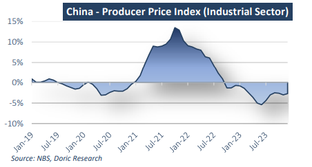
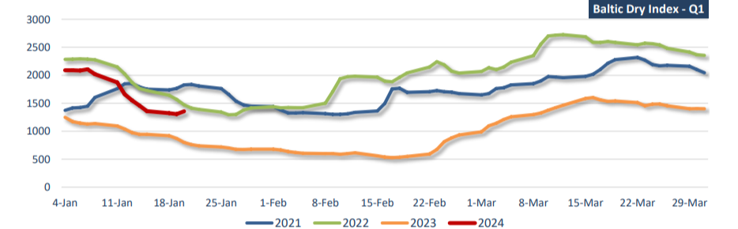

# Doric Weekly Market Insight

**Date:** January 22, 2024  
**Publisher:** Breakwave Advisors | **Category:** Market Insights  
**Original URL:** [https://www.breakwaveadvisors.com/insights/2024/1/22/doric-weekly-market-insight](https://www.breakwaveadvisors.com/insights/2024/1/22/doric-weekly-market-insight)  

---

## “The Spot Market Witnessed a Sudden Surge Mid-Week, Leaving Many Participants Wondering Whether This Was Tied to a Pre-Holiday Buying Spree or a Repetition of the Unusually Robust First Quarter Experienced in 2021.”

*By*[*Michalis Voutsinas*](https://www.linkedin.com/in/michalis-voutsinas-587544163/)

Around this time last year in Davos, Chinese Vice-Premier Liu He emphasized that the world's second-largest economy was rebounding towards normality at a faster pace than anticipated. Despite recording the second-lowest annual growth figures in over 40 years, he painted an optimistic picture for 2023. Liu He highlighted that since China had ended its zero-Covid policy, the time taken to reach the peak in infection numbers had been surprisingly swift, surpassing expectations. However, in stark contrast, expectations for the first quarter in the spot market were far from optimistic. Trading activity was grappling with a double challenge of rising Covid infections and the holiday season in China, resulting in a slow destocking.

A year later, Premier Li Qiang took an unusual step during his speech at the World Economic Forum's Davos conference on Tuesday by emphasizing the annual results. The aim was to address investor concerns about China, especially after an uneven year marked by instability in the property sector. Conversely, the freight market experienced positive developments this week, witnessing gains in both Capesizes and Panamaxes at $18,608 and $13,946 daily, respectively. On a year-on-year basis, all segments concluded the week higher, with Supramaxes and Panamaxes surpassing last year's levels by approximately $4,000, Handies by $2,500, and Capesizes by a substantial $11,204 daily.

On the macroeconomic front, China's economy expanded by 5.2 percent year-on-year in 2023, as reported by the National Bureau of Statistics on Wednesday. China's GDP reached 126.06 trillion yuan (approximately $17.71 trillion) in 2023. The world's second-largest economy has faced challenges in achieving a robust post-Covid recovery, grappling with an extended property crisis, diminished consumer and business confidence, escalating local government debts, and sluggish global growth. The growth rate for the final quarter of 2023 also stood at 5.2 percent on a yearly basis, an improvement from the 4.9 percent recorded in the preceding period. Government spending played a crucial role in stimulating a recovery from the Covid-19 pandemic. On a quarterly basis, the final term's GDP expanded by 1 percent, slightly lower than the 1.3 percent growth observed in the previous term.

During last year, the value added in China's industry witnessed a 4.6 percent year-on-year increase. Breaking down the sectors, the value added in mining rose by 2.3 percent, in manufacturing by 5.0 percent, and in the production and supply of electricity, thermal power, gas, and water by 4.3 percent. Notably, the value added in equipment manufacturing experienced a robust growth of 6.8 percent, surpassing industrial enterprises by 2.2 percentage points.

The growth in investments in fixed assets reached 3 percent, while the volume of retail trade saw a substantial 7.2 percent year-on-year increase. Concurrently, the total volume of retail trade in consumer goods for 2023 reached 47.15 trillion yuan (approximately $6.63 trillion).

Recent data indicates that the economy is entering 2024 on shaky footing, marked by persistent deflationary pressures. In December 2023, producer prices for industrial products declined by 2.7 percent year-on-year and 0.3 percent month-on-month. Purchasing prices for industrial producers also saw a year-on-year decrease of 3.8 percent and a month-on-month decrease of 0.2 percent. Over the entirety of 2023, producer prices for industrial products decreased by 3.0 percent compared to the previous year, and purchasing prices for industrial producers decreased by 3.6 percent. In parallel, the national Consumer Price Index (CPI) recorded a 0.3 percent year-onyear decrease in December 2023. Notably, prices for food, tobacco, and alcohol took a two-percent dive year-on-year. Within the food categories, the price for livestock meat saw a significant decline of 15.9 percent, contributing to a 0.56 percentage point decrease in the CPI, with the price for pork specifically dropping by 26.1 percent.

> **Figure 1: 1**  
> **Interactive Data & Source:** [Doric](https://www.doric.gr/) | [Local Asset](file:///C:/Users/Dell/Github/Shipping/corpus/03-breakwave/insights/2024/assets/2024-01-22_doric-weekly-market-insight_img_1_c182fa390415.png)

Amidst a prolonged housing downturn, a soft job market and other challenges such as looming debt risks, consumers in the world's second largest economy have been tightening their purse strings lately, pushing prices down. Overall, this trend suggests that the accommodative policy environment has yet to translate into a sustained economic turnaround, potentially prompting a stronger call for supportive interventions looking forward. In stark contrast, the dry bulk spot market witnessed a sudden surge mid-week, leaving many participants wondering whether this was tied to a pre-holiday buying spree or a repetition of the unusually robust first quarter experienced in 2021.

> **Figure 2: 2**  
> **Interactive Data & Source:** [Doric](https://www.doric.gr/) | [Local Asset](file:///C:/Users/Dell/Github/Shipping/corpus/03-breakwave/insights/2024/assets/2024-01-22_doric-weekly-market-insight_img_2_264291d0c939.png)

Data source:[Doric](https://www.doric.gr/)
