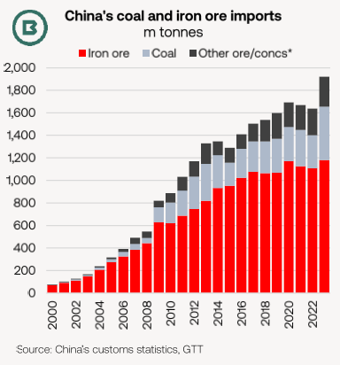
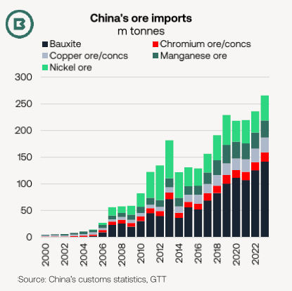
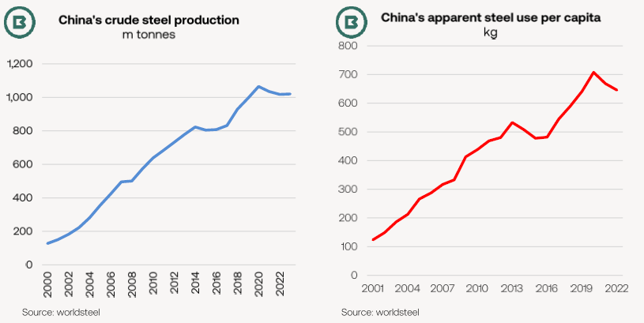

# The Big Picture: China’s coal and ore imports: the very big picture

**Date:** January 23, 2024  
**Publisher:** Breakwave Advisors | **Category:** Market Insights  
**Original URL:** [https://www.breakwaveadvisors.com/insights/2024/1/22/the-big-picture-chinas-coal-and-ore-imports-the-very-big-picture](https://www.breakwaveadvisors.com/insights/2024/1/22/the-big-picture-chinas-coal-and-ore-imports-the-very-big-picture)  

---

- *The first chart, below left, demonstrates that 2023 was a huge year for Chinese imports of coal and ore—even by the standards of the last 20 years.*
- *The second chart, below right, shows that this is not a pure coal and iron ore story—that bauxite and other ores have also experienced sizeable trend growth.*
- *We put 2023 into context.*

Combining all coal types with bauxite, and chrome, copper, iron, manganese and nickel ores and concentrates, last year’s import total of 1.92 billion tonnes was historic on a number of accounts:

1. 2023 was not only a record year, but marked a record annual leap of 283m tonnes (17%), which exceeded the previous (China stimulus-fuelled) all-time high of 274m tonnes in 2009 in volume.
2. Last year was comfortably more than double the coal and ore import total in 2010 and was almost four times the 2007 level.
3. All-time highs for iron ore, coal, bauxite, copper ores and concentrates drove the overall increase.

> **Figure 1: Market Chart 1**  
> [Local Asset](file:///C:/Users/Dell/Github/Shipping/corpus/03-breakwave/insights/2024/assets/2024-01-23_the-big-picture-chinas-coal-and-ore-imports-the-very-big-picture_img_image0281229_509b95a1b554.png)

Turning to the chart on the right, last year’s estimated total for other ores (confirmed customs data for December is not yet available) is double 2016 and four times the 2009 level.

Like the overall coal and ore total,**nickel ore**imports are also on course for an increase of 17% in 2023, but will fail to match the 2019 peak of 56m tonnes, because 2019 was the last full year of Indonesian availability. Since 2020, the Philippines has raised exports into China to meet demand.

Since 2017,**bauxite**imports have grown by an average of 12m tonnes annually. As Indonesia placed an export ban on bauxite from June 2023, China has become even more reliant on Guinea.

With one month of data remaining, imports from Guinea into China have already registered a record annual increase of 20m+ tonnes and will likely approach 30m tonnes with the release of final data for 2023.

Using vessel tracking from AXS, the share of Capesize involvement in China’s bauxite trades was 77% in 2023 from around 50% in 2020. Additional bauxite from Guinea would push that share even higher in 2024.

> **Figure 2: Market Chart 2**  
> [Local Asset](file:///C:/Users/Dell/Github/Shipping/corpus/03-breakwave/insights/2024/assets/2024-01-23_the-big-picture-chinas-coal-and-ore-imports-the-very-big-picture_img_image1281229_df263c55378b.png)

An exceptionally low month for Chinese crude steel production was released by the National Bureau of Statistics in December. At 67.4m tonnes, it was almost 20m tonnes below the January-November average.

As a result, official statistics now indicate steel production in 2023 was flat on 2022. This has echoes of earlier news reports from Chinese media group Caixin Global (in April 2023) that authorities were planning to cap 2023 production at 2022 levels.

Although never officially confirmed, flat growth has been the outcome.

> **Figure 3: Market Chart 3**  
> [Local Asset](file:///C:/Users/Dell/Github/Shipping/corpus/03-breakwave/insights/2024/assets/2024-01-23_the-big-picture-chinas-coal-and-ore-imports-the-very-big-picture_img_image2281129_ab7d74bc38b8.png)

In contrast to many of the import growth stories on page 2, China’s crude steel output has fallen short of the previous peak (2020).

A comparison with apparent steel use per capita in the charts above reveals some similarities and that demand per person also peaked in 2020. Per capita steel use is not yet available for 2023.

Moreover, matching 2022 growth was only possible thanks to expansion in net steel exports.

Braemar’s calculations for apparent steel demand show a -2.2% contraction last year.
