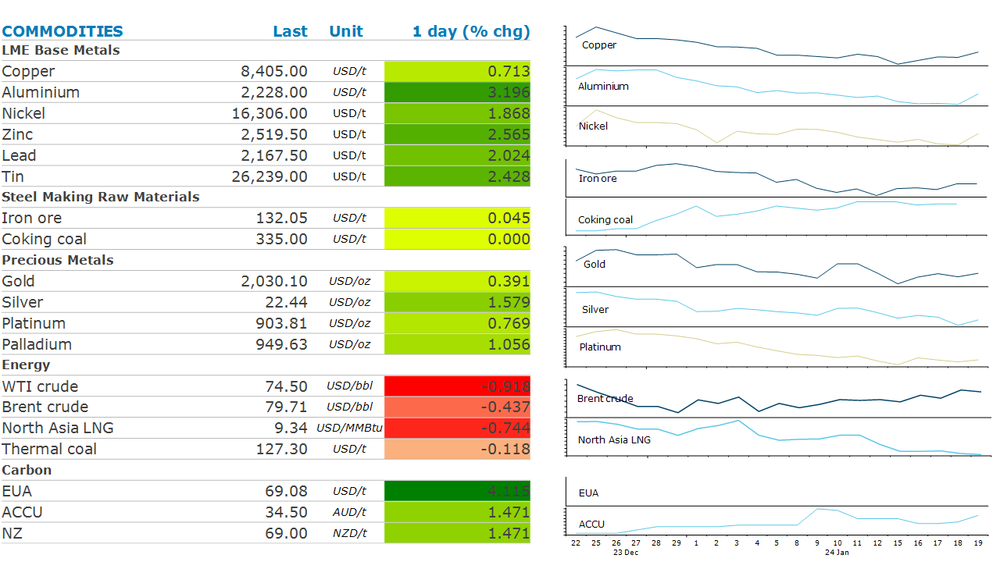

# Aluminium rallies as Russian sanctions loom

**Date:** January 24, 2024  
**Publisher:** Breakwave Advisors | **Category:** Market Insights  
**Original URL:** [https://www.breakwaveadvisors.com/insights/2024/1/24/aluminium-rallies-as-russian-sanctions-loom](https://www.breakwaveadvisors.com/insights/2024/1/24/aluminium-rallies-as-russian-sanctions-loom)  

---

*By*[*Daniel Hynes*](https://www.linkedin.com/in/dahynes/)

Supply side issues were back in focus amid a dearth of economic data. Geopolitical tensions remained supportive in the energy sector, while price-induced closures continued in metals.

> **Figure 1: 1706044549115**  
> **Interactive Data & Source:** [Linkedin](https://www.linkedin.com/newsletters/commodities-wrap-6692196755876012032/?fbclid=IwAR3kiXJqZdxmp9ZcRwBNI7FsBySI-XSC0pfPur1qzjt7OZp7PTE59Tsl1QI) | [Local Asset](file:///C:/Users/Dell/Github/Shipping/corpus/03-breakwave/insights/2024/assets/2024-01-24_aluminium-rallies-as-russian-sanctions-loom_img_1706044549115_266124302b54.png)

**Aluminium**led the base metals sector higher as supply side issues came back into focus. The lightweight metal rallied after reports that the European Union is considering sanctions on Russian supply ahead of the second anniversary of the invasion of Ukraine. Metal from Russia has escaped broad sanctions until December, when the UK block citizens from trading physical metal from the country. While the LME received a licence to continue trading, the risks of being left holding unwanted Russia metal remains high. The latest move raises this risk further. The rest of the complex was dragged along by the move, with recent closures of copper, nickel and zinc operations also providing some support.

**Iron ore**futures rallied as the spectre of stronger demand after the Lunar New Year holiday boosted sentiment. Chinese Premier Li Qiang called for more rigours and effective measures to stabilise the slumping stock market. The market took this as a sign that new measures to support the economy may be forthcoming. This may be offset by rising supply, with exports from Australia and Brazil showing signs of recovery in recent weeks.

**Gold**edged higher as traders waited for key economic data that may provide a guide to the outlook for interest rates. US GDP, jobless claims and durable goods data may help provide some clarity around the timing and pace of future rate cuts.

Weak demand amid ongoing supply risks kept**crude oil**hemmed in a tight range. Tensions remain high in the Middle East as the US and UK launched more airstrikes on Houthi missile sites to prevent the Iran-backed group from attacking commercial vessels in the Red Sea. The risks have seen the prompt spread, where Brent’s front month future is trading at a USD0.48/bbl premium over the following month contract. The upside to outright prices was limited by reports the Libya has fully resumed exports following the restart of the Sharara oil field. US oil producers are also slowing starting to recover from the recent cold snap that curtailed operations in shale oil region of North Dakota.

**North Asia LNG**spot prices dipped to the low-to-mid USD9/MMBtu range amid expectations of soft winter demand. The recent sell-off has induced some price sensitive buyers back into the spot market. However, volumes traded remain low.**European gas**prices stabilised following recent heavy selling as traders view the move as overdone. Demand for gas remains tepid amid a sluggish economic recovery. In addition, weather forecasts show unseasonably mild temperatures lasting until February, meaning demand for heating is likely to remain weak.

Data source:[Commodities Wrap](https://www.linkedin.com/newsletters/commodities-wrap-6692196755876012032/?fbclid=IwAR3kiXJqZdxmp9ZcRwBNI7FsBySI-XSC0pfPur1qzjt7OZp7PTE59Tsl1QI)
