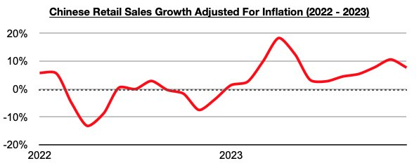
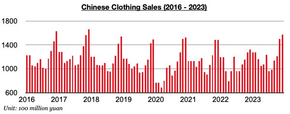
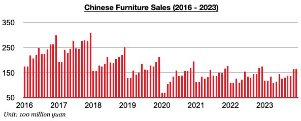

# Divergence in Clothing Purchases and Furniture Purchases in China

**Date:** January 26, 2024  
**Publisher:** Breakwave Advisors | **Category:** Market Insights  
**Original URL:** [https://www.breakwaveadvisors.com/insights/2024/1/26/divergence-in-clothing-purchases-and-furniture-purchases-in-china](https://www.breakwaveadvisors.com/insights/2024/1/26/divergence-in-clothing-purchases-and-furniture-purchases-in-china)  

---

*By*[*Jeffrey Landsberg*](https://www.linkedin.com/in/jeffrey-landsberg-70ab957/)

China’s retail sales in December grew year-on-year by 7.4%. This is down from November’s recent peak but is still a healthy level. Taking December’s 0.3% contraction into account, retail sales adjusted for inflation grew year-on-year by 7.7%. China’s retail sales growth has now come in higher than inflation during each of the last twelve months. Prior to these last twelve months, retail sales growth had come in lower than inflation for four straight months.

> **Figure 1: Chart 1 (93)**  
> [Local Asset](file:///C:/Users/Dell/Github/Shipping/corpus/03-breakwave/insights/2024/assets/2024-01-26_divergence-in-clothing-purchases-and-furniture-purchases-in-china_img_chart1289329_7bc55e8d5139.jpg)

Overall, it remains quite positive that Chinese consumers continue to buy more goods than they did a year ago. The same cannot unfortunately be said about consumers in many other major economies however. In Europe, for example, each of the last twenty-two months have seen European consumers buy less goods than they did during the previous year. All is certainly not perfect in China though. Among the specific retail categories that Commodore monitors, of note is only clothing sales grew on a year-on-year basis last month. Clothing sales in China (which includes garments, footwear, hats, and knitwear) increased year-on-year last month by 19%. Clothing sales have now increased on a year-on-year basis during ten of the last twelve months.

> **Figure 2: Chart 2 (82)**  
> [Local Asset](file:///C:/Users/Dell/Github/Shipping/corpus/03-breakwave/insights/2024/assets/2024-01-26_divergence-in-clothing-purchases-and-furniture-purchases-in-china_img_chart2288229_6006e157329e.jpg)

Both furniture sales and household appliance sales (which includes consumer electronics) fell on a year-on-year basis last month. Furniture sales have remained particularly weak. Last month saw furniture sales in China fall year-on-year by 5%. Sales have now contracted on a year-on-year basis for nine straight months. This ongoing contraction remains a direct result of the weakness in China’s housing market and continues to be highlighted in Commodore's Weekly China Reports.

> **Figure 3: Chart 3 (56)**  
> [Local Asset](file:///C:/Users/Dell/Github/Shipping/corpus/03-breakwave/insights/2024/assets/2024-01-26_divergence-in-clothing-purchases-and-furniture-purchases-in-china_img_chart3285629_c9c724c161f0.jpg)
