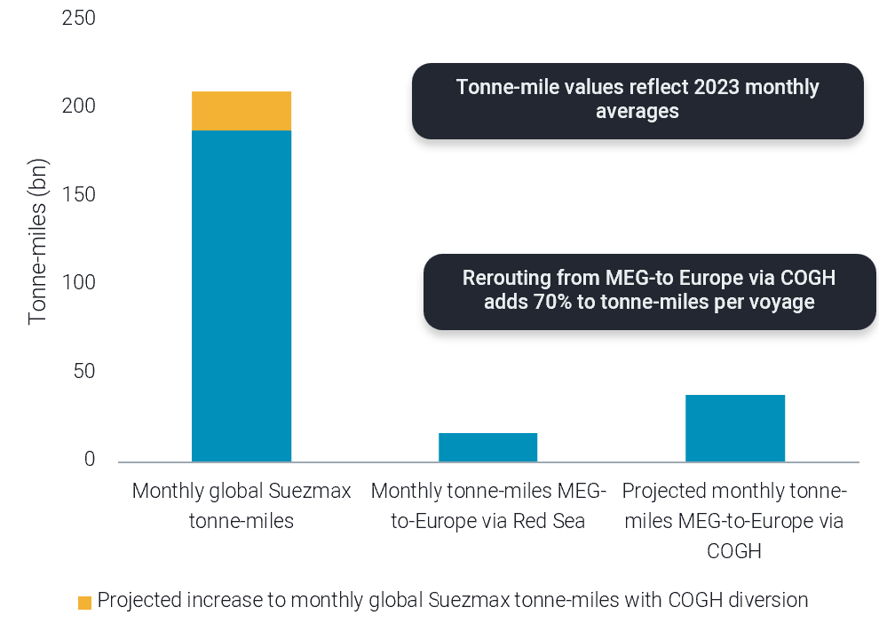
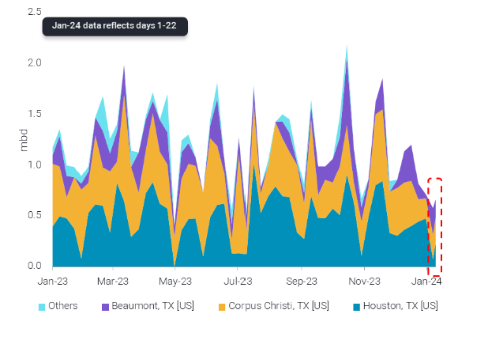

# Red Sea rerouting to impact Suezmaxes || US Gulf STS recovering

**Date:** January 26, 2024  
**Publisher:** Breakwave Advisors | **Category:** Market Insights  
**Original URL:** [https://www.breakwaveadvisors.com/insights/2024/1/26/red-sea-rerouting-to-impact-suezmaxes-us-gulf-sts-recovering](https://www.breakwaveadvisors.com/insights/2024/1/26/red-sea-rerouting-to-impact-suezmaxes-us-gulf-sts-recovering)  

---

**This week, in the East we focus on Suezmaxes heading to Europe and LRs carrying naphtha to Asia in the context of Red Sea developments. In the West, we discuss the resumption of STS in the US Gulf after recent cold weather, and on the clean side we examine why MR rates out of UK Cont have skyrocketed.**

*By*[*Mary Melton*](https://www.linkedin.com/search/results/all/?fetchDeterministicClustersOnly=true&heroEntityKey=urn%3Ali%3Afsd_profile%3AACoAABXVyecBtg-pRnIrZe0BoWk0ygPiUfbvhsw&keywords=mary%20melton&origin=RICH_QUERY_SUGGESTION&position=0&searchId=40e8d7d2-c4d0-4022-81e7-176f6eba418b&sid=H_Y&spellCorrectionEnabled=false)

### Analysis / East of Suez / Dirty

## Red Sea Rerouting to Significantly Impact Global Suezmax Tonne-Miles

> **Figure 1: Suezmax Monthly Average Tonne-Miles by Route and with Projected**  
> *Suezmax monthly average tonne-miles by route and with projected increase via Cape of Good Hope*  
> **Interactive Data & Source:** [Vortexa](https://www.vortexa.com//oil-gas-data-traders-analysts-data-scientists?gclid=Cj0KCQjw8_qRBhCXARIsAE2AtRZKOvMnbilZ_6_91d7huSFFy71pWLrnPwGwOHVzXsmsG-1a1mZnQw8aAt89EALw_wcB&hsa_acc=1782073842&hsa_ad=548425387665&hsa_cam=14746637662&hsa_grp=125038601902&hsa_kw=&hsa_mt=&hsa_net=adwords&hsa_src=g&hsa_tgt=dsa-1431852288425&hsa_ver=3&utm_campaign=%5BCD%5D%20-%20DSA%20-%20EMEA&utm_medium=cpc&utm_medium=ppc&utm_source=google&utm_source=adwords&utm_term=) | [Local Asset](file:///C:/Users/Dell/Github/Shipping/corpus/03-breakwave/insights/2024/assets/2024-01-26_red-sea-rerouting-to-impact-suezmaxes-us-gulf-sts-recovering_img_unnamed-2024-01-26t114551208_c45787aaff21.png)

- Middle East-origin crude flows to Europe have all now started rerouting to Europe via the Cape of Good Hope (COGH), though loadings do appear to be continuing normally. Only 2 transits have been observed via the Bab el-Mandeb since US-led strikes began on 12th January, the last of which occurred 6 days ago.
- The vessel class most impacted by these diversions is Suezmax, as this is the class which carries most of these cargoes through the Red Sea on this route. Diverting via the COGH adds about 4900 nautical miles to the voyage and over two weeks in voyage length. This increases tonne-miles for a single voyage by around 70%.
- Using 2023 data, we projected the impact to the vessel class if this rerouting continues. On a monthly basis, tonne-miles for Suezmaxes carrying crude MEG-to-Europe would increase about 130% if transits occur via the COGH instead of the Bab el-Mandeb. With the incremental increase from the extra tonne-miles for these specific cargoes, monthly global Suezmax tonne-miles would increase by around 10%. This substantial increase in global Suezmax tonne-miles would likely provide upward momentum for freight rates.

### Analysis / West of Suez / Dirty

## USG Sts Operations Starting to Recover After Recent Cold Snap

> **Figure 2: Us Gulf Coast Sts Movements by Origin Port**  
> *US Gulf Coast STS movements by origin port*  
> **Interactive Data & Source:** [Vortexa](https://www.vortexa.com//oil-gas-data-traders-analysts-data-scientists?gclid=Cj0KCQjw8_qRBhCXARIsAE2AtRZKOvMnbilZ_6_91d7huSFFy71pWLrnPwGwOHVzXsmsG-1a1mZnQw8aAt89EALw_wcB&hsa_acc=1782073842&hsa_ad=548425387665&hsa_cam=14746637662&hsa_grp=125038601902&hsa_kw=&hsa_mt=&hsa_net=adwords&hsa_src=g&hsa_tgt=dsa-1431852288425&hsa_ver=3&utm_campaign=%5BCD%5D%20-%20DSA%20-%20EMEA&utm_medium=cpc&utm_medium=ppc&utm_source=google&utm_source=adwords&utm_term=) | [Local Asset](file:///C:/Users/Dell/Github/Shipping/corpus/03-breakwave/insights/2024/assets/2024-01-26_red-sea-rerouting-to-impact-suezmaxes-us-gulf-sts-recovering_img_unnamed-2024-01-26t114802432_1e32c4521da3.png)

- STS operations in the US Gulf Coast were hampered last week with the onset of a cold snap which hit 13th January and led to rough sea conditions and port closures.
- Houston was the port most impacted by this weather event, with crude STS loadings falling to 575kbd last week, an almost 44% decrease compared to December loadings of 1mbd. STS loadings averaged around 1.2 mbd in 2023, slightly over a quarter of all crude exported out of the Gulf Coast.
- Latest Vortexa data suggests an uptick in STS movements w-o-w as weather conditions improve, but STS movements will remain under pressure due to the overall slowdown in January crude exports.

Data Source:[Vortexa](https://www.vortexa.com//oil-gas-data-traders-analysts-data-scientists?gclid=Cj0KCQjw8_qRBhCXARIsAE2AtRZKOvMnbilZ_6_91d7huSFFy71pWLrnPwGwOHVzXsmsG-1a1mZnQw8aAt89EALw_wcB&hsa_acc=1782073842&hsa_ad=548425387665&hsa_cam=14746637662&hsa_grp=125038601902&hsa_kw=&hsa_mt=&hsa_net=adwords&hsa_src=g&hsa_tgt=dsa-1431852288425&hsa_ver=3&utm_campaign=%5BCD%5D%20-%20DSA%20-%20EMEA&utm_medium=cpc&utm_medium=ppc&utm_source=google&utm_source=adwords&utm_term=)
