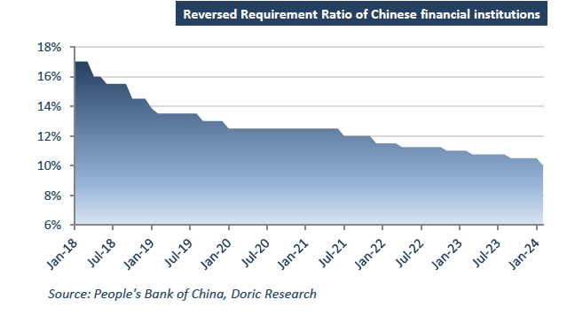
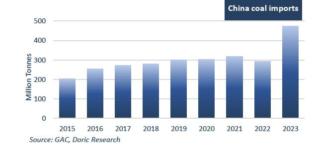

# Doric Weekly Market Insight

**Date:** January 29, 2024  
**Publisher:** Breakwave Advisors | **Category:** Market Insights  
**Original URL:** [https://www.breakwaveadvisors.com/insights/2024/1/29/doric-weekly-market-insight](https://www.breakwaveadvisors.com/insights/2024/1/29/doric-weekly-market-insight)  

---

## “Numerous Macro and Commodity Analysts Noted That Additional Policy Easing Could Positively Influence the Trajectory of the World's Second-Largest Economy, with Expectations of More Supportive Fundamentals Emerging Post the Chinese New Year in Mid-February”

*By*[*Michalis Voutsinas*](https://www.linkedin.com/in/michalis-voutsinas-587544163/)

In a relatively stable week, the Panamax segment stood out, reporting a weekly gain of $1,317 and closing at $15,263 daily. The geared segments showed a predominantly sideways trend, but still ended positively for the week with the Supramax at $11,711 and the Handysize at $10,735 daily. Conversely, the Capesize segment experienced a loss of momentum as the week progressed. Despite an optimistic start on the first trading day, the leading segment struggled to maintain its positive momentum, concluding the fourth trading week at $17,708 daily. Notably, grain trades saw vibrant activity, contributing to a positive sentiment in the Atlantic basin, particularly for mid-size bulkers. Meanwhile, mineral trades faced deflationary pressures, impacting the corresponding Baltic indices.

In the Pacific region, recent data signals that the Chinese economy is commencing 2024 on uncertain ground, characterized by persistent deflationary pressures. In December 2023, producer prices for industrial products witnessed a year-on-year decline of 2.7 percent and a month-on-month decrease of 0.3 percent. Simultaneously, the national Consumer Price Index (CPI) registered a 0.3 percent year-on-year decrease in December 2023. Particularly noteworthy is the two-percent year-on-year drop in prices for food, tobacco, and alcohol. Overall, this trend indicates that the accommodative policy environment has yet to translate into a sustained economic recovery, potentially necessitating stronger calls for supportive interventions.

Against this backdrop, China’s central bank will cut the amount of reserves banks must maintain, a move that is part of efforts to boost growth as investors sour on the outlook for the world’s second-largest economy. The 0.5 percentage point cut to the People’s Bank of China’s reserve requirement ratio, announced by PBoC governor Pan Gongsheng on Wednesday, will inject Rmb1tn ($140bn) of liquidity into the financial system. Reducing the reserve requirements that banks must maintain will increase the capacity for lenders to extend loans and spur spending in the broader economy. Pan Gongsheng, Deputy Governor of the People's Bank of China stressed that there’s room for further monetary policy easing, adding that a modest rebound in consumer prices is likely. He further noted that within China, there’s insufficient demand, overcapacity in some industries, weak societal expectations about the future and low-price levels.

> **Figure 1: Screenshot 2024 01 29 15.37.15**  
> **Interactive Data & Source:** [Doric](https://www.doric.gr/) | [Local Asset](file:///C:/Users/Dell/Github/Shipping/corpus/03-breakwave/insights/2024/assets/2024-01-29_doric-weekly-market-insight_img_screenshot2024-01-29153715_fa84e5b9b66b.png)

Numerous macro and commodity analysts noted that additional policy easing could positively influence the trajectory of the world's second-largest economy, with expectations of more supportive fundamentals emerging post the Chinese New Year in mid-February.

However, concerns have surfaced in the freight market, particularly regarding activity in staple coal runs, following recent changes in China's coal import policy. Starting from January 1, China reintroduced coal import tariffs ranging from 3 to 6 percent for countries without free trade agreements, affecting Mongolia, Russia, the United States, and Canada. Notably, Australia and Indonesia are exempted from these import taxes. The concerns arise as China's imports surged by 61.8 percent to a record-high of 474.42 million tonnes between January and December 2023. Looking ahead to 2024, Chinese coal imports will be significantly influenced by a range of factors. The government's strategic goals include boosting domestic coal production, a response to the energy crisis experienced in 2021. Simultaneously, there is a concerted effort to fortify energy security by decreasing dependence on imports and augmenting stock levels in power plants. These initiatives underscore the country's commitment to achieving a more sustainable and resilient energy landscape in the coming year.

> **Figure 2: Screenshot 2024 01 29 15.37.26**  
> **Interactive Data & Source:** [Doric](https://www.doric.gr/) | [Local Asset](file:///C:/Users/Dell/Github/Shipping/corpus/03-breakwave/insights/2024/assets/2024-01-29_doric-weekly-market-insight_img_screenshot2024-01-29153726_fd2d44bcf1b8.png)

While concerns surrounding the activity in coal runs persist for the current trading year, there is an optimistic development in the iron ore sector, marking its best week since November on the backdrop of improved sentiment in China. Dalian iron ore experienced a notable 4.3 percent increase on a weekly basis, the most significant gain since November 2023. Similarly, the Singapore iron ore contract rose by the same percentage, set to achieve its best week since the same month last year. Following the reserve requirement ratio cut, Chinese authorities are reportedly contemplating mobilizing approximately 2 trillion yuan ($278.61 billion) to stabilize a declining stock market. This move is seen as a significant effort to boost risk sentiment, as highlighted in a Bloomberg report. With these factors in consideration and Baltic Indices maintaining higher year-on-year balances, the dry bulk shipping industry is approaching the Chinese New Year holidays with a more positive outlook compared to the same period a year earlier.

Data source:[Doric](https://www.doric.gr/)
