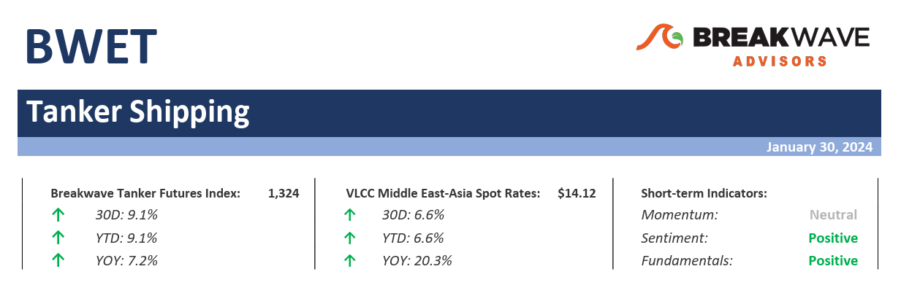
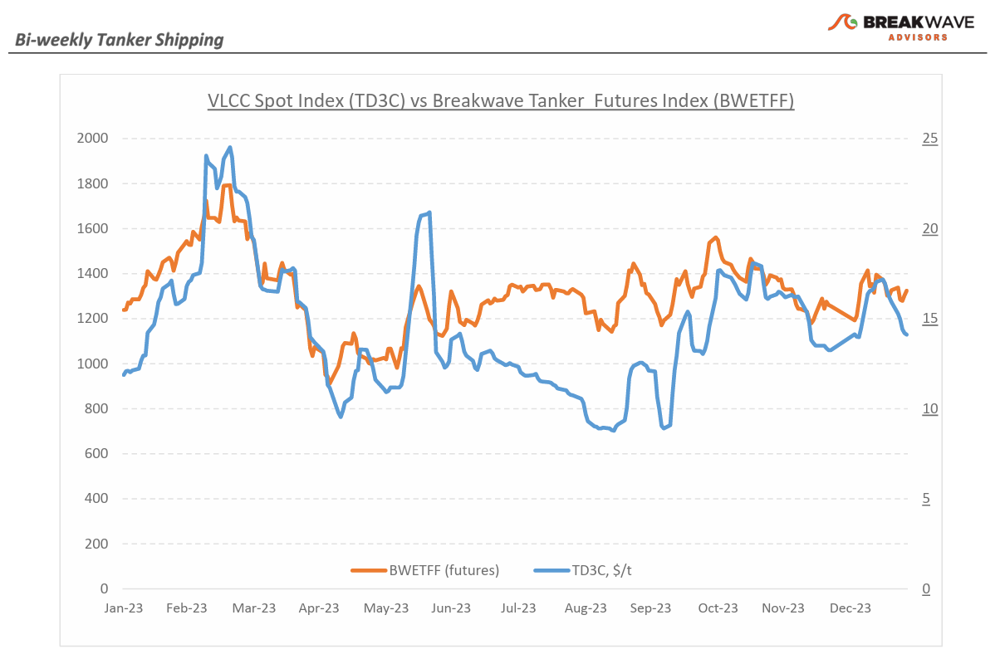
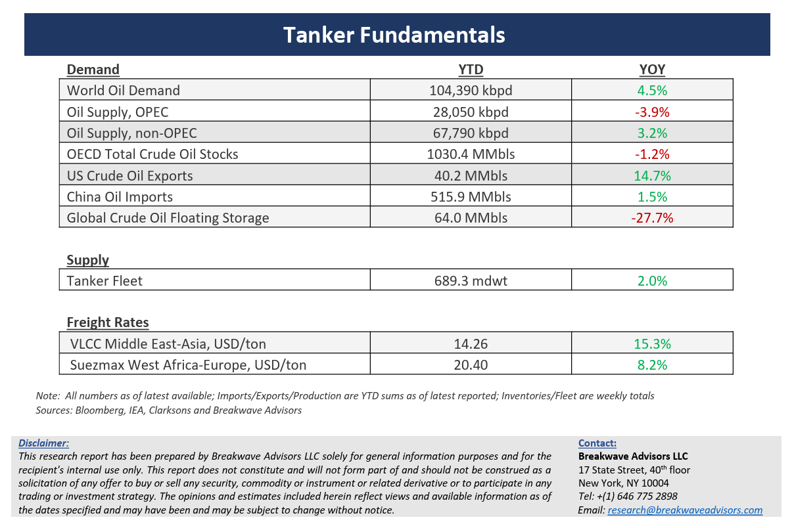

# Breakwave Bi-Weekly Tanker Report - January 30, 2024

**Date:** January 30, 2024  
**Publisher:** Breakwave Advisors | **Category:** Market Insights  
**Original URL:** [https://www.breakwaveadvisors.com/insights/2024130wet](https://www.breakwaveadvisors.com/insights/2024130wet)  

---

> **Figure 1: Tankerreporttop**  
> [Local Asset](file:///C:/Users/Dell/Github/Shipping/corpus/03-breakwave/insights/2024/assets/2024-01-30_2024130wet_img_tankerreporttop_fbff72c217c6.png)

**· Red Sea tensions continue to impact shipping as VLCC rates decline while clean tanker rates jump –**As the month of January comes to an end,**VLCC rates remain soft**, even though tensions in the Red Sea have caused**clean product tanker rates to surge**. Europe-bound ship owners now face a tough choice: Sail through the Red Sea risking an attack on their vessels or take the longer, more expensive route around the Cape of Good Hope. The**Red Sea hostilities**have greatly affected**clean tankers**, a segment that historically has relied the most on the Suez Canal, and a large number for clean product tankers have now diverted away from the Red Sea and the Suez Canal. As a result of the longer sailing distances involved, freight rates for such vessels have surged to the highest level in three years. In the**crude tanker sector**, market data shows that only a**handful of vessels**have recently chosen the**longer route**around Africa's Cape of Good Hope instead of the Suez Canal, adding up to 45 days to the voyage. Rates for VLCC tankers traveling from the Middle East Gulf to China have softened but remain above last year’s comparable levels. The**disruption in the Red Sea is not having a major impact**on those Asia-focused routes as Europe remains a marginal buyer of Middle Eastern crude oil barrels. A similar trend of weakening rates is evident in the Atlantic market for the West Africa to China route. The potential for a**supply squeeze**in the crude tanker sector like the one in the clean segment is undoubtedly not evident despite the Red Sea tensions and it will depend on any**geopolitical developments**given the highly**fluid situation**in the broader region.

**·****Crude oil inventories drop and US economic data remains robust, supporting oil prices**– Despite a rather uninspiring price action, the**fundamentals**for**oil**remain**strong**. Recent inventory data in the US has revealed a surprising crude oil draw, the result of a combination of bad weather that affected refinery operations, lower production, and lower imports. The impact on the**geopolitical turmoil**in the Middle East has so far had a muted impact on oil prices as**key production regions**and important oil trade routes have remained**unaffected**. Although demand for transportation fuels in the US seems weak, Chinese demand remains robust while the recent stimulus efforts by the Chinese government should begin to gradually affect the broader economy in a positive manner during the next several months. We continue to expect a**rangebound market for oil prices**, similar to the range over the past six months, with**geopolitics**providing for the sudden**stronger bid**and**weak economic data**bringing back the**doom and gloom**element for prices. Finally, the new increases in**Atlantic basin production**and the associated oil export ambitions should continue to support crude tanker rates as longer sailing distances are a**positive development**for a tanker market that is already tight in new vessel supply.

**·****Our long-term view –**The tanker market is recovering from a long period of staggered rates as the growth in new vessel supply shrinks while oil demand is recovering in line with the global economy. A historically low orderbook combined with favorable demand fundamentals should continue to support increased spot rate volatility, which combined with the ongoing geopolitical turmoil, should support freight rates in the medium to long term.

> **Figure 2: Tankerreportchart**  
> [Local Asset](file:///C:/Users/Dell/Github/Shipping/corpus/03-breakwave/insights/2024/assets/2024-01-30_2024130wet_img_tankerreportchart_5eb5f7024262.png)

> **Figure 3: Tankerreportbottom**  
> [Local Asset](file:///C:/Users/Dell/Github/Shipping/corpus/03-breakwave/insights/2024/assets/2024-01-30_2024130wet_img_tankerreportbottom_d0f56ec968ec.png)

### Subscribe:
