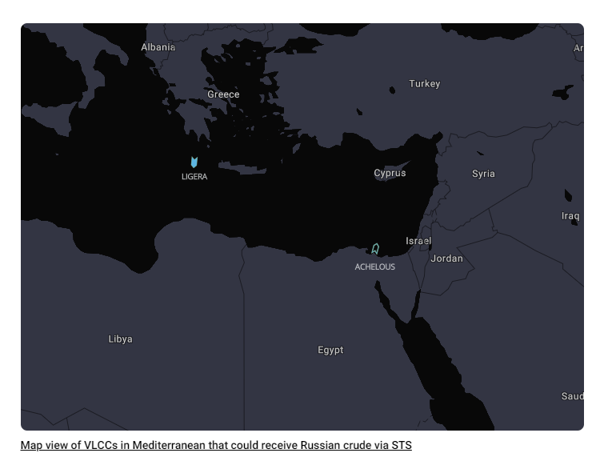
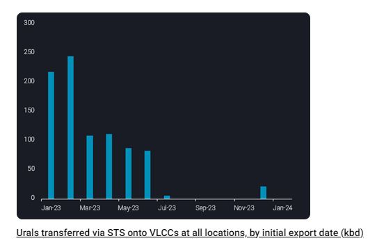
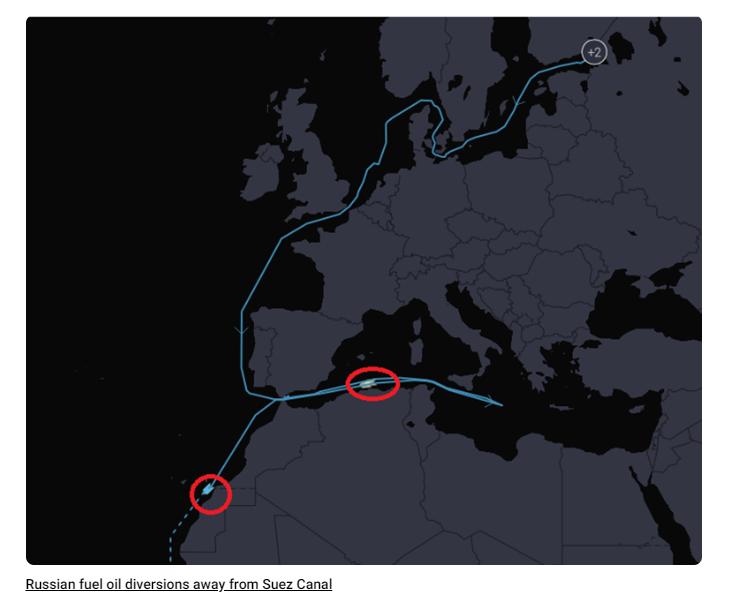

# Russian Urals STS activity resurfacing in Med

**Date:** January 31, 2024  
**Publisher:** Breakwave Advisors | **Category:** Market Insights  
**Original URL:** [https://www.breakwaveadvisors.com/insights/2024/1/31/russian-urals-sts-activity-resurfacing-in-med](https://www.breakwaveadvisors.com/insights/2024/1/31/russian-urals-sts-activity-resurfacing-in-med)  

---

*In this insight we highlight the emergence of Russian Urals crude oil loadings onto VLCCs via ship-to-ship transfers in Mediterranean waters.*

*By*[*Jay Maroo*](https://www.linkedin.com/search/results/all/?keywords=Jay%20Maroo&origin=GLOBAL_SEARCH_HEADER&sid=.Hu)

For the first time in almost 6 months, Vortexa data shows Urals has been transferred onto a VLCC in Mediterranean waters. STS activity for Urals cargoes had largely dried up after the first half of last year as Chinese and Indian buyers imported Russian Baltic and Black Sea crude through direct shipments on Aframax and Suezmax tankers.

More STS activity of Urals could be imminent given that another VLCC previously deployed in Iranian crude trade is also ballasting into the Mediterranean, up northwards from the Suez Canal.

> **Figure 1: Screenshot 2024 01 31 12.02.10**  
> **Interactive Data & Source:** [Vortexa](https://www.vortexa.com//oil-gas-data-traders-analysts-data-scientists?gclid=Cj0KCQjw8_qRBhCXARIsAE2AtRZKOvMnbilZ_6_91d7huSFFy71pWLrnPwGwOHVzXsmsG-1a1mZnQw8aAt89EALw_wcB&hsa_acc=1782073842&hsa_ad=548425387665&hsa_cam=14746637662&hsa_grp=125038601902&hsa_kw=&hsa_mt=&hsa_net=adwords&hsa_src=g&hsa_tgt=dsa-1431852288425&hsa_ver=3&utm_campaign=%5BCD%5D%20-%20DSA%20-%20EMEA&utm_medium=cpc&utm_medium=ppc&utm_source=google&utm_source=adwords&utm_term=) | [Local Asset](file:///C:/Users/Dell/Github/Shipping/corpus/03-breakwave/insights/2024/assets/2024-01-31_russian-urals-sts-activity-resurfacing-in-med_img_screenshot2024-01-31120210_81d722e5d44b.png)

According to Vortexa data, VLCC LIGERA loaded Urals offshore Kalamata from the Aframax tanker NAUTILIUS this month, with the latter having loaded originally from the Russian Baltic port of Ust Luga in December. Given that LIGERA is only partly laden, it could load more Russian cargos from other tankers carrying Russian crude in the coming days.

The resurfacing of Urals STS in the Mediterranean is highly unusual as it does not fit with any kind of wider rerouting for Russian crude oil. Russian crude cargoes have travelled via the Suez Canal and Bab El Mandeb largely unaffected before and after the US/UK attacks on Houthi targets – unlike tankers owned by western firms or cargoes for discharge in the West. With that in mind it is hard to justify the emerging Urals STS activity solely as a response to Red Sea transit risks, albeit it could be a supporting factor.

Rising STS activity also transitions the burden of carrying Russian crude from the Aframax/Suezmax tanker classes – segments that are heavily also used for intra-Atlantic Basin crude flows – to VLCCs. More specifically within VLCCs, Russian crude would likely focus upon the older/grey market fleet, which is exposed to Iranaian/Venezuelan exports, and to a lesser extent OPEC flows – the latter being subject to production cuts.

> **Figure 2: Screenshot 2024 01 31 12.02.20**  
> **Interactive Data & Source:** [Vortexa](https://www.vortexa.com//oil-gas-data-traders-analysts-data-scientists?gclid=Cj0KCQjw8_qRBhCXARIsAE2AtRZKOvMnbilZ_6_91d7huSFFy71pWLrnPwGwOHVzXsmsG-1a1mZnQw8aAt89EALw_wcB&hsa_acc=1782073842&hsa_ad=548425387665&hsa_cam=14746637662&hsa_grp=125038601902&hsa_kw=&hsa_mt=&hsa_net=adwords&hsa_src=g&hsa_tgt=dsa-1431852288425&hsa_ver=3&utm_campaign=%5BCD%5D%20-%20DSA%20-%20EMEA&utm_medium=cpc&utm_medium=ppc&utm_source=google&utm_source=adwords&utm_term=) | [Local Asset](file:///C:/Users/Dell/Github/Shipping/corpus/03-breakwave/insights/2024/assets/2024-01-31_russian-urals-sts-activity-resurfacing-in-med_img_screenshot2024-01-31120220_900039844752.png)

Outside of Russian crude, another significant development in fuel oil is the observations of Russian Baltic fuel oil cargoes backtracking away from Suez and diverting for either West Africa discharge or for a longer journey around the Cape of Good Hope (CoGH) to Asia. An alternative possibility is that rather than sailing around the CoGH, fuel oil could be transferred onto VLCCs in the Mediterranean – either as co-loads with Russian crude oil or as separate VLCCs solely taking fuel oil on the longer voyage.

In summary, these latest indications on Russian crude and fuel oil, suggest that Russian tanker operators/cargo owners do have a risk threshold for Red Sea transit which is being tested, even if it is higher than Western-related entities.

> **Figure 3: Screenshot 2024 01 31 12.02.29**  
> **Interactive Data & Source:** [Vortexa](https://www.vortexa.com//oil-gas-data-traders-analysts-data-scientists?gclid=Cj0KCQjw8_qRBhCXARIsAE2AtRZKOvMnbilZ_6_91d7huSFFy71pWLrnPwGwOHVzXsmsG-1a1mZnQw8aAt89EALw_wcB&hsa_acc=1782073842&hsa_ad=548425387665&hsa_cam=14746637662&hsa_grp=125038601902&hsa_kw=&hsa_mt=&hsa_net=adwords&hsa_src=g&hsa_tgt=dsa-1431852288425&hsa_ver=3&utm_campaign=%5BCD%5D%20-%20DSA%20-%20EMEA&utm_medium=cpc&utm_medium=ppc&utm_source=google&utm_source=adwords&utm_term=) | [Local Asset](file:///C:/Users/Dell/Github/Shipping/corpus/03-breakwave/insights/2024/assets/2024-01-31_russian-urals-sts-activity-resurfacing-in-med_img_screenshot2024-01-31120229_ae92b678fcd2.png)

Data Source:[Vortexa](https://www.vortexa.com//oil-gas-data-traders-analysts-data-scientists?gclid=Cj0KCQjw8_qRBhCXARIsAE2AtRZKOvMnbilZ_6_91d7huSFFy71pWLrnPwGwOHVzXsmsG-1a1mZnQw8aAt89EALw_wcB&hsa_acc=1782073842&hsa_ad=548425387665&hsa_cam=14746637662&hsa_grp=125038601902&hsa_kw=&hsa_mt=&hsa_net=adwords&hsa_src=g&hsa_tgt=dsa-1431852288425&hsa_ver=3&utm_campaign=%5BCD%5D%20-%20DSA%20-%20EMEA&utm_medium=cpc&utm_medium=ppc&utm_source=google&utm_source=adwords&utm_term=)

---

**Tags:** Tankers, Crude, Oil  
