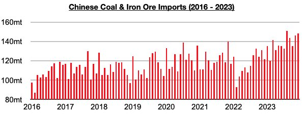
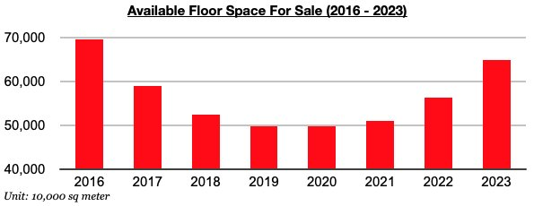

# China's Housing Market / Commodity Import Divergence Continues

**Date:** February 02, 2024  
**Publisher:** Breakwave Advisors | **Category:** Market Insights  
**Original URL:** [https://www.breakwaveadvisors.com/insights/2024/2/2/chinas-housing-market-commodity-import-divergence-continues](https://www.breakwaveadvisors.com/insights/2024/2/2/chinas-housing-market-commodity-import-divergence-continues)  

---

*By*[*Jeffrey Landsberg*](https://www.linkedin.com/in/jeffrey-landsberg-70ab957/)

Last year saw China’s major dry bulk imports set a record as we anticipated, even though the nation’s housing sales fell to the lowest level in over ten years.

> **Figure 1: 241**  
> [Local Asset](file:///C:/Users/Dell/Github/Shipping/corpus/03-breakwave/insights/2024/assets/2024-02-02_chinas-housing-market-commodity-import-divergence-continues_img_241_e9a269ae5b5d.jpg)

Also of note is that last year ended with 673 million square meters of floor space available in China's commercial buildings (which includes residential buildings), which marked the largest available since 2016.

As we have continued to discuss in Commodore's Weekly China Reports and Weekly Dry Bulk Reports, excess in the housing market remains extreme, but we continue to stress that supply and demand of Chinese homes is not what drives China’s dry bulk spot demand.

The production of steel, consumption of iron ore, consumption of coal, global mining, etc. are what drives China's commodity imports and spot demand for dry bulk vessels.

Looking forward, there are still no signs that China's robust appetite for commodity imports is set to suddenly reverse, even as there are also still no signs that China’s extreme housing oversupply problem is set to suddenly be solved.

> **Figure 2: 242**  
> [Local Asset](file:///C:/Users/Dell/Github/Shipping/corpus/03-breakwave/insights/2024/assets/2024-02-02_chinas-housing-market-commodity-import-divergence-continues_img_242_b19ec49e509e.jpg)

---

**Tags:** China, Commodities, Shipping  
