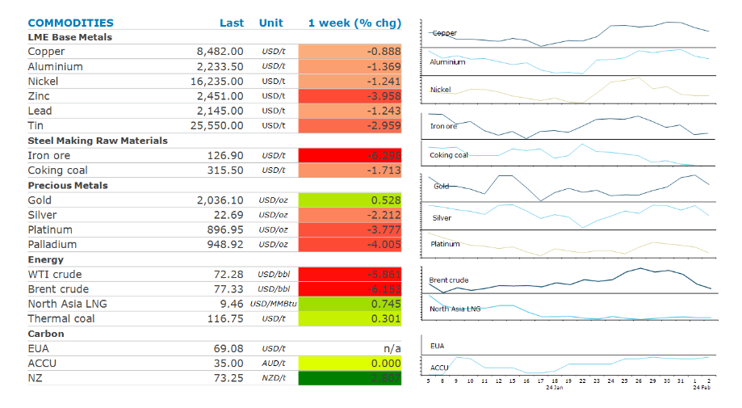

# Oil falls amid easing geopolitical tensions

**Date:** February 05, 2024  
**Publisher:** Breakwave Advisors | **Category:** Market Insights  
**Original URL:** [https://www.breakwaveadvisors.com/insights/2024/2/5/oil-falls-amid-easing-geopolitical-tensions](https://www.breakwaveadvisors.com/insights/2024/2/5/oil-falls-amid-easing-geopolitical-tensions)  

---

*By*[*Daniel Hynes*](https://www.linkedin.com/in/dahynes/)

Easing geopolitical risks weighed on energy prices last week, compounded by fading expectations of an imminent Fed rate cut.

> **Figure 1: Screenshot 2024 02 05 16.42.45**  
> [Local Asset](file:///C:/Users/Dell/Github/Shipping/corpus/03-breakwave/insights/2024/assets/2024-02-05_oil-falls-amid-easing-geopolitical-tensions_img_screenshot2024-02-05164245_0793d994ba6d.png)

**Crude oil**prices slumped last week as early negotiations to halt the bombardment of Gaza and release hostages gained traction. The four-month Israel-Hamas conflict has raised concerns that it would spread across the Middle East and disrupt oil supplies. The Iranian-backed Houthi rebels have been attacking merchant ships in the Red Sea. The US has bombed targets in Yemen as part of efforts to allow ships to traverse the Red Sea without disruption. OPEC’s Joint Monitoring Ministerial Committee signalled it will stick with oil supply cutbacks this quarter to avert a surplus. The group plans to decide in early March whether to extend curbs into the second quarter. Fuel markets, which have most impacted by Middle East tensions could be under further pressure. The large Lukoil facility in Volgograd is offline following a drone attack. It processes more than 300kb/d of crude oil.

**Global gas**prices edged higher last week, despite easing geopolitical risks. The recent selloff has induced price sensitive buyers back into the market. Those gains could be ultimately caped by the high level of inventories across Asia and Europe. Nuclear power restarts and stronger renewable energy output in Japan have also weakened demand. Volumes for January fell to the lowest levels for that month on over a decade. The prospect of lower-than-normal temperatures across Europe later this month also provided some support for European gas prices.

**Gold**slumped on Friday after a hotter-than-expected jobs report reinforced the Fed’s wait-and-see approach on rates. Investor demand evaporated as expectations of an imminent rate cut fade. Nevertheless, the precious metal managed to end the week higher amid a weaker USD and ongoing geopolitical tensions.

The strong jobs data weighed on sentiment in the**base metals**sector.**Copper**led the losses, as expectations of a possible boost to demand from easing monetary policy diminished. This added to further losses earlier in the week on concerns over demand in China following a further contraction of its factory activity in January. Data from the Shanghai Futures Exchange on Friday showed a sharp jump in copper and zinc inventories held in exchange warehouses. Nevertheless, supply side issues continue to bubble away in the background. Producers have shut down a sizeable amount of capacity in the face of surging costs and falling margins. We expect[**more to come**](../pdfs/2024-02-05_oil-falls-amid-easing-geopolitical-tensions_commodity-call-in-shorter-supply_a0b886fb4365.pdf). Prices for metals, including nickel and lithium, remain well below the highest cost producers. Moreover, climate change policies could exacerbate the cutbacks as countries double down on efforts to reduce emissions. This could come to bare on the market when Chinese demand returns following the Lunar New Year holidays.

Data source:[Commodities Wrap](https://www.linkedin.com/newsletters/commodities-wrap-6692196755876012032/?fbclid=IwAR3kiXJqZdxmp9ZcRwBNI7FsBySI-XSC0pfPur1qzjt7OZp7PTE59Tsl1QI)

---

**Tags:** Commodities, Crude Oil  
