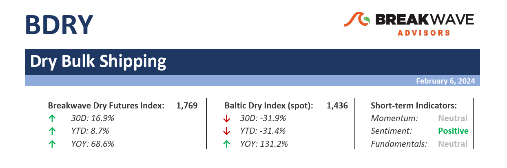
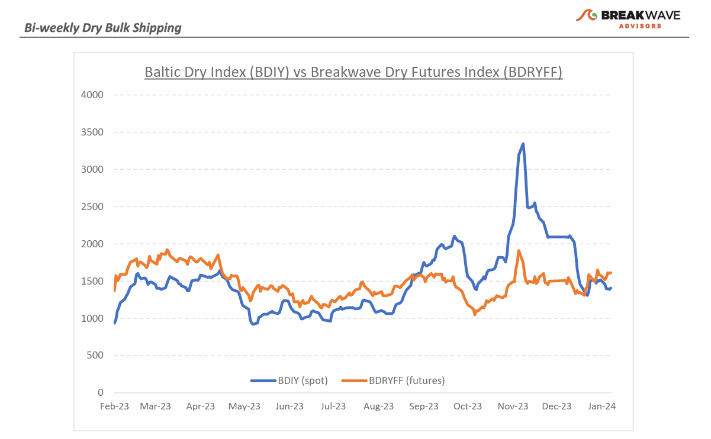
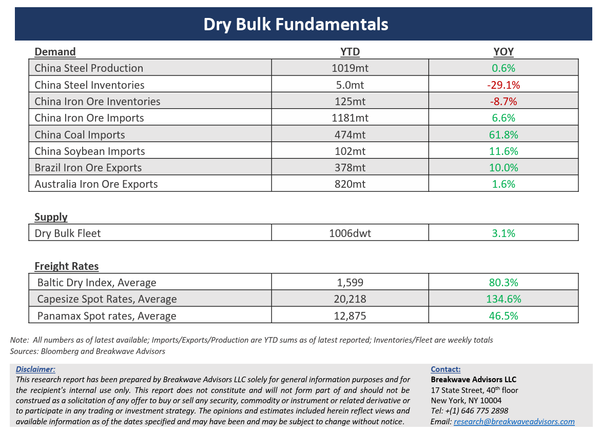

# Breakwave Bi-Weekly Dry Bulk Report - February 6, 2024

**Date:** February 06, 2024  
**Publisher:** Breakwave Advisors | **Category:** Market Insights  
**Original URL:** [https://www.breakwaveadvisors.com/insights/202426dry](https://www.breakwaveadvisors.com/insights/202426dry)  

---

> **Figure 1: Dryreporttop**  
> [Local Asset](file:///C:/Users/Dell/Github/Shipping/corpus/03-breakwave/insights/2024/assets/2024-02-06_202426dry_img_dryreporttop_3a0450e72b44.png)

·**Chinese New Year sees Capesize spot rates at 15-year highs –**As the celebrations for the**Year of the Dragon**are underway in China, Capesize owners have their own milestone to celebrate, with**Capesize spot rates at 15-year highs**for**this time of the year**, a period that traditionally had marked the low point for any given year. The**Atlantic**market remains the main driver of such an astonishing yet surprising performance, while the reasons behind the current strength all point to**inadequate vessel supply**in the western hemisphere. Although statistics show a trivial impact from the current Red Sea disruption when it comes to dry bulk, it seems that**ballasting tonnage**has indeed been**dislocated**(at a time when also the Panama Canal draught is affecting vessel supply), leading to the now months’ long vessel shortage in that part of the world. Combining the above with the**overall optimism**across every shipping segment, and indeed it is not difficult to envision a spot market that remains strong for a long period of time.**Freight futures**have already priced-in such a scenario, with the next two years now**showing above 20,000**, a stretch of strength that has not happened since the late 2000’s for Capesize vessels. A lot can be said about the fundamental supply and demand balance in dry bulk (most analysts have a rather balanced market in the next few years), but the reality is that currently there is little evidence of an upcoming weakness in spot rates which is clearly reflected in the**strong bid**across all durations in freight futures. Of course, one must always remember that this is the nature of the shipping market as both**spot****strength and spot weakness has usually been extrapolated**to months and years out, as traders’ sentiment reacts violently to prompt conditions rather that future ones, which should not be the case.

·**There is no stopping in China’s glooming economic outlook as its time for stock markets to take the lead – Chinese stock markets**have recently experienced some of the**steepest declines**in recent memory. After years of deteriorating economic activity and numerous uneventful stimulus announcements by the government, there is little evidence that the situation is stabilizing let alone improving. Investors are thus aggressively reducing exposure to China, in the process leading to declines in major asset classes, and stocks are no exception.**Sentiment**around China**remains at best tepid**, while attempts by the government to “talk up” even marginal improvements have failed. That**leaves very little options**in terms of revival, and since a major and aggressive stimulus program has been rejected (and rightly so given the heavy debt burden already in place) the**“low and slow”**activity might be with us for a while. In the midst of such an environment,**bulk commodities are actually performing quite well**, with iron ore prices relatively strong and coal imports continuing to support dry bulk trade.

·**Our long-term view –**The last few years have been characterized by increased geopolitical uncertainty. Going forward, we expect such events to continue to affect global trade and have a meaningful impact on effective vessel supply. Combined with the potential for a multi-year rebound in China’s economic activity following the recent economic turmoil, dry bulk shipping should experience higher volatility on top of a secular tightness driven by increasing bulk commodity demand and a slower fleet growth as a result of a relatively low orderbook.

> **Figure 2: Dryreportchart**  
> [Local Asset](file:///C:/Users/Dell/Github/Shipping/corpus/03-breakwave/insights/2024/assets/2024-02-06_202426dry_img_dryreportchart_b23dbb000bb0.png)

> **Figure 3: Dryreportbottom**  
> [Local Asset](file:///C:/Users/Dell/Github/Shipping/corpus/03-breakwave/insights/2024/assets/2024-02-06_202426dry_img_dryreportbottom_5cfc3abb3c7e.png)

### Subscribe:
