# “This is a good (US) economy”

**Date:** February 06, 2024  
**Publisher:** Breakwave Advisors | **Category:** Market Insights  
**Original URL:** [https://www.breakwaveadvisors.com/insights/2024/2/6/this-is-a-good-us-economy](https://www.breakwaveadvisors.com/insights/2024/2/6/this-is-a-good-us-economy)  

---

*The three things investors should know today:*

1. ***The Fed didn’t manage a soft landing. It managed a perfect,***[***Sully Sullenberger,***](https://www.youtube.com/watch?v=pKEYqrs72ps)***landing.****This is a good US economy. Not necessarily a healthy one, as it bought its way out of a recession with debt, but good. Inflation is receding at a healthy pace, growth is close to long-term averages and the labour market is strong.*
2. ***Market expectations are still manifestly ahead of economic realities.****The Fed expects to cut rates three times this year, and later in the year. Investors have absolutely no reason to fight it.*
3. ***Investors need not wait for the world to balance.******It will probably not****, and that’s not a bad thing for portfolios who want to generate Alpha.*

*By*[*George Lagarias*](https://www.linkedin.com/in/george-lagarias-mba-3baa769/)

90%. That’s the aggregate probability of a developed market recession this time last year by professional forecasters -yours humbly included. Economists often mock Wall Street by saying that it has “predicted” nine of the last five recessions. Or the International Monetary Fund (IMF), which hosts a top-line economic think-tank, and central banks all of whom last year saw economic difficulties ahead.

On the other hand, late last year, one of our senior analysts,[James Hunter Jones](https://www.mazars.co.uk/Users/Our-team/James-Hunter-Jones), insisted on adding a “Dream” scenario in our forecasts. One where the economy would perform well, and still inflation would drop. We did, and assigned an outlier probability to it.

Let’s see how James fared versus the world.

Last week the IMF increased its forecast for 2024, from 2.9% to 3.1%, mostly due to strength in the US and China, stating that the global economy is “surprisingly resilient”.

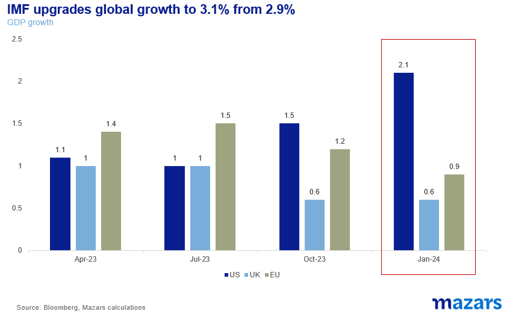

> **Figure 1: On Wednesday**  
> *On Wednesday, Fed Chair Jay Powell said: “The labour market is strong ... We've got six good months of inflation data and an expectation that there's more to come … Let's be honest, this is a good economy”.*  
> **Interactive Data & Source:** [Youtube](https://www.youtube.com/watch?v=pKEYqrs72ps) | [Local Asset](file:///C:/Users/Dell/Github/Shipping/corpus/03-breakwave/insights/2024/assets/2024-02-06_this-is-a-good-us-economy_img_241_c19625653cfd.png)

Let’s focus on the US, as it is the economy which leads the interest rate cycle and affects global growth and inflation.

On the back of that resilience, US Non-Farm Payrolls, one of the key indicators for US interest rates, literally blew past expectations in January, suggesting that the US economy added more than 300 thousand jobs in the month.

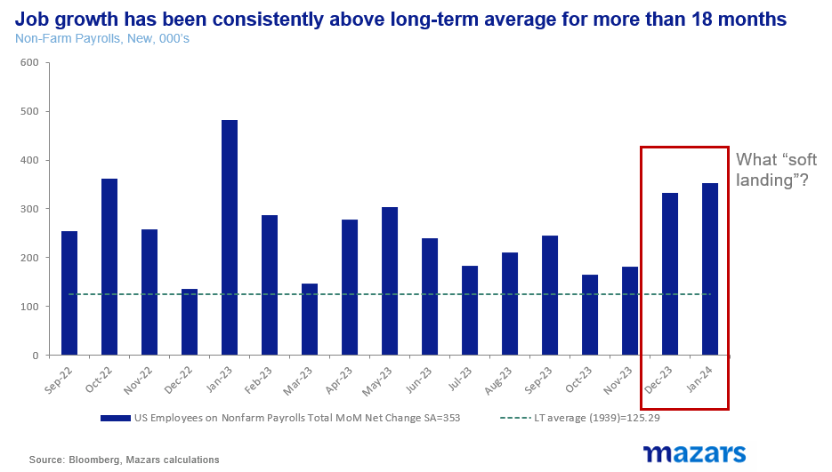

> **Figure 2: 242**  
> **Interactive Data & Source:** [Youtube](https://www.youtube.com/watch?v=pKEYqrs72ps) | [Local Asset](file:///C:/Users/Dell/Github/Shipping/corpus/03-breakwave/insights/2024/assets/2024-02-06_this-is-a-good-us-economy_img_242_c7e8a2a11bde.png)

PMIs also suggest that the manufacturing sector may have bottomed out, with all countries bar Russia improving in January.

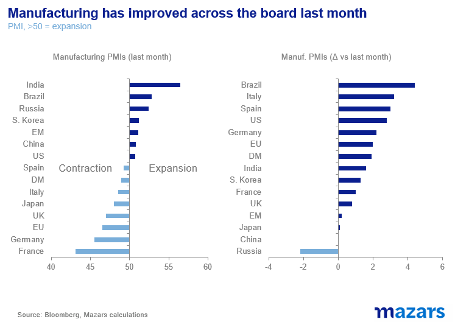

> **Figure 3: 243**  
> **Interactive Data & Source:** [Youtube](https://www.youtube.com/watch?v=pKEYqrs72ps) | [Local Asset](file:///C:/Users/Dell/Github/Shipping/corpus/03-breakwave/insights/2024/assets/2024-02-06_this-is-a-good-us-economy_img_243_e8383e3e019b.png)

As expected, year-end bond-market rate expectations for the US Federal Reserve moved closer towards the earth, from 6.5 cuts to 4.7 cuts as investors realised that the US economy is probably going from “soft landing” to “no landing” at all.

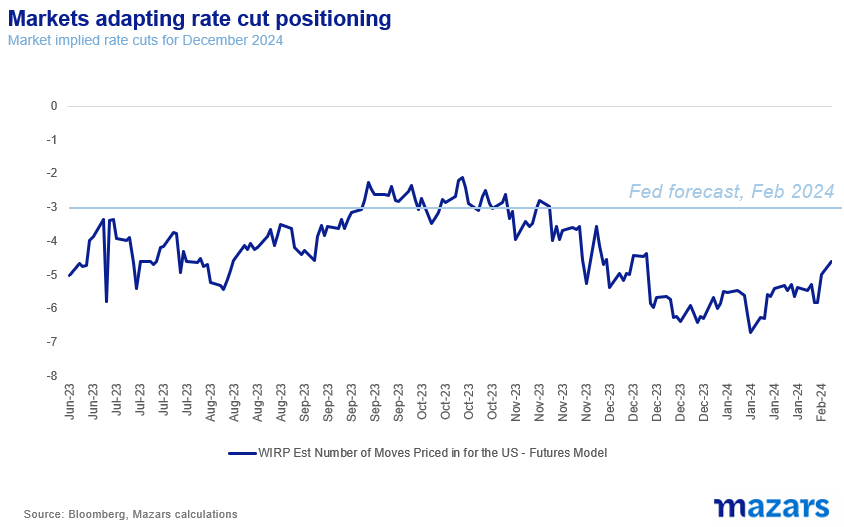

> **Figure 4: 244**  
> **Interactive Data & Source:** [Youtube](https://www.youtube.com/watch?v=pKEYqrs72ps) | [Local Asset](file:///C:/Users/Dell/Github/Shipping/corpus/03-breakwave/insights/2024/assets/2024-02-06_this-is-a-good-us-economy_img_244_3c100975500e.png)

Economic strength, we could argue, would undermine rate cuts as inflation would rise. However, this may not necessarily be the case, for various reasons.

I) Headline inflation was strong in the first few months of last year. So, if inflation pressures remain benign, the number would still continue to drop even due to the base effect.

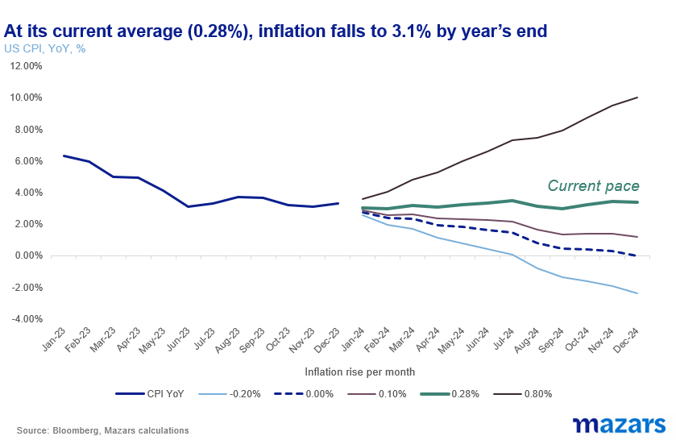

> **Figure 5: 245**  
> **Interactive Data & Source:** [Youtube](https://www.youtube.com/watch?v=pKEYqrs72ps) | [Local Asset](file:///C:/Users/Dell/Github/Shipping/corpus/03-breakwave/insights/2024/assets/2024-02-06_this-is-a-good-us-economy_img_245_98312764c920.png)

II) However, average inflation in the past six months has been benign.

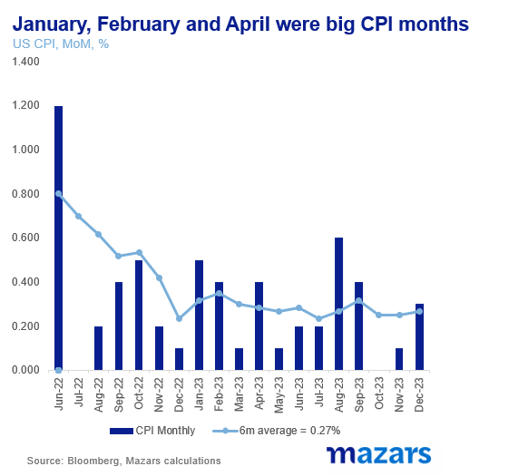

> **Figure 6: 246**  
> **Interactive Data & Source:** [Youtube](https://www.youtube.com/watch?v=pKEYqrs72ps) | [Local Asset](file:///C:/Users/Dell/Github/Shipping/corpus/03-breakwave/insights/2024/assets/2024-02-06_this-is-a-good-us-economy_img_246_6b8ef42f1ba4.png)

III) Core inflation, meanwhile, the Fed’s preferred gauge is still dropping

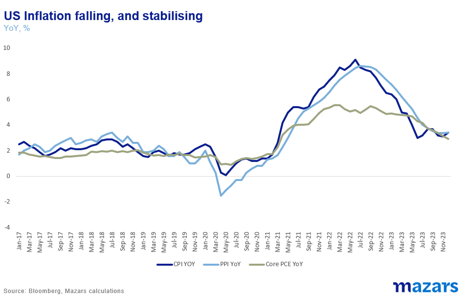

> **Figure 7: 247**  
> **Interactive Data & Source:** [Youtube](https://www.youtube.com/watch?v=pKEYqrs72ps) | [Local Asset](file:///C:/Users/Dell/Github/Shipping/corpus/03-breakwave/insights/2024/assets/2024-02-06_this-is-a-good-us-economy_img_247_ed993e57a777.png)

So this is indeed a good US economy. Not necessarily a healthy one, as we will show, but a good one. Inflation is receding at a healthy pace, growth is close to long-term averages and the labour market is strong.

**The Fed didn’t manage a soft landing. It managed a perfect,**[**Sully Sullenberger,**](https://www.youtube.com/watch?v=pKEYqrs72ps)**landing.**

What did most of the analysis world get wrong (bar James that is)?

Well, the answer is surprisingly simple. Debt. The Treasury of the world’s biggest economy didn’t want to enter an election year in a recession. So it ran a high deficit and boosted the economy, in hopes that consumers would not go on a spending binge and stoke inflation. After all, incentivising new factories in the Rust Belt to boost growth may not have the same effect as sending cheques across the nation.

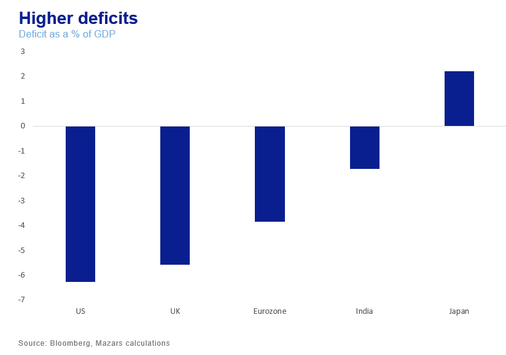

> **Figure 8: 248**  
> **Interactive Data & Source:** [Ft](https://www.ft.com/content/4c78d236-5af7-40ad-9188-6f37a6223f36) | [Local Asset](file:///C:/Users/Dell/Github/Shipping/corpus/03-breakwave/insights/2024/assets/2024-02-06_this-is-a-good-us-economy_img_248_36c75aa6440a.png)

Meanwhile, acting quickly, the Fed avoided “the inflation mindset”, i.e. the secular increase of consumer expectations over inflation, which can become inflationary by itself. Consumer expectations for inflation are indeed coming down.

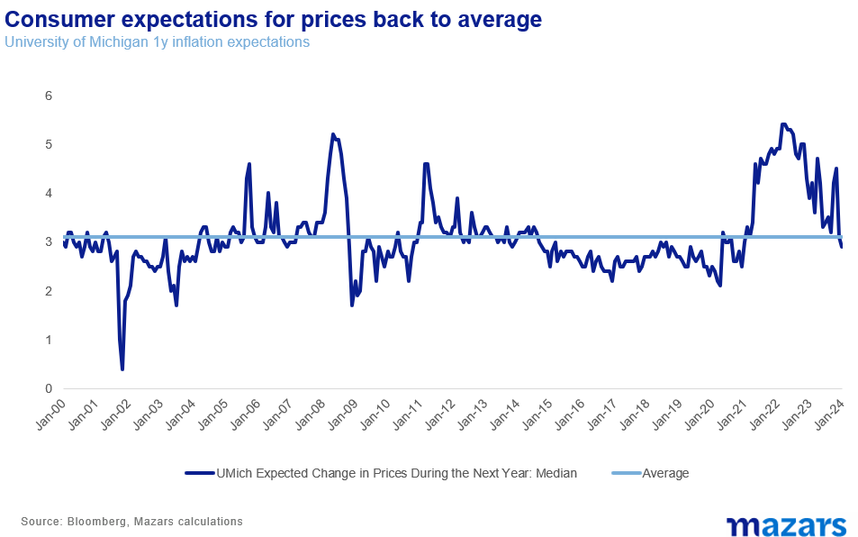

> **Figure 9: 249**  
> **Interactive Data & Source:** [Ft](https://www.ft.com/content/4c78d236-5af7-40ad-9188-6f37a6223f36) | [Local Asset](file:///C:/Users/Dell/Github/Shipping/corpus/03-breakwave/insights/2024/assets/2024-02-06_this-is-a-good-us-economy_img_249_513aaf1b0939.png)

So, in this environment, the Fed is[now saying](https://www.ft.com/content/4c78d236-5af7-40ad-9188-6f37a6223f36)it will perform three cuts this year, and qualifies this statement by intoning that the fight against inflation can’t be[considered won yet](https://www.youtube.com/watch?v=OPO7S8WimSc).

### What Does It All Mean for Investors?

For one, we will not be fighting the Fed, whose 2024 policies are becoming clearer by the day. If they say “three cuts” we are likely to believe them. We also stick to our guns that cuts might come later in the year, as the Fed is wary of cutting “too soon” according to it’s chair. Additionally, we are now looking hard at the debt world once more.**This may be a good economy, but it was likely purchased at the expense of a future economy.**To be sure, some of the debt incurred is “good debt”, the kind that fosters higher growth. But at these high levels, any debt is precarious and has implications for long-term investors, even if is in the world’s reserve currency. At this point, we should add that neither presidential candidate in the US is too excited about fiscal discipline. It is, thus, not outside the realm of possibility that credit agencies might once again warn investors about rising US debt. According to the IMF, the number could be as high as 137% in four years, higher than the 133% at the height of the pandemic, a time when GDP collapsed.

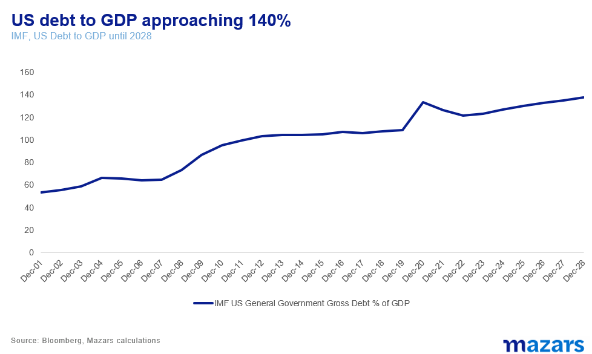

> **Figure 10: 2410**  
> [Local Asset](file:///C:/Users/Dell/Github/Shipping/corpus/03-breakwave/insights/2024/assets/2024-02-06_this-is-a-good-us-economy_img_2410_693682208079.png)

Debt to GDP is a very difficult number to bring down. In the last fifty years, only President Clinton managed to reduce it, by less than 10% in the five years from 1996 to 2001 (last year was technically George W. Bush’s year, but it’s safe to say that it was Clinton’s policies which were still affecting the economy.

As a result we stand by our earlier predictions,**that investors should not be strategically piling over each other to obtain higher yields**. At those debt levels, and given the Fed’s determination not to return to the zero-rate world and avoid secular yield suppression, we would expect long-term yields to remain well above the zero-rates we saw last decade.

As for equities, we are still cognisant of the fact that the bond market continues to price in two more cuts than the Fed has said it will perform and that the S&P 500 is trading 27% above its 30-year average, led by a very narrow band of stocks.

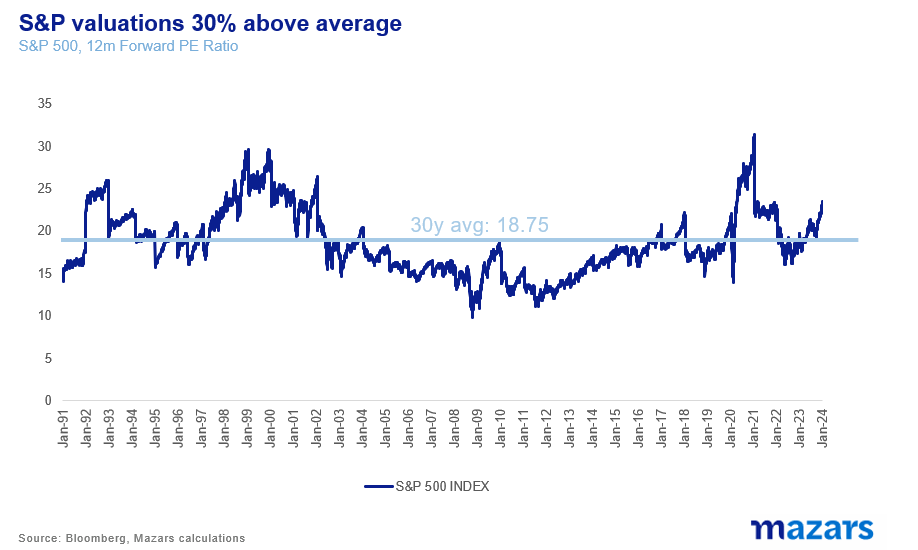

> **Figure 11: 2411**  
> [Local Asset](file:///C:/Users/Dell/Github/Shipping/corpus/03-breakwave/insights/2024/assets/2024-02-06_this-is-a-good-us-economy_img_2411_e54490f18532.png)

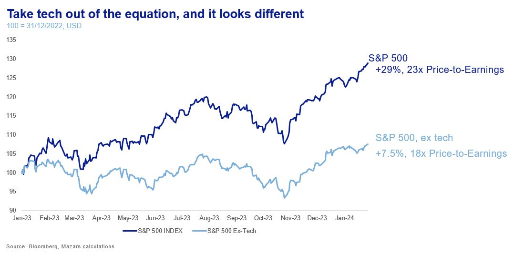

> **Figure 12: 2412**  
> [Local Asset](file:///C:/Users/Dell/Github/Shipping/corpus/03-breakwave/insights/2024/assets/2024-02-06_this-is-a-good-us-economy_img_2412_daba3120756d.png)

This may be a good economy, and possibly a good market, but neither seems balanced.**Market expectations are still manifestly ahead of economic realities.**And this is the key for investors going forward. Lack of balance means that risks abound. For inflation, this is more the case, as geopolitical tensions continue to disrupt global trade and threaten a third wave of price hikes, which would probably delay rate cuts. And let us not forget that the economy in Europe and the UK is much weaker.

To be sure, investors need not wait for the world to balance. It will probably not, and that’s not a bad thing for portfolios. Lack of balance exacerbates differences in world views, and that in turn creates opportunities and markets. Instead, investors need to make sure their advisers understand this world, and how to turn risk into opportunity and generate “alpha” for their portfolios.

---

**Tags:** Economy, Markets  
