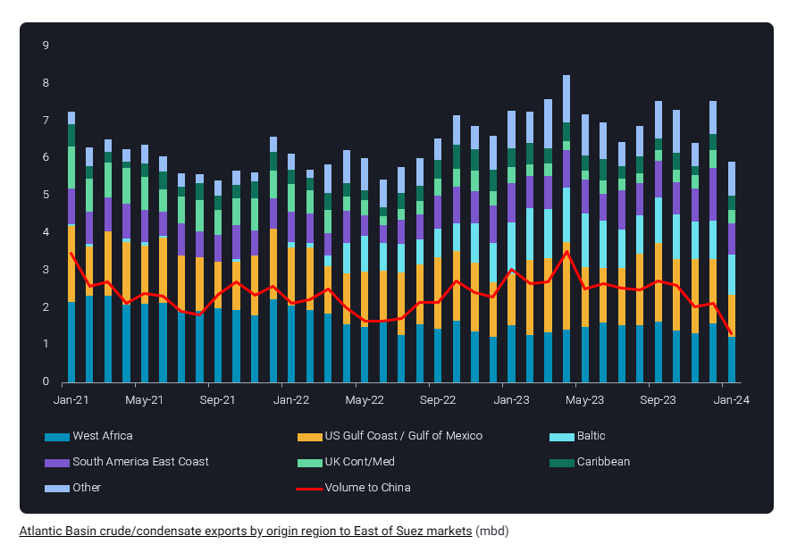
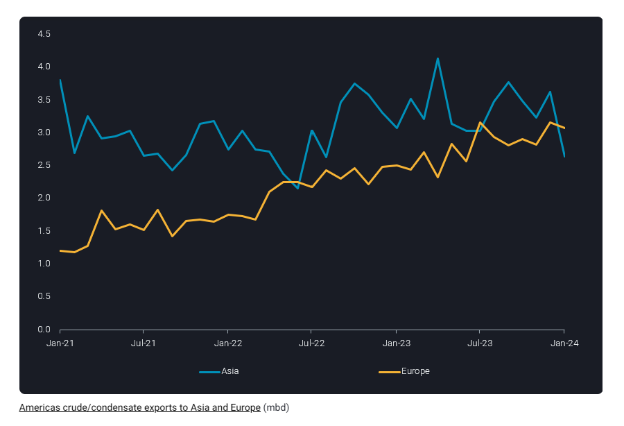

# Atlantic Basin crude exports experience slowdown

**Date:** February 07, 2024  
**Publisher:** Breakwave Advisors | **Category:** Market Insights  
**Original URL:** [https://www.breakwaveadvisors.com/insights/2024/2/7/atlantic-basin-crude-exports-experience-slowdown](https://www.breakwaveadvisors.com/insights/2024/2/7/atlantic-basin-crude-exports-experience-slowdown)  

---

**Crude supplies from Atlantic Basin experience declines amidst slowdown in East of Suez markets but find some relief from demand within the basin.**

*By*[*Rohit Rathod*](https://www.linkedin.com/in/rathodrohit/)

Atlantic Basin emerged as the marginal supplier in 2023 for global markets hit with OPEC+ supply cuts and managed to keep the markets well supplied keeping crude prices in check. Come 2024, the momentum seems to have slowed a bit, not due to supply side issues, but to slowdown in demand from East of Suez markets, mainly China. Demand from Europe has played its part in keeping these barrels flowing and within the basin.

### Atlantic Basin Crude Going to East of Suez Markets Slows

> **Figure 1: Screenshot 2024 02 07 10.28.35**  
> **Interactive Data & Source:** [Analytics Vortexa](https://analytics.vortexa.com/?dateRange=2021-01-01T00%3A00%3A00.000Z__2024-01-31T23%3A59%3A59.999Z&filtersEnabled=%5B%22p%22%2C%22o%22%2C%22d%22%2C%22d_r%22%2C%22v%22%2C%22intra_d%22%2C%22sts_o%22%2C%22c_o%22%2C%22v_f%22%2C%22w%22%5D&from=%5B%22c48ec599431027d68fbdc85031399ba463394e0e7dbec392ba3ce6979ee01c15%22%2C%2244a1b0bb0e2afdb98d07b20184550b77449745bb650cb31628fb4c6ceeb64603%22%2C%226bb56a826eb270e0329ccd071a8445a077ee1bc9551e7727193a7dc1e39f764a%22%5D&geoBreakdownDestinationGlobal=region&geoBreakdownOriginGlobal=terminal&metric=bpd&movementEvent=unloading_start&page=Flows&products=%5B%2254af755a090118dcf9b0724c9a4e9f14745c26165385ffa7f1445bc768f06f11%22%5D&tabId=fed0c5bb-bbe0-4f82-96d5-1e348abc8ef9&timeSeriesProperty=destination_country&timeSeriesSeasonalToggle=0&v=3&waypoint=%5B%22f5634597081459985237dc54fcbe518d4b0a4f4af618b7719abda334b95538d1%22%5D) | [Local Asset](file:///C:/Users/Dell/Github/Shipping/corpus/03-breakwave/insights/2024/assets/2024-02-07_atlantic-basin-crude-exports-experience-slowdown_img_screenshot2024-02-07102835_6d14f38acc96.png)

January 2024 saw a big drop in Atlantic Basin crude exports to East of Suez markets with a decline of 1.7mbd vs December 2023. Majority of this decline was driven by the Americas as they sent barrels to Europe instead. Atlantic Basin crude exports remained mostly unaffected by the security risks in the Red Sea as most of the crude goes to Asia via the Cape of Good Hope with the exception of Russian crude.[Russian Baltic and Black Sea crude arrivals via Suez](https://analytics.vortexa.com/?dateRange=2021-01-01T00%3A00%3A00.000Z__2024-01-31T23%3A59%3A59.999Z&filtersEnabled=%5B%22p%22%2C%22o%22%2C%22d%22%2C%22d_r%22%2C%22v%22%2C%22intra_d%22%2C%22sts_o%22%2C%22c_o%22%2C%22v_f%22%2C%22w%22%5D&from=%5B%22c48ec599431027d68fbdc85031399ba463394e0e7dbec392ba3ce6979ee01c15%22%2C%2244a1b0bb0e2afdb98d07b20184550b77449745bb650cb31628fb4c6ceeb64603%22%2C%226bb56a826eb270e0329ccd071a8445a077ee1bc9551e7727193a7dc1e39f764a%22%5D&geoBreakdownDestinationGlobal=region&geoBreakdownOriginGlobal=terminal&metric=bpd&movementEvent=unloading_start&page=Flows&products=%5B%2254af755a090118dcf9b0724c9a4e9f14745c26165385ffa7f1445bc768f06f11%22%5D&tabId=fed0c5bb-bbe0-4f82-96d5-1e348abc8ef9&timeSeriesProperty=destination_country&timeSeriesSeasonalToggle=0&v=3&waypoint=%5B%22f5634597081459985237dc54fcbe518d4b0a4f4af618b7719abda334b95538d1%22%5D)have not been majorly impacted by the developments with January flows down only marginally. The key factor driving this decline in AB exports has been the lack of Chinese buying.[Chinese crude/condensate imports](https://analytics.vortexa.com/?dateRange=2021-01-01T00%3A00%3A00.000Z__2024-01-31T23%3A59%3A59.999Z&filtersEnabled=%5B%22p%22%2C%22o%22%2C%22d%22%2C%22d_r%22%2C%22v%22%2C%22intra_d%22%2C%22sts_o%22%2C%22c_o%22%2C%22sts%22%2C%22w%22%5D&geoBreakdownOriginGlobal=region&metric=bpd&movementEvent=unloading_start&page=Flows&products=%5B%2254af755a090118dcf9b0724c9a4e9f14745c26165385ffa7f1445bc768f06f11%22%5D&sortField=unloading_start&tabId=539f16a6-3a98-4357-b053-a28166a8b06f&timeSeriesHiddenSeries=%5B%22seasonal_comparison_24%22%2C%22seasonal_comparison_12%22%5D&timeSeriesProperty=origin_region&to=%5B%22934c47f36c16a58d68ef5e007e62a23f5f036ee3f3d1f5f85a48c572b90ad8b2%22%5D&v=3)have been declining since November 2023 and have failed to pick up even after the issuance of full year crude import quotas to their refiners. This suggests that even teapot refiners in the Shandong region aren’t buying due to the slowdown in the Chinese domestic market.

### Americas Crude Heads to Europe Instead of Asia

> **Figure 2: Screenshot 2024 02 07 10.28.45**  
> **Interactive Data & Source:** [Analytics Vortexa](https://analytics.vortexa.com/?dateRange=2021-01-01T00%3A00%3A00.000Z__2024-01-31T23%3A59%3A59.999Z&filtersEnabled=%5B%22p%22%2C%22o%22%2C%22d%22%2C%22d_r%22%2C%22v%22%2C%22intra_d%22%2C%22sts_o%22%2C%22c_o%22%2C%22sts%22%2C%22w%22%5D&from=%5B%22ae06d7e47d6ca2a5bcd7625b8ad402d39e5e92fcc740157dc3301a6d2a6bb207%22%2C%22bbb65b6cb13db7dca985347796498c0f4458e8982c73fbe612515a536e5277b5%22%2C%22eb51f8315cf769b317615f7fcbdad3ff8612baaea0e9a39d3a63550c44784658%22%5D&metric=bpd&originGlobalXFilter=%5B%226ac49669e238276d51719480fddfee2e18cf265f43678ed995071d363ee943f5%22%2C%2229b72132c16974cc52c0c7d3f643261a74a62e9e2bdfb52b5129f6f14c5e3e25%22%2C%22b903eceaae4690fafdc2fd76c23d1e44faf31bf0d1398078b967dcba01a11e6a%22%5D&page=Flows&products=%5B%2254af755a090118dcf9b0724c9a4e9f14745c26165385ffa7f1445bc768f06f11%22%5D&sortField=unloading_start&tabId=a016a716-ec2f-46f9-95c5-c64efb2a3acb&timeSeriesHiddenSeries=%5B%22seasonal_comparison_24%22%2C%22seasonal_comparison_12%22%5D&timeSeriesProperty=origin_country&to=%5B%22f39d455f5d38907394d6da3a91da4e391f9a34bd6a17e826d6042761067e88f4%22%5D&v=3) | [Local Asset](file:///C:/Users/Dell/Github/Shipping/corpus/03-breakwave/insights/2024/assets/2024-02-07_atlantic-basin-crude-exports-experience-slowdown_img_screenshot2024-02-07102845_14a3455f8b61.png)

Focusing on the Americas, which have driven the growth in Atlantic Basin supplies, we have seen a steady increase in their volumes heading to Europe. In January 2024, Europe surpassed Asia as the preferred destination for Americas crude mainly driven by European appetite for US light sweet crude. Not only that, Europe has also shown an interest in buying other[Americas crude mainly from Brazil, Guyana and Mexico](https://analytics.vortexa.com/?dateRange=2021-01-01T00%3A00%3A00.000Z__2024-01-31T23%3A59%3A59.999Z&filtersEnabled=%5B%22p%22%2C%22o%22%2C%22d%22%2C%22d_r%22%2C%22v%22%2C%22intra_d%22%2C%22sts_o%22%2C%22c_o%22%2C%22sts%22%2C%22w%22%5D&from=%5B%22ae06d7e47d6ca2a5bcd7625b8ad402d39e5e92fcc740157dc3301a6d2a6bb207%22%2C%22bbb65b6cb13db7dca985347796498c0f4458e8982c73fbe612515a536e5277b5%22%2C%22eb51f8315cf769b317615f7fcbdad3ff8612baaea0e9a39d3a63550c44784658%22%5D&metric=bpd&originGlobalXFilter=%5B%226ac49669e238276d51719480fddfee2e18cf265f43678ed995071d363ee943f5%22%2C%2229b72132c16974cc52c0c7d3f643261a74a62e9e2bdfb52b5129f6f14c5e3e25%22%2C%22b903eceaae4690fafdc2fd76c23d1e44faf31bf0d1398078b967dcba01a11e6a%22%5D&page=Flows&products=%5B%2254af755a090118dcf9b0724c9a4e9f14745c26165385ffa7f1445bc768f06f11%22%5D&sortField=unloading_start&tabId=a016a716-ec2f-46f9-95c5-c64efb2a3acb&timeSeriesHiddenSeries=%5B%22seasonal_comparison_24%22%2C%22seasonal_comparison_12%22%5D&timeSeriesProperty=origin_country&to=%5B%22f39d455f5d38907394d6da3a91da4e391f9a34bd6a17e826d6042761067e88f4%22%5D&v=3). With slowing demand in Asia and upcoming spring maintenance season in Europe and the US, it remains to be seen whether these Americas barrels will end up hitting the water or land in storage.

Going forward, the market will remain well supplied in terms of crude despite the situation in the Red Sea, with Atlantic Basin crudes continuing to provide the marginal barrels and exports only being constrained by a lack of demand from East of Suez markets.

Data Source:[Vortexa](https://www.vortexa.com//oil-gas-data-traders-analysts-data-scientists?gclid=Cj0KCQjw8_qRBhCXARIsAE2AtRZKOvMnbilZ_6_91d7huSFFy71pWLrnPwGwOHVzXsmsG-1a1mZnQw8aAt89EALw_wcB&hsa_acc=1782073842&hsa_ad=548425387665&hsa_cam=14746637662&hsa_grp=125038601902&hsa_kw=&hsa_mt=&hsa_net=adwords&hsa_src=g&hsa_tgt=dsa-1431852288425&hsa_ver=3&utm_campaign=%5BCD%5D%20-%20DSA%20-%20EMEA&utm_medium=cpc&utm_medium=ppc&utm_source=google&utm_source=adwords&utm_term=)

---

**Tags:** Tankers, Crude, Shipping  
