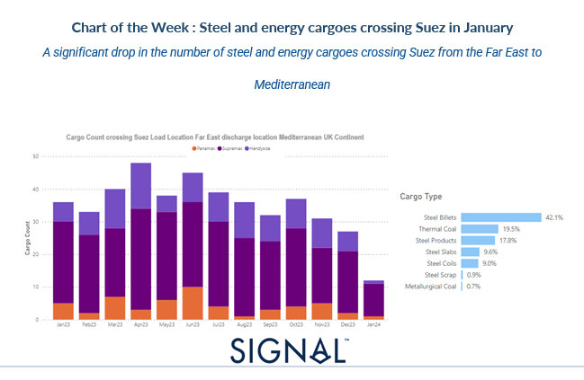
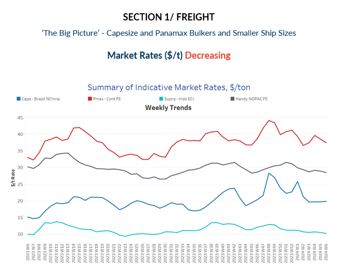
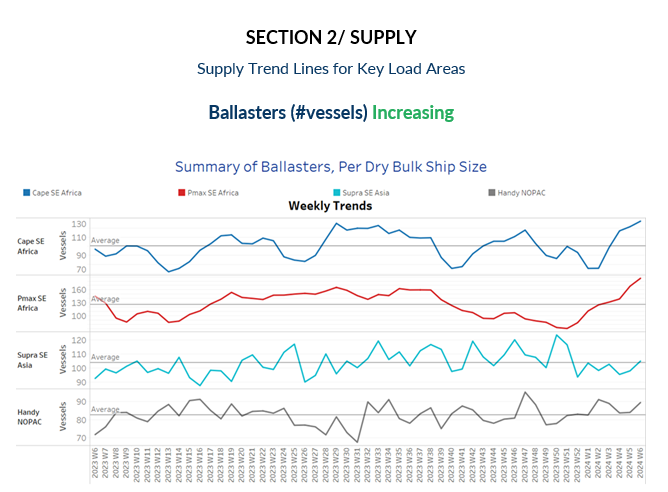
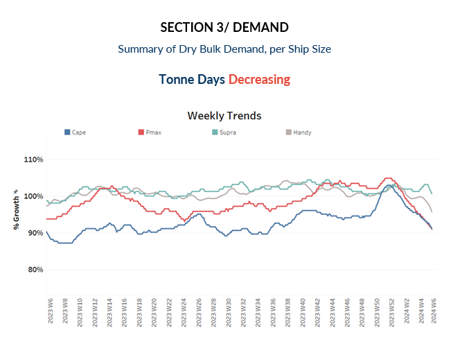
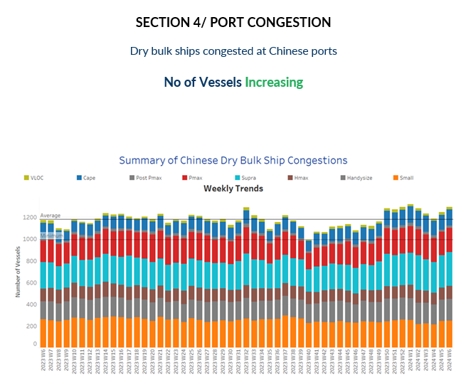

# Signal Weekly Dry Market Monitor

**Date:** February 07, 2024  
**Publisher:** Breakwave Advisors | **Category:** Market Insights  
**Original URL:** [https://www.breakwaveadvisors.com/insights/2024/2/7/signal-weekly-dry-market-monitor](https://www.breakwaveadvisors.com/insights/2024/2/7/signal-weekly-dry-market-monitor)  

---

> **Figure 1: Screenshot 2024 02 07 18.10.33**  
> **Interactive Data & Source:** [Signal Ocean Platform](https://www.thesignalgroup.com/signal-ocean-platform) | [Local Asset](file:///C:/Users/Dell/Github/Shipping/corpus/03-breakwave/insights/2024/assets/2024-02-07_signal-weekly-dry-market-monitor_img_screenshot2024-02-07181033_a467f6f8be5f.png)

The second week of February began with a rebound in the Baltic Capesize Index, surpassing the 2,000 points mark, one of the highest points seen in the last two weeks. Meanwhile, smaller vessel size categories continued to trend downward. It remains to be seen whether there will be sustained firmness in the market just a few days before the start of the Chinese New Year. Notably, despite the high numbers of ballast ships for Capesize and Panamax vessels in Southeast Africa, demand growth is showing a decreasing pace.

Additionally, the Red Sea crisis has started to influence the flow of grain shipments from the Black Sea, potentially impacting earnings for Panamax and Supramax vessels if grain diversions via the Cape of Good Hope continue at a rapid pace. In the cargo types of steel and energy, as depicted in the image above, the count of cargo vessels crossing the Suez Canal from the Far East (loading location) to the Mediterranean (discharge location) experienced a notable 67% decrease in January compared to the monthly level observed a year ago.

​​​For more information on this week's trends, see the analysis sections below:

Freight Market, Supply, Demand and Port Congestion

> **Figure 2: Screenshot 2024 02 07 18.10.47**  
> **Interactive Data & Source:** [Signal Ocean Platform](https://www.thesignalgroup.com/signal-ocean-platform) | [Local Asset](file:///C:/Users/Dell/Github/Shipping/corpus/03-breakwave/insights/2024/assets/2024-02-07_signal-weekly-dry-market-monitor_img_screenshot2024-02-07181047_8b51feae66e4.png)

Despite the positive start observed in the second week of February in the Baltic Capesize Index, the Brazil to North China rates have not yet reached their peak. However, rates have maintained a firmer stability, consistently hovering around or above $20 per tonne.

- **Capesize**vessel freight rates from Brazil to North China have almost reached $20 per ton, signalling a modest weekly increase. Moreover, there appears to be a significant 36% surge from the levels observed at the same time last year.
- **Panamax**vessel freight rates from the Continent to the Far East have remained steady at around $40 per tonne for the past four weeks. Notably, current rates are 10% higher compared to the same week a year ago.
- **Supramax**vessel freight rates on the Indo-ECI route have maintained a sentiment around $11 per tonne, reflecting a momentum similar to that of a year ago.
- **Handysize**freight rates for the NOPAC Far East route have remained stable, holding steady at around $29 per tonne since mid-January. However, there are indications of a potential soft downward revision in the near future.

> **Figure 3: Screenshot 2024 02 07 18.10.57**  
> **Interactive Data & Source:** [Signal Ocean Platform](https://www.thesignalgroup.com/signal-ocean-platform) | [Local Asset](file:///C:/Users/Dell/Github/Shipping/corpus/03-breakwave/insights/2024/assets/2024-02-07_signal-weekly-dry-market-monitor_img_screenshot2024-02-07181057_675ef771c9c0.png)

The trend in terms of the number of ballast ships has seen an accelerated pace particularly for Capesize and Panamax vessels in Southeast Africa. Recent levels have consistently surpassed the annual average for more than three weeks in a row, indicating a sustained increase in ballast ship activity in the region.

- **Capesize SE****Africa**: The number of ballast ships reached its peak in the first days of February, hitting 118 vessels, which is approximately 20 vessels more than the annual average. Such levels had not been observed since week 29 of the previous year.
- **Panamax SE Africa**: The number of ballast ships surged to 190 in the second week of February, marking an increase of almost 16 from the previous week. This figure represents the highest count observed in the past year.
- **Supramax SE Asia**: The number of ballast ships is on the verge of surpassing the annual average of 100, with the last recorded low at the end of the year hovering around 93.
- **Handysize NOPAC**: The count of ballast ships increased to 90, marking a rise of nearly 5 compared to the previous week. February's trend is now showing an uptick, following almost steady activity in the preceding two weeks.

> **Figure 4: Screenshot 2024 02 07 18.11.08**  
> **Interactive Data & Source:** [Signal Ocean Platform](https://www.thesignalgroup.com/signal-ocean-platform) | [Local Asset](file:///C:/Users/Dell/Github/Shipping/corpus/03-breakwave/insights/2024/assets/2024-02-07_signal-weekly-dry-market-monitor_img_screenshot2024-02-07181108_3569f305dd44.png)

The second week of February maintains the same trajectory as the preceding days, with a consistent decline in the growth of demand tonne days across all vessel size categories.

- **Capesize**: The decline has been increasingly pronounced week by week since reaching its peak at the end of the previous year.
- **Panamax**: The decline still mirrors the steep downward trend observed in the Capesize category as the previous week, with growth rates at the lowest in a year.
- **Supramax**: The current growth rate has exhibited signs of decline, following a trend of stabilisation seen at end-of-January levels.
- **Handysize**: The growth rate of smaller vessel sizes is also showing weakness, despite the firmer sentiment observed two weeks ago.

> **Figure 5: Screenshot 2024 02 07 18.11.17**  
> **Interactive Data & Source:** [Signal Ocean Platform](https://www.thesignalgroup.com/signal-ocean-platform) | [Local Asset](file:///C:/Users/Dell/Github/Shipping/corpus/03-breakwave/insights/2024/assets/2024-02-07_signal-weekly-dry-market-monitor_img_screenshot2024-02-07181117_cac88c166355.png)

In the second week of February, the upward trend that began at the start of the month persists, with notable increases recorded across the Capesize, Panamax, and Supramax vessel segments.

- **Capesize**: Capesize congestion levels rose to 148, almost 12 higher than the previous week, while it remains to be seen whether the figure will surpass the 150 mark in the coming days.
- **Panamax**: In the case of Panamax vessels, the count of congested ships rose above the 220 mark but was still lower than the heightened levels of 240 noted at the commencement of the new year.
- **Supramax**: Congestion saw a significant uptick, with over 300 ships affected, marking an increase of nearly 13 vessels compared to the previous week's levels. This mirrors a similar high observed in week 2 of January.
- **Handysize**: Congestion continued to escalate for a second consecutive week, hovering around 190. The question remains whether it will surpass the 200 mark in the near future. It's worth noting that in the 50th week of 2023, the figure had indeed reached 200.

Data Source:[Signal Ocean Platform](https://www.thesignalgroup.com/signal-ocean-platform)

---

**Tags:** Drybulk, Shipping, Freightrates  
