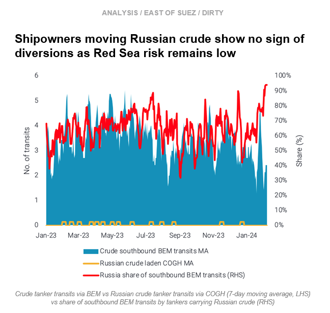
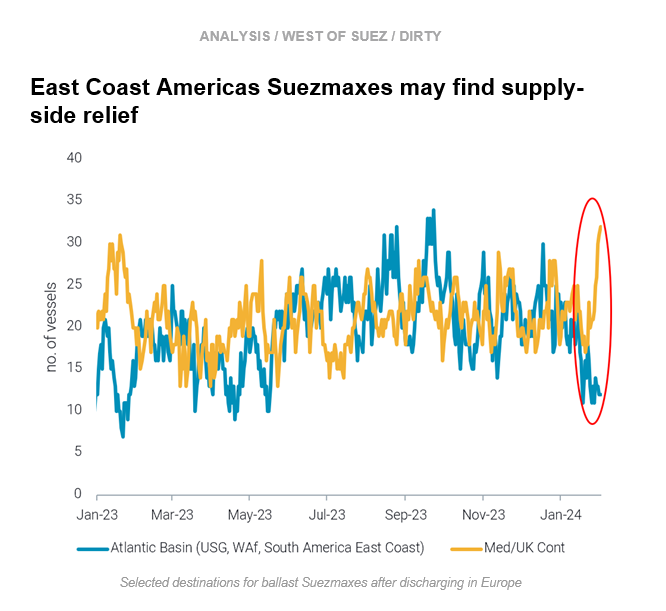

# Russian crude not diverting || Supply-side relief for AB Suezmaxes?

**Date:** February 08, 2024  
**Publisher:** Breakwave Advisors | **Category:** Market Insights  
**Original URL:** [https://www.breakwaveadvisors.com/insights/2024/2/8/russian-crude-not-diverting-supply-side-relief-for-ab-suezmaxes](https://www.breakwaveadvisors.com/insights/2024/2/8/russian-crude-not-diverting-supply-side-relief-for-ab-suezmaxes)  

---

**This week, in the East, we investigate Russian crude transits continuing in the Red Sea. In the West, we explore why supply-side relief may be coming for Suezmaxes**.

*By*[*Mary Melton*](https://www.linkedin.com/search/results/all/?fetchDeterministicClustersOnly=true&heroEntityKey=urn%3Ali%3Afsd_profile%3AACoAABXVyecBtg-pRnIrZe0BoWk0ygPiUfbvhsw&keywords=mary%20melton&origin=RICH_QUERY_SUGGESTION&position=0&searchId=40e8d7d2-c4d0-4022-81e7-176f6eba418b&sid=H_Y&spellCorrectionEnabled=false)

> **Figure 1: Screenshot 2024 02 08 15.07.17**  
> **Interactive Data & Source:** [Marketingmail Vortexa](https://marketingmail.vortexa.com/ODM3LU1aRS01NzgAAAGRIw6b18ZQ8qYXvob6zopij7pDyMguIXGOPVpRguj7rZLJtf0_WraTcT8FA0PBJ6_0kpreESo=) | [Local Asset](file:///C:/Users/Dell/Github/Shipping/corpus/03-breakwave/insights/2024/assets/2024-02-08_russian-crude-not-diverting-supply-side-relief-for-ab-suezmaxes_img_screenshot2024-02-08150717_23104354a6b8.png)

- Since late December 2023, overall crude tanker transits through the Bab-el-Mandeb (BEM) strait have declined by almost 45%. Most of the decline in crude tanker BEM transits has stemmed from northbound transits, however, southbound transits have declined slightly since last year.

- At the same time, southbound crude volumes moving via BEM are stable, as Russian crude volumes via BEM have increased by over 40% this year to offset an almost 90% decline in non-Russian crude volumes in the same period. As a result, the proportion of southbound BEM transits which are done by tankers carrying Russian crude has reached almost 100%.
- This is a strong indication that shipowners moving Russian crude are less concerned with the risk of Red Sea attacks overall. Currently, there have been no transits of Russian crude through the Cape of Good Hope (COGH) since late last year. Additionally, our[map screen](https://marketingmail.vortexa.com/ODM3LU1aRS01NzgAAAGRIw6b18ZQ8qYXvob6zopij7pDyMguIXGOPVpRguj7rZLJtf0_WraTcT8FA0PBJ6_0kpreESo=)shows no sign of Russian crude tanker diversions via the COGH from either direction.

> **Figure 2: Screenshot 2024 02 08 15.07.34**  
> **Interactive Data & Source:** [Marketingmail Vortexa](https://marketingmail.vortexa.com/ODM3LU1aRS01NzgAAAGRIw6b2AJ_WNUAsHCIqFfXLhOjSYxIZUrP65XX26T1LrEa8vSI3jn9hSsMkqxBWBS5OAJrzGk=) | [Local Asset](file:///C:/Users/Dell/Github/Shipping/corpus/03-breakwave/insights/2024/assets/2024-02-08_russian-crude-not-diverting-supply-side-relief-for-ab-suezmaxes_img_screenshot2024-02-08150734_338e3ba7d712.png)

- [Suezmax utilisation](https://marketingmail.vortexa.com/ODM3LU1aRS01NzgAAAGRIw6b2AJ_WNUAsHCIqFfXLhOjSYxIZUrP65XX26T1LrEa8vSI3jn9hSsMkqxBWBS5OAJrzGk=)out of the East Coast Americas (US Gulf and South America) has continued to increase over the past two months, increasing about 30% since the start of December. In recent weeks, continuing upward momentum has been driven by utilisation out of[South America East Coast](https://marketingmail.vortexa.com/ODM3LU1aRS01NzgAAAGRIw6b1xkRUCfpMBK4ivA5NJ4SBeAEWkV4mKVltEb8vVns8niaPimWMOuAy8esGs_e1MdlX-c=), mainly for short-haul voyages. Utilisation out of the[US Gulf](https://marketingmail.vortexa.com/ODM3LU1aRS01NzgAAAGRIw6b1-WFZuZBI-N-6lYh56ZM_RFpsohh2nN5xVQeht9fKXLxx1De-4wpwYCrdBrbMgwmRvU=)is stable at fairly high levels, but is no longer increasing.

- Despite high employment, freight rates out of the East Coast Americas remain suppressed (Argus) due to[high vessel supply](https://marketingmail.vortexa.com/ODM3LU1aRS01NzgAAAGRIw6b15FSRJ3vnjThLK8KvITPWR1adZVRWpwjUk7k8XNJzLdL0-7x5hVwlklA7-il_GJhxm4=). Higher shorter-haul employment is failing to clear tonnage.
- Overall weak crude demand means the prospect of upward momentum in freight rates is unlikely, but supply-side relief for the Americas may be coming. Vessels discharging in Europe are increasingly staying in the[Med or UK Cont](https://marketingmail.vortexa.com/ODM3LU1aRS01NzgAAAGRIw6b1yZcU40Dd_xCvLGGjVStB_D7FZUdgP8Vr1eeHOT0lfGvC33DiceuO7ZYb5J23egeSqk=)instead of ballasting back to the[Atlantic Basin](https://marketingmail.vortexa.com/ODM3LU1aRS01NzgAAAGRIw6b2AyGAEhgrL_mkao66QFQJ2bZxOUilmjGw_zyCqZYoD4vMxBoidnTUBB4vis7HNG-xk8=).This may be due to the perception of future decreases in availability in Europe due to disruptions in the Red Sea as well as additional demand in the Med.

Data Source:[Vortexa](https://www.vortexa.com//oil-gas-data-traders-analysts-data-scientists?gclid=Cj0KCQjw8_qRBhCXARIsAE2AtRZKOvMnbilZ_6_91d7huSFFy71pWLrnPwGwOHVzXsmsG-1a1mZnQw8aAt89EALw_wcB&hsa_acc=1782073842&hsa_ad=548425387665&hsa_cam=14746637662&hsa_grp=125038601902&hsa_kw=&hsa_mt=&hsa_net=adwords&hsa_src=g&hsa_tgt=dsa-1431852288425&hsa_ver=3&utm_campaign=%5BCD%5D%20-%20DSA%20-%20EMEA&utm_medium=cpc&utm_medium=ppc&utm_source=google&utm_source=adwords&utm_term=)

---

**Tags:** Crude, Tankers, Oil  
