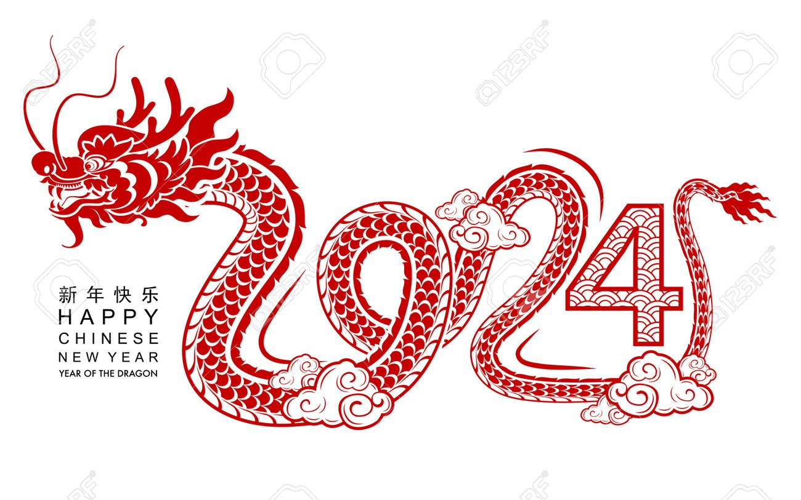

# Riding The Dragon

**Date:** February 09, 2024  
**Publisher:** Breakwave Advisors | **Category:** Market Insights  
**Original URL:** [https://www.breakwaveadvisors.com/insights/2024/2/3/riding-the-dragon](https://www.breakwaveadvisors.com/insights/2024/2/3/riding-the-dragon)  

---

### "It Simply Isn’t an Adventure Worth Telling If There Aren’t Any Dragons."

It is time to say goodbye to the year of the Rabbit and say hello to the year of the Dragon.

In Chinese astrology each year is characterized by one animal and one element; 2024 is the year of the Wood Dragon, beginning on 10th February. The Dragon is the only mythical creature amongst the 12 animals, making this year extra special; as the luckiest and most auspicious of the 12 animals, the dragon is thought to signify unprecedented opportunities.

Feng Shui experts argue that “Big things” always happen in Dragon years, sometimes good, sometimes bad. For example, during the Dragon Year of 1976, two devastating events took place, the Tangshan earthquake (one of largest natural disasters in Chinese history) and the passing of Chairman Mao. More recently, during the previous Dragon year, on 3rd February 2012, the Baltic Dry Index dropped to 647 points, even lower than the 5th December 2008 (year of Lehman Brothers crisis) level of 663 points (the lowest since 1986 at the time).

While the BDI is floating between 1300 to 1500 points since 1st January, current market sentiment is characterized by uncertainty & instability. We are living in turbulent times of ongoing wars, regional conflicts, slow economies and forthcoming elections; almost half of the world population will be voting this Dragon year, including USA, Russia, India, Pakistan & Bangladesh. Despite the volatile environment globally, it seems the stars predict a prosperous year as the combination of Dragon fierce presence & energy and the stable element of wood, is expected to bring growth, development and unexpected opportunities.

According to Chinese folklore, Dragons are believed to have control over water, rain and storms thus some of our Chinese clients expect “calm seas” and are confident that this lunar year will be a good time to buy a ship and anticipate more sale & purchase transactions, while others consider the current dry cargo market levels as the new norm, having enjoyed relatively good earnings the past two years.

Despite concerns, our friends and Clients in the Far East feel overall positive for the new Lunar New Year and believe that shipping will overcome and adapt to new circumstances. Perhaps what we need is the Strong Dragon to create a more peaceful world this year and all will follow...

**Wish all our readers a healthy and lucky new year and hope that Shipping Markets will ride the dragon.**

### Gong Xi Fa Cai 新年快乐！

> **Figure 1: 241**  
> [Local Asset](file:///C:/Users/Dell/Github/Shipping/corpus/03-breakwave/insights/2024/assets/2024-02-09_riding-the-dragon_img_241_e70523757fe3.jpeg)

### Lunar New Year Facts

• Each Lunar New Year is characterized by one of 12 animals which appear in the Chinese zodiac. According to the legend, the Jade Emperor (玉皇 Yùhuáng, one of the most important Chinese Gods) invited all animals in the Kingdom to compete to a “Great Race”. Whoever arrived at his palace first would win and the order in which the 12 animals finish will also settle the zodiac order. Dragon was the fifth animal to finish thus becoming the fifth animal of the Chinese Zodiac.

• The order of the Chinese Zodiac : 1. Rat 2. Ox 3. Tiger 4. Rabbit 5. Dragon 6. Snake 7. Horse 8. Goat 9. Monkey 10. Rooster 11. Dog 12. Pig

• Countries that have public holidays during Lunar New Year include China, Indonesia, the Philippines, Vietnam, Korea, Malaysia, Singapore and Brunei.

• Previous Dragon years: 1952, 1964, 1976, 1988, 2000, 2012

• The Chinese believe that performing the dragon dance during festivals and celebrations drives away evil spirits and brings good luck and blessings to the community.

• Though in winter, Chinese call their New Year holidays 'Spring Festival' (春节 chūnjié), because 'Start of Spring' (4 February) is the first of the terms in the traditional solar calendar.

• Over 2 billion people celebrate Chinese New Year globally.

• The largest annual human migration in the world is taking place the Lunar New Year holidays (a.k.a. the Spring Festival Travel Rush). Over 200 million people will travel within China and tens of millions will travel internationally.

> **Figure 2: 241**  
> [Local Asset](file:///C:/Users/Dell/Github/Shipping/corpus/03-breakwave/insights/2024/assets/2024-02-09_riding-the-dragon_img_241_e70523757fe3.jpeg)

---

**Tags:** Fengshui, Chinesenewyear, 2024  
