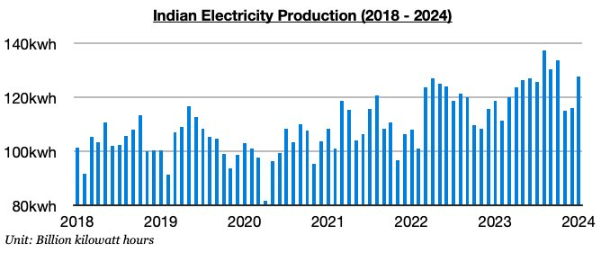
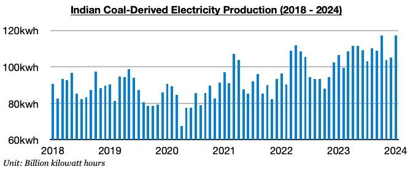
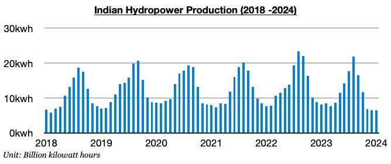

# Surge in India's Thermal Coal Burn About to Become Even Stronger

**Date:** February 09, 2024  
**Publisher:** Breakwave Advisors | **Category:** Market Insights  
**Original URL:** [https://www.breakwaveadvisors.com/insights/2024/2/9/surge-in-indias-thermal-coal-burn-about-to-become-even-stronger](https://www.breakwaveadvisors.com/insights/2024/2/9/surge-in-indias-thermal-coal-burn-about-to-become-even-stronger)  

---

*By*[*Jeffrey Landsberg*](https://www.linkedin.com/in/jeffrey-landsberg-70ab957/)

For the near-term, it remains India’s thermal coal import demand where we are particularly bullish in the dry bulk market. As we have highlighted often in Commodore's Weekly Dry Bulk Reports in recent months, demand for thermal coal in India has been very likely to rise from an already strong base — and this certainly has been occurring as anticipated. Going forward, new overall electricity production and thermal coal-derived electricity generation records remain likely to begin to be set in India no later than starting in March.

India produced approximately 127.8 billion kilowatt hours of electricity last month. This is up month-on-month by 11.8 billion kilowatt hours (10%) and up year-on-year by 9 billion kilowatt hours (8%). India’s electricity output has stayed strong as anticipated and has now increased on a year-on-year basis for eight straight months. Hydropower output continues to contract and thermal coal-derived electricity generation has continued to grow.

> **Figure 1: 241**  
> [Local Asset](file:///C:/Users/Dell/Github/Shipping/corpus/03-breakwave/insights/2024/assets/2024-02-09_surge-in-indias-thermal-coal-burn-about-to-become-even-stronger_img_241_985a357de448.jpg)

Thermal coal-derived electricity generation totaled approximately 117.1 billion kilowatt hours last month. This is up month-on-month by 1.5 billion kilowatt hours (11%), up year-on-year by 10.6 billion kilowatt hours (10%), and matched the record set in October. India’s thermal coal-derived electricity generation has now grown on a year-on-year basis during each of the last nine months. We remain of our view that strength will continue near term and we expect several new overall electricity production and thermal coal-derived generation production records will be set soon.

> **Figure 2: 242**  
> [Local Asset](file:///C:/Users/Dell/Github/Shipping/corpus/03-breakwave/insights/2024/assets/2024-02-09_surge-in-indias-thermal-coal-burn-about-to-become-even-stronger_img_242_5e552100a092.jpg)

Hydropower output totaled approximately 6.5 billion kilowatt hours last month. This is unchanged from December and is down year-on-year by 1.7 billion kilowatt hours (-21%). India’s hydropower output has now contracted on a year-on-year basis for seven straight months. This contraction is continuing to result in an ongoing surge in India’s thermal coal-derived electricity generation. Overall, it remains quite helpful for the dry bulk shipping market that India’s economy is faring so well while India’s hydropower output has remained mired in a significant contraction.

> **Figure 3: 243**  
> [Local Asset](file:///C:/Users/Dell/Github/Shipping/corpus/03-breakwave/insights/2024/assets/2024-02-09_surge-in-indias-thermal-coal-burn-about-to-become-even-stronger_img_243_782a5ab7ee2d.jpg)

---

**Tags:** India, Coal, Drybulk  
