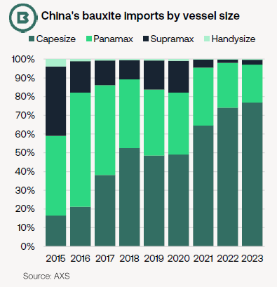
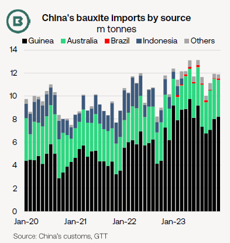
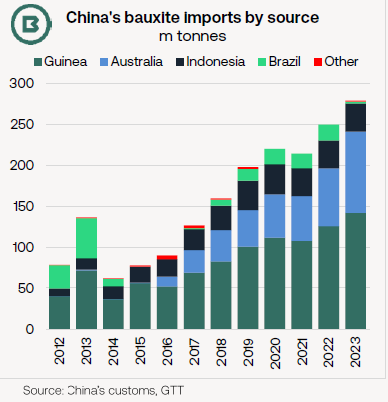

# The Big Picture: Events shaping bauxite trades

**Date:** February 09, 2024  
**Publisher:** Breakwave Advisors | **Category:** Market Insights  
**Original URL:** [https://www.breakwaveadvisors.com/insights/2024/2/9/the-big-picture-events-shaping-bauxite-trades](https://www.breakwaveadvisors.com/insights/2024/2/9/the-big-picture-events-shaping-bauxite-trades)  

---

- *December’s oil depot fire in the world’s dominant bauxite exporter, Guinea, led to a national fuel crisis, helping push international prices of alumina and aluminium higher.*
- *Disruption from Guinea appears to have been fairly minor and short-lived.*
- *Despite Indonesia’s bauxite export ban and weather-related disruption in both Australia and Brazil, Braemar estimates global bauxite trade grew by 6% in 2023.*

**Such is Guinea’s importance**to the world’s (and, in particular, China’s) supply of bauxite that a fire at the Conakry oil depot 18 December contributed to a rise in global prices of alumina and aluminium.

With severe fuel shortages affecting everyday life in Guinea, a negative effect on mining activities was cause for concern for aluminium producers.

Moreover,**tight domestic bauxite supply added to production costs for China’s alumina producers in January**, according to Shanghai Metals Market (SMM). Alumina prices jumped at the start of 2024, propelling the Shanghai primary aluminium contract to its highest point in almost two years. Bauxite mine restarts are possible in Henan and Shanxi provinces in early March, SMM adds.

In the event,**disruption to bauxite liftings from Guinea appears to have been short-lived**.

The aluminium price move does, however, underline the**importance of Guinea to global bauxite supply and, from a shipping perspective, to seaborne trade volumes**.

As the first chart shows, the share of bauxite carried by Capesizes in 2023 (defined as 100k+ dwt) reached 71% globally—and 77% for imports into China.

Moreover, the**contribution made to fronthaul Capesize trade growth by Guinean bauxite**over the last two years has been**unmatched by any other trade**.

> **Figure 1: 241**  
> [Local Asset](file:///C:/Users/Dell/Github/Shipping/corpus/03-breakwave/insights/2024/assets/2024-02-09_the-big-picture-events-shaping-bauxite-trades_img_241_0b0b9f8c6080.png)

In 2022-23 inclusive, vessel tracking indicated combined growth of some**45m tonnes in bauxite from Guinea**to Asia in Capes, which overshadowed corresponding net growth in Capesize**iron ore trade from Brazil to Asia of just 4.5m tonnes**in the corresponding period (mainly thanks to steep retreat in 2022).

While Panamax and geared bulkers are active on bauxite trades from a range of suppliers, including Australia and Brazil, growth was focused overwhelmingly on Capesize trades.

> **Figure 2: 242**  
> [Local Asset](file:///C:/Users/Dell/Github/Shipping/corpus/03-breakwave/insights/2024/assets/2024-02-09_the-big-picture-events-shaping-bauxite-trades_img_242_13a0af0f9a30.png)

**Despite the presence of three disruptors**to supply last year, Braemar estimates that**global seaborne bauxite trade rose by an estimated 9.5m tonnes, or 5.9%, to 173.4m tonnes**in 2023, based on official trade data.

The three disruptors to bauxite supply were (1) the self-imposed ban on Indonesian exports which formally entered force in June, (2) severe weather affecting mining and supply chain operations in the far north of Australia and (3) limited exports from Brazil from low water levels in the tributaries of the Amazon, which disrupted cargo supply to river ports.

Longhaul bauxite exports from Brazil to China did rise last year, however, with customs data showing a six-year high of 2.8m tonnes for 2023, a gain of roughly 1m tonnes. Arguably, this total could have been higher were it not for historic drought conditions in the second half of the year.

**Guinea has attracted fresh investment**in bauxite mining.

This week it was reported by newswires that Société Minière de Boké (SMB) announced expansion of annual bauxite production over the next five years. The project would lift annual export capacity by 10m tonnes, starting at the end of 2024 (on top of last year’s reported exports of 48m tonnes), facilitated by more barges and upgraded capacity on the Dapilon River. All ore is exported to China.

Nonetheless, in 2022, Guinea’s government encouraged the construction of new alumina refining capacity. This may pose a threat to some international bauxite supply in the longer term—**if**such projects materialise.

> **Figure 3: 243**  
> [Local Asset](file:///C:/Users/Dell/Github/Shipping/corpus/03-breakwave/insights/2024/assets/2024-02-09_the-big-picture-events-shaping-bauxite-trades_img_243_4c65cbba76ff.png)

---

**Tags:** Bauxite, Guinea, Drybulk  
