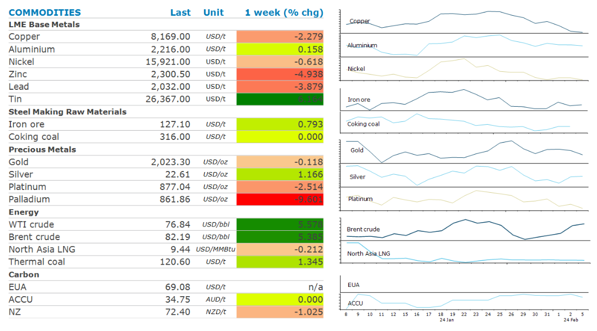

# Elevated tensions in Middle East push oil prices higher

**Date:** February 12, 2024  
**Publisher:** Breakwave Advisors | **Category:** Market Insights  
**Original URL:** [https://www.breakwaveadvisors.com/insights/2024/2/12/elevated-tensions-in-middle-east-push-oil-prices-higher](https://www.breakwaveadvisors.com/insights/2024/2/12/elevated-tensions-in-middle-east-push-oil-prices-higher)  

---

**Elevated geopolitical risks saw energy markets push higher last week. However, mixed signals on China’s economy weighed on sentiment in industrial metal markets.**

*By*[*Daniel Hynes*](https://www.linkedin.com/in/dahynes/)

> **Figure 1: Screenshot 2024 02 12 11.48.24**  
> [Local Asset](file:///C:/Users/Dell/Github/Shipping/corpus/03-breakwave/insights/2024/assets/2024-02-12_elevated-tensions-in-middle-east-push-oil-prices-higher_img_screenshot2024-02-12114824_201cae98df0a.png)

**Crude oil**rallied last week as the prospect of a ceasefire agreement in Gaza diminished. Israel’s Prime Minister, Benjamin Netanyahu, said that he sees no other solution than total victory, following a counterproposal from Hamas for a hostage and ceasefire agreement. He also ordered another military push in southern Gaza, raising the risk of an escalation in the conflict. Risks were magnified as Houthi rebels increased their attacks on merchant ships in the Red Sea. Positive fundamentals also boosted sentiment. US gasoline inventories were drawn down sharply last week while its premium over crude increased to its highest level since September, signalling strong demand.

**North Asia LNG**prices were largely unchanged last week as subdued demand was met by ongoing supply issues. Fears of energy shortages appear to have abated, with supply and demand looking evenly balanced in 2024. Nevertheless,[**upside risks to prices remain**](../pdfs/2024-02-12_elevated-tensions-in-middle-east-push-oil-prices-higher_commodity-call-climate-for-lng-chang_0a2b29e6db10.pdf). Europe’s LNG imports must rise while China’s demand may exceed expectations amid an increasing focus on energy efficiency and emissions. India could surprise as its energy transition accelerates. Risks of disruptions to supply also remain elevated. European sanctions on Russian LNG shipments are under consideration, while tensions in the Middle East are causing major obstacles to trade flows.

**Base metals**declined as rising inventories amid concerns about weak demand weighed on sentiment. Lead fell to a two-month low after data showed inventories in LME warehouses hit their highest level since 2017. Last week zinc stockpiles hit a five-month high after inventories in Singapore LME warehouses rose sharply.**Nickel**prices fell despite signs of further disruptions in Indonesia. Tensions are rising amongst workers about fatal accidents and ethnic clashes. In December, an explosion at Tsingshan Stainless Steel’s nickel furnace forced its temporary closure, while recently some Indonesia miners have seen delays to permit renewals that have force many to halt operations.

**Iron ore**fell as investors fail to find signs that demand may be improving. Chinese steel production remains subdued due to a slowdown in construction activity during winter. Supply is also rising, with data showing export volumes up nearly 5% so far this year.

**Gold**ended the week lower amid an uncertain outlook on rates. Data on Friday showed a decline in inflation remained on track following revision, raising hopes of a rate cut. However, big moves in gold are unlikely until the timing and depth of such cuts are clearer.**Platinum**moved ahead of**palladium**for the first time in over five years last week. Platinum is expected to have a starring role in the**hydrogen**economy going forward.

Data source:[Commodities Wrap](https://www.linkedin.com/newsletters/commodities-wrap-6692196755876012032/?fbclid=IwAR3kiXJqZdxmp9ZcRwBNI7FsBySI-XSC0pfPur1qzjt7OZp7PTE59Tsl1QI)

---

**Tags:** Commodities, Oil, Crude  
