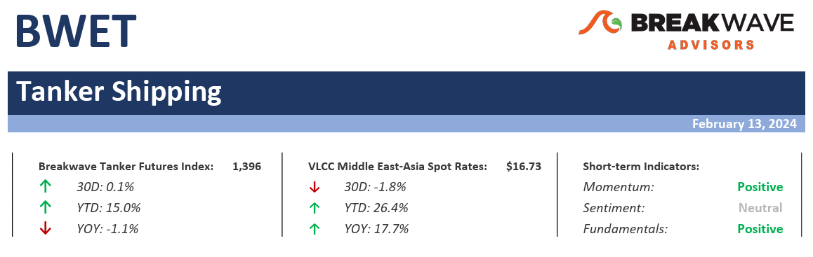
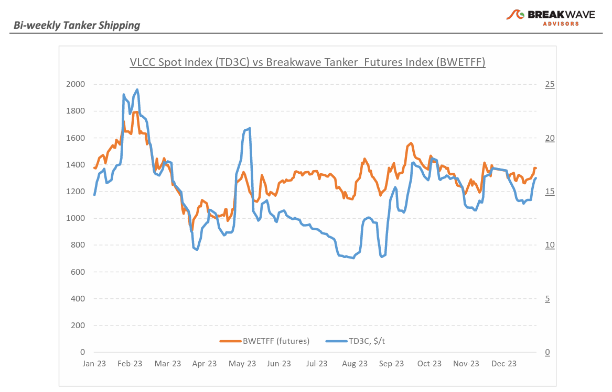
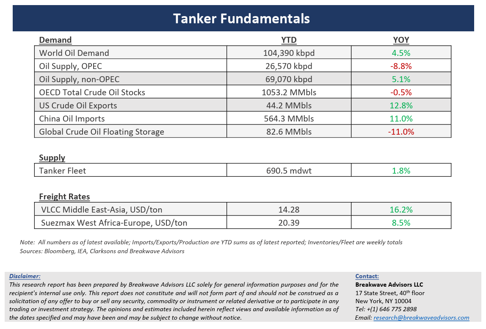

# Breakwave Bi-Weekly Tanker Report - February 13, 2024

**Date:** February 13, 2024  
**Publisher:** Breakwave Advisors | **Category:** Market Insights  
**Original URL:** [https://www.breakwaveadvisors.com/insights/2024213wet](https://www.breakwaveadvisors.com/insights/2024213wet)  

---

> **Figure 1: Tankerreporttop**  
> [Local Asset](file:///C:/Users/Dell/Github/Shipping/corpus/03-breakwave/insights/2024/assets/2024-02-13_2024213wet_img_tankerreporttop_c4697fb27c3a.png)

**·****VLCC market comes to life amid Lunar New Year rush and heightened geopolitical tensions –**Following an uneventful conclusion to January loadings, the**VLCC**(Very Large Crude Carrier) market displayed**stronger indications**across global regions in the second week of February as Charterers rushed to secure shipments**ahead of the Lunar New Year**, prompting a resurgence in rates. With a reduction in tonnage supply, particularly for earlier cargoes, owners found themselves in a favorable position to capitalize on the tighter conditions. Notably, the market exhibited**an uptick in the Middle East Gulf to China route**, where rates surged by 25% compared to the same period last year. Meanwhile, rates in the West Africa – China route also displayed resilience, although they have yet to reach peak levels seen in mid-November.**Expectations**are for**further gains**as the month progresses, and futures traders have already priced-in such a scenario. Although oil exports remain constrained due to the ongoing OPEC+ production cuts, the fact that the**crude tanker market is indeed thinly balanced**is evident by the current strength despite the relatively low trade flows. Any further increase in oil exports due to a stronger global economy, and rates can propel much higher. We**remain optimistic for the near-term**progression of spot VLCC rates as both vessel position and remaining cargoes should at least support-if not strengthen- spot rates for the remainder of the month, especially with US Gulf exports to Asia making a strong comeback on a route that adds considerably to trade in terms of tonne-mile demand.

**·****Crude oil demand remains resilient with Asia leading the charge**– Broader Asia remains by far the main driver for oil demand growth and January was a strong month with**China estimated to be up almost 10%****in terms of imports**versus last year. Moreover, based on recent air traffic numbers,**Chinese****jet fuel demand should post a strong recovery**coming from the Lunar New Year travel, something we expect to see when final February numbers are reported. However, the western hemisphere offsets most of such increases as transportation fuel demand growth has waned putting upward pressure on oil inventories.**Oil prices continue to trade in a relatively wide range**, reflecting on one hand the bearish sentiment due to fundamental factors (domestic oil inventories, Developed Market demand) and the geopolitical risk premium on the other hand, with Red Sea attacks on commercial shipping continuing to unnerve oil traders and a broader Middle East conflict remaining a distant, but not impossible, scenario.**Muted expectations for global economic growth**also continue to put a lid on oil demand forecasts, although real time data points to continuing economic strength despite all the headwinds cited by economists.

**·****Our long-term view –**The tanker market is recovering from a long period of staggered rates as the growth in new vessel supply shrinks while oil demand is recovering in line with the global economy. A historically low orderbook combined with favorable demand fundamentals should continue to support increased spot rate volatility, which combined with the ongoing geopolitical turmoil, should support freight rates in the medium to long term.

> **Figure 2: Tankerreportchart**  
> [Local Asset](file:///C:/Users/Dell/Github/Shipping/corpus/03-breakwave/insights/2024/assets/2024-02-13_2024213wet_img_tankerreportchart_661e3ee23e04.png)

> **Figure 3: Tankerreportbottom**  
> [Local Asset](file:///C:/Users/Dell/Github/Shipping/corpus/03-breakwave/insights/2024/assets/2024-02-13_2024213wet_img_tankerreportbottom_523d8fd65de7.png)

### Subscribe:
