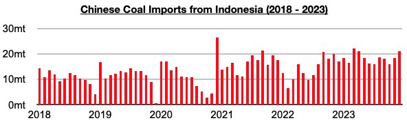
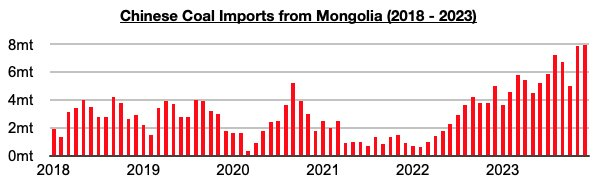
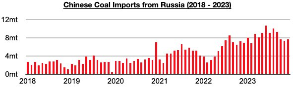
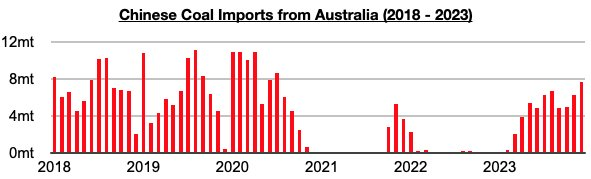

# China's Coal Imports From Mongolia Set Another Record in December

**Date:** February 13, 2024  
**Publisher:** Breakwave Advisors | **Category:** Market Insights  
**Original URL:** [https://www.breakwaveadvisors.com/insights/2024/2/12/chinas-coal-imports-from-mongolia-set-another-record-in-december](https://www.breakwaveadvisors.com/insights/2024/2/12/chinas-coal-imports-from-mongolia-set-another-record-in-december)  

---

*By*[*Jeffrey Landsberg*](https://www.linkedin.com/in/jeffrey-landsberg-70ab957/)

December saw coal imports from Indonesia total 21.1 million tons, which is up from November by 2.8 million tons (15%) and up year-on-year by 4 million tons (23%). This has also marked the largest amount imported since March.

> **Figure 1: 241**  
> [Local Asset](file:///C:/Users/Dell/Github/Shipping/corpus/03-breakwave/insights/2024/assets/2024-02-13_chinas-coal-imports-from-mongolia-set-another-record-in-december_img_241_7c20e7621505.jpg)

Imports from Mongolia totaled a record 8 million tons. This is up from November by 100,000 tons (1%) and up year-on-year by 3 million tons (60%). China’s coal imports from Mongolia have now set records for two straight months.

> **Figure 2: 242**  
> [Local Asset](file:///C:/Users/Dell/Github/Shipping/corpus/03-breakwave/insights/2024/assets/2024-02-13_chinas-coal-imports-from-mongolia-set-another-record-in-december_img_242_768a0752cc97.jpg)

Imports from Russia, China’s second largest source of coal imports during much of 2023, totaled 7.6 million tons. This is up from November by 300,000 tons (4%) and up year-on-year by 700,000 tons (10%). While Russia and Mongolia remain likely to continue to export a sizable amount of coal to China, there is a solid chance that Australia could soon return to its previous position of being China’s second largest source of coal imports (as was last seen in 2020 before China’s import ban was put into effect).

> **Figure 3: 243**  
> [Local Asset](file:///C:/Users/Dell/Github/Shipping/corpus/03-breakwave/insights/2024/assets/2024-02-13_chinas-coal-imports-from-mongolia-set-another-record-in-december_img_243_62cc19938472.jpg)

Imports from Australia totaled 6.7 million tons. This is up from November by 400,000 tons (6%) and up year-on-year by 6.7 million tons.

> **Figure 4: 244**  
> [Local Asset](file:///C:/Users/Dell/Github/Shipping/corpus/03-breakwave/insights/2024/assets/2024-02-13_chinas-coal-imports-from-mongolia-set-another-record-in-december_img_244_d99f6070cbef.jpg)

---

**Tags:** Coal, Drybulk, China  
