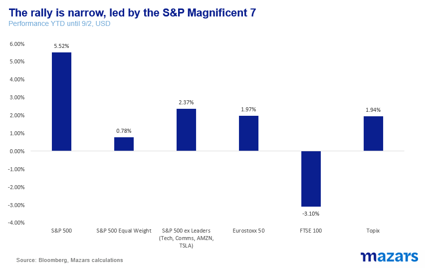
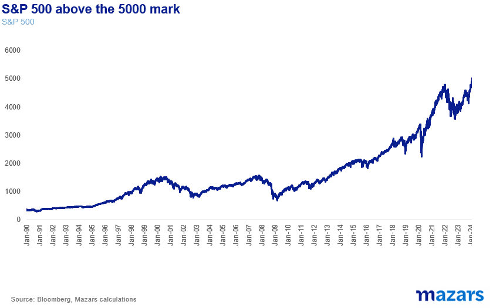
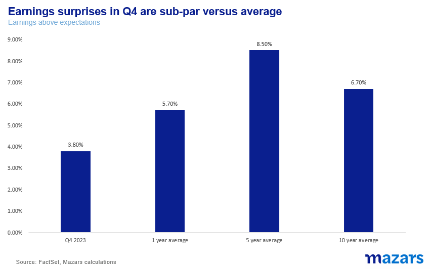
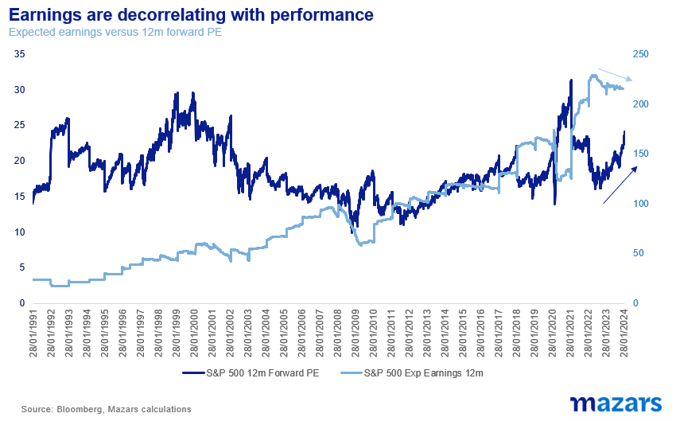
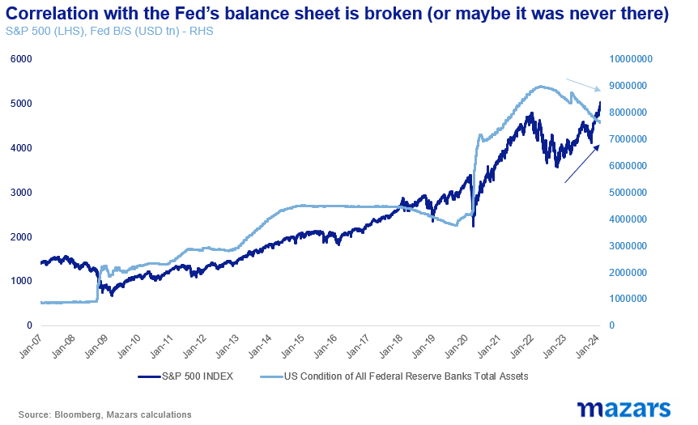
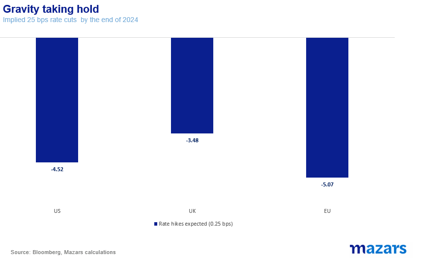
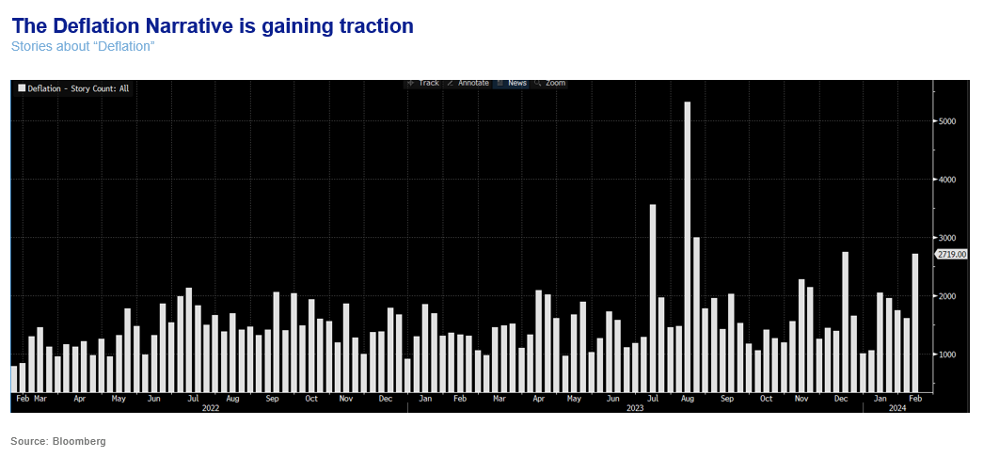
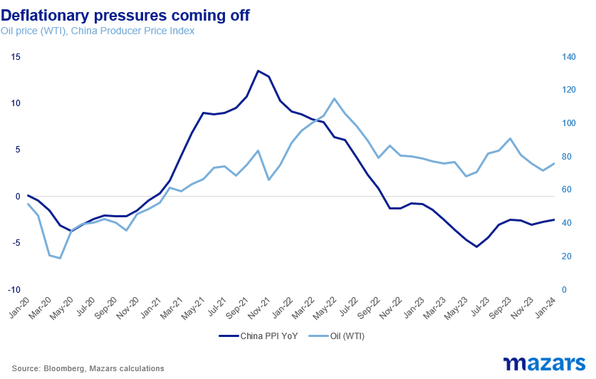
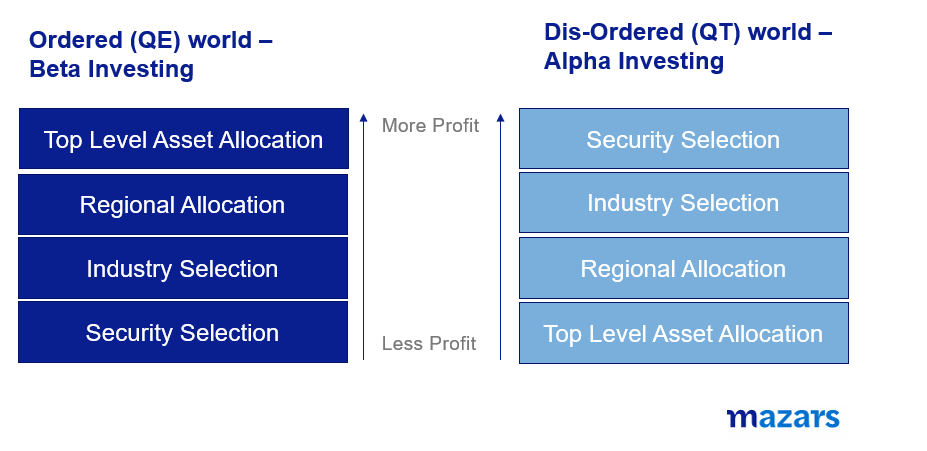

# The Bull Market has yet to show us its legs. Does it matter?

**Date:** February 13, 2024  
**Publisher:** Breakwave Advisors | **Category:** Market Insights  
**Original URL:** [https://www.breakwaveadvisors.com/insights/2024/2/12/the-bull-market-has-yet-to-show-us-its-legs-does-it-matter](https://www.breakwaveadvisors.com/insights/2024/2/12/the-bull-market-has-yet-to-show-us-its-legs-does-it-matter)  

---

### The Three Things Investors Need to Know This Week:

1. *US stocks hit an all-time high with the S&P 500 hitting 5000 points.*
2. *Yet, the rally still has to demonstrate legs. Leadership is narrow, earnings are barely supportive and the Fed has turned more hawkish. The deflation argument is picking up steam*
3. *For traders, it’s back to the age-old question: does one ride the wave, investing in what is popular, do they try to find value, or do they reduce risk exposure, acknowledging the headwinds against a sustainable bull market? But for asset allocators, things are much simpler. We can’t afford to ignore the bullishness, so we need to at least keep with our benchmarks in terms of risk exposure. As we have said so often, in this non-QE market, it will be security selection, industry focus and even geographical selection that will make a difference, more than top-line asset allocation.*

*By*[*George Lagarias*](https://www.linkedin.com/in/george-lagarias-mba-3baa769/)

The worst bull markets are by far the “quiet ones”. A period of time when the index rises little by little per day, without any major breakouts and in the absence of a clear narrative. The less investors are convinced, the more excuses why it can’t last, the more persistent the rally gets. This isn’t karma. It’s about flows. The more money stays on the sidelines, the more money will go into markets at higher valuations.

Last week the S&P 500 breached the 5,000 level for the first time. To be sure, the usual contra-arguments are there.

The rally is mostly led by the usual narrow band of stocks, the so-called Magnificent Seven (Alphabet, Amazon, Apple, Meta, Microsoft, Nvidia and Tesla). From these, it was really Meta’s decision to pay a dividend that spurred the latest leg of the rally.

Most indices, including the S&P 500 equally-weighted and the S&P 500 Ex Tech and Comms, are significantly lower than the headline index performance.

> **Figure 1: 241**  
> [Local Asset](file:///C:/Users/Dell/Github/Shipping/corpus/03-breakwave/insights/2024/assets/2024-02-13_the-bull-market-has-yet-to-show-us-its-legs-does-it-matter_img_241_03369a77ed1d.png)

When so few stocks have such a grip over an index, then we can’t really call the index rally a market rally as such. The winners are the index trackers and those who join the bandwagon of technology. The losers are those who expect the fundamentals to play out over the medium term.

**Yet, the market rallied. Bulls simply point to the resilience of the index.**

> **Figure 2: 242**  
> [Local Asset](file:///C:/Users/Dell/Github/Shipping/corpus/03-breakwave/insights/2024/assets/2024-02-13_the-bull-market-has-yet-to-show-us-its-legs-does-it-matter_img_242_8651730be4f8.png)

Earnings are not that supportive. S&P bottom-line earnings have grown a paltry 2.9% for the year to December. For Q4, companies are reporting earnings 3.8% above expectations, below their 1-year (5.7%), 5-year (8.5%) and 10-year average (6.7%), according to Factset. Not exactly the stuff of bull markets.

> **Figure 3: 243**  
> [Local Asset](file:///C:/Users/Dell/Github/Shipping/corpus/03-breakwave/insights/2024/assets/2024-02-13_the-bull-market-has-yet-to-show-us-its-legs-does-it-matter_img_243_a6fd307ba970.png)

Much like the Fed’s balance sheet, earnings growth has decoupled with market growth.

> **Figure 4: 244**  
> [Local Asset](file:///C:/Users/Dell/Github/Shipping/corpus/03-breakwave/insights/2024/assets/2024-02-13_the-bull-market-has-yet-to-show-us-its-legs-does-it-matter_img_244_cd61d0111eba.png)

**Yet, the market rallied. Bulls suggest that 2.9% is still better than 1.6% expected at the beginning of the earnings season. A diversified portfolio of energy, consumer discretionary and industrials lead the pack, not tech.**

The Fed isn’t supportive either. Last week was littered with statements from Fed officials singing a very similar tune: Inflation isn’t beat yet. “More evidence needed that inflation is cooling”, and “rate cuts are coming later in the year”. “Too soon to consider rate cuts”. The OECD’s outlook also suggested that, although inflation will eventually come down, it’s too soon to cry victory. And of course, the Fed has said very little about when it plans to stop quantitative tightening, which removes c $100bn per month from financial markets. The notion of quantitative tightening is not compatible with a sustainable bull market.

> **Figure 5: 245**  
> [Local Asset](file:///C:/Users/Dell/Github/Shipping/corpus/03-breakwave/insights/2024/assets/2024-02-13_the-bull-market-has-yet-to-show-us-its-legs-does-it-matter_img_245_e64059deae95.png)

As a result of the Fed’s hawkishness, rate cut expectations have been coming down. Bond markets are pricing in 4.5x 25bp rate cuts, down from nearly 7x in December.

> **Figure 6: 246**  
> [Local Asset](file:///C:/Users/Dell/Github/Shipping/corpus/03-breakwave/insights/2024/assets/2024-02-13_the-bull-market-has-yet-to-show-us-its-legs-does-it-matter_img_246_bd0a8f11e821.png)

Additionally, PMI services surveys suggest that input prices are rising and that employment conditions remain tight. And growth projections continue to improve. Both the IMF and the OECD, as well as Bloomberg surveys have all upgraded their forecasts on global and US growth. Growth can support inflation, and higher inflation does not help with rate cuts.

**Yet, the market rallied. Bulls are simply shrugging off the Fed’s comments, suggesting that hawkish talk is necessary to prevent a downward shift of the yield curve which would lower borrowing costs way ahead of when the Fed is comfortable with inflation. As for inflation, they point to deflation exported from China and lower energy prices.**

**The Deflation narrative has been picking up steam, to be sure. On some level, it makes even long-term sense, if consumers haven’t really broken from the 14-year paradigm of secular stagnation.**

> **Figure 7: 247**  
> [Local Asset](file:///C:/Users/Dell/Github/Shipping/corpus/03-breakwave/insights/2024/assets/2024-02-13_the-bull-market-has-yet-to-show-us-its-legs-does-it-matter_img_247_45c975f3f688.png)

> **Figure 8: 248**  
> [Local Asset](file:///C:/Users/Dell/Github/Shipping/corpus/03-breakwave/insights/2024/assets/2024-02-13_the-bull-market-has-yet-to-show-us-its-legs-does-it-matter_img_248_745979db7f6b.png)

But it’s not enough. When all is said and done, this bull market has yet to show us it has legs. Yet this doesn’t seem to matter. Markets are in a bullish mood and are likely to focus on the sunny side of every argument. Long-term fundamentals don’t apply for the medium and short term. Investors have been bullish since October when they realised that inflation was finally coming down, and bullishness has been breeding bullishness.

### What This Means for Portfolios

For traders, it’s back to the age-old question: does one ride the wave, investing in what is popular (remember, not all assets rally), do they try to find value, or do they reduce risk exposure, acknowledging the headwinds against a sustainable bull market?

But for asset allocators, things are much simpler. We can’t afford to ignore the bullishness, so we need to at least keep with our benchmarks in terms of risk exposure. We can’t take sides on the growth tech—value debate, simply because the tech side is driven purely by sentiment and wild speculation as to what Artificial Intelligence will be able to do (hint: we don’t know, any more than we knew how the internet was going to change the world in 1994). But in a market not run by fundamentals, what will the catalyst be for value to catch up to growth? So we need a balanced approach.

As we have said so often, in this non-QE market, it will be security selection, industry focus and even geographical selection that will make a difference, more than top-line asset allocation. Managers need to think in all four of those dimensions to position properly.

> **Figure 9: 249**  
> [Local Asset](file:///C:/Users/Dell/Github/Shipping/corpus/03-breakwave/insights/2024/assets/2024-02-13_the-bull-market-has-yet-to-show-us-its-legs-does-it-matter_img_249_c99fed19a973.png)

---

**Tags:** Economy, Markets  
