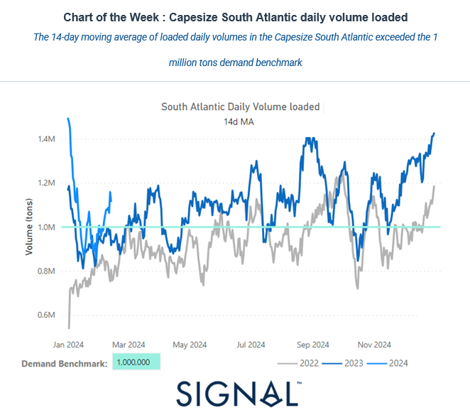
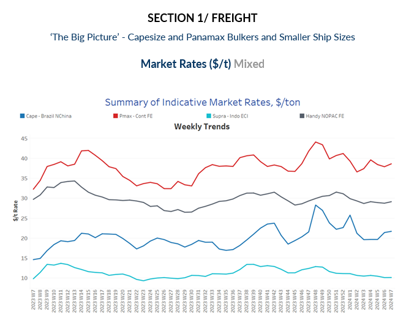
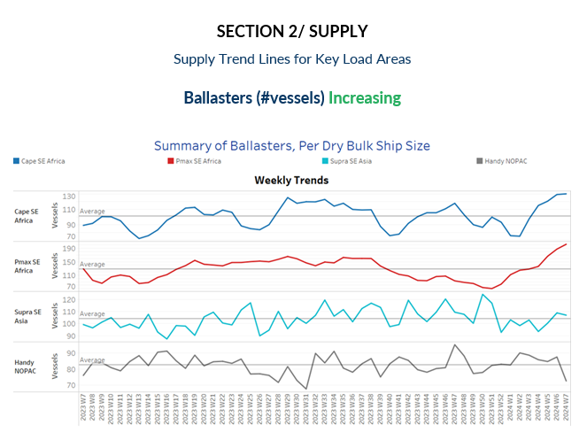
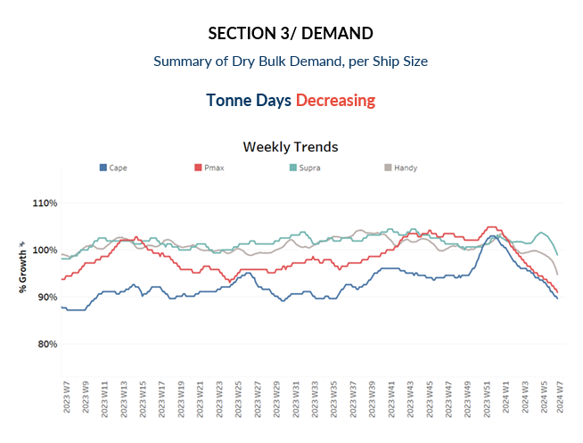
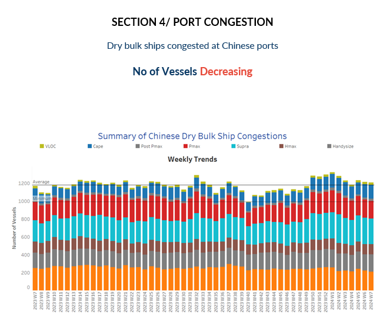

# Dry Weekly Market Monitor

**Date:** February 14, 2024  
**Publisher:** Breakwave Advisors | **Category:** Market Insights  
**Original URL:** [https://www.breakwaveadvisors.com/insights/2024/2/14/dry-weekly-market-monitor](https://www.breakwaveadvisors.com/insights/2024/2/14/dry-weekly-market-monitor)  

---

> **Figure 1: Screenshot 2024 02 14 18.22.20**  
> **Interactive Data & Source:** [Signal Ocean Platform](https://www.thesignalgroup.com/signal-ocean-platform) | [Local Asset](file:///C:/Users/Dell/Github/Shipping/corpus/03-breakwave/insights/2024/assets/2024-02-14_dry-weekly-market-monitor_img_screenshot2024-02-14182220_f81128284a3b.png)

In the third week of February, Capesize Brazil to North China rates experienced an upturn, surpassing the $20 per ton mark. However, with the Chinese Lunar New Year already celebrated, the sentiment regarding freight rates remains uncertain, leaving observers to wonder if there will be a softening in prices. Meanwhile, in terms of supply trends, there has been another week of excessive ballaster numbers recorded for Capesize and Panamax vessels in Southeast Asia. In addition, overall demand growth rates continue to show signs of decrease across all vessel size categories.

Interestingly, in the Capesize South Atlantic region, there has been a notable rebound in daily volume loaded. The 14-day moving average for February has eventually surpassed the demand benchmark of 1 million tonnes, marking a significant recovery from the lows recorded from mid-January to the end of the first month of the year.

> **Figure 2: Screenshot 2024 02 14 18.22.37**  
> **Interactive Data & Source:** [Signal Ocean Platform](https://www.thesignalgroup.com/signal-ocean-platform) | [Local Asset](file:///C:/Users/Dell/Github/Shipping/corpus/03-breakwave/insights/2024/assets/2024-02-14_dry-weekly-market-monitor_img_screenshot2024-02-14182237_2a27aabf2b56.png)

During the third week of February, the freight market has exhibited more robust indications in the Capesize Brazil to North China route, accompanied by emerging signs of an uptick in the Panamax Continent to the Far East route as well.

- **Capesize**vessel freight rates for shipments from Brazil to North China have surged to $22 per ton, marking a notable 10% monthly uptick. Despite this rise, current rates stand $5 per ton below the previous peak observed at the outset of January.
- **Panamax**vessel freight rates from the Continent to the Far East have maintained a level of approximately $39 per ton, marking an 18% increase compared to the rates recorded during the same week last year.
- **Supramax**vessel freight rates on the Indo-ECI route have experienced a downward trend, settling around $10 per tonne, marking a consistent decline since the beginning of the year.
- **Handysize**freight rates for the NOPAC Far East route have remained resilient, maintaining stability at approximately $29 per tonne since mid-January. Currently, there are no clear indications of an imminent upturn in rates.

> **Figure 3: Screenshot 2024 02 14 18.22.44**  
> **Interactive Data & Source:** [Signal Ocean Platform](https://www.thesignalgroup.com/signal-ocean-platform) | [Local Asset](file:///C:/Users/Dell/Github/Shipping/corpus/03-breakwave/insights/2024/assets/2024-02-14_dry-weekly-market-monitor_img_screenshot2024-02-14182244_ac829f743618.png)

The trend in terms of the number of ballast ships accelerated for Capesize and Panamax vessels in Southeast Africa for another week, indicating a sustained trend. Conversely, a downward trajectory is observed in the smaller vessel size categories for Handy vessels in the NOPAC region.

- **Capesize SE Africa**: The number of ballast ships has surged to a new peak, reaching 130 vessels. This represents a staggering 70% increase compared to the low recorded during the second week of January.
- **Panamax SE Africa**: During the third week of February, the number of ballast ships surged to 200, representing a stark contrast to the record low of 70 witnessed before the end of the previous year. While it appeared that the previous week had reached the pinnacle, this notable figure now establishes a new highest count observed in the past year.
- **Supramax SE Asia**: The number of ballast ships eventually surpassed this week the annual average of 100, with the last recorded low at the end of the year hovering around 93.
- **Handysize NOPAC:**The count of ballast ships decreased to 76, marking a drop of 14 compared to the previous week. Recent levels indicate a downward revision in ship counts.

> **Figure 4: Screenshot 2024 02 14 18.22.57**  
> **Interactive Data & Source:** [Signal Ocean Platform](https://www.thesignalgroup.com/signal-ocean-platform) | [Local Asset](file:///C:/Users/Dell/Github/Shipping/corpus/03-breakwave/insights/2024/assets/2024-02-14_dry-weekly-market-monitor_img_screenshot2024-02-14182257_2e39450af6c7.png)

In the third week of February, the ongoing trend mirrors that of the preceding days, with a continual decline observed in the growth of demand tonne days across all vessel size categories. Notably, the larger vessel size categories exhibit a sharper decrease in demand.

- **Capesize**: The decline has persisted steadily each week since the beginning of the year, and current levels have now fallen below the growth recorded in week 47 of the previous year.
- **Panamax**: The decline still mirrors the steep downward trend observed in the Capesize category as the previous week, with growth rates at the lowest in a year.
- **Supramax**: The current growth rate has dipped below the peak observed two weeks ago, with levels reaching their lowest point since the beginning of the year.
- **Handysize**: The growth rate of smaller vessel sizes has displayed weakness over the past four weeks, reaching its lowest point in over a year.

> **Figure 5: Screenshot 2024 02 14 18.23.16**  
> **Interactive Data & Source:** [Signal Ocean Platform](https://www.thesignalgroup.com/signal-ocean-platform) | [Local Asset](file:///C:/Users/Dell/Github/Shipping/corpus/03-breakwave/insights/2024/assets/2024-02-14_dry-weekly-market-monitor_img_screenshot2024-02-14182316_f66cae3e25fa.png)

In the third week of February, there appears to be a correction in the upward trend that commenced at the beginning of the month, primarily attributed to the Supramax size category.

- **Capesize**: Capesize congestion levels have surged past the 150 mark, indicating a persistent rise over the past three weeks.
- **Panamax**: In the case of Panamax vessels, despite initial indications of surpassing the 200 mark, recent levels have been revised downward to lower numbers. This contrasts with the highs around 220 recorded three weeks ago.
- **Supramax**: Congestion has declined to about 286 affected ships, surpassing expectations that it would reach highs around 300. However, it remains uncertain whether this trend will persist in the near future.
- **Handysize**: Congestion has persisted in escalating for a third consecutive week, with levels hovering above 190—almost 10 more than the previous week. It still remains to be seen whether congestion will surpass the 200 mark for February.

Data Source:[Signal Ocean Platform](https://www.thesignalgroup.com/signal-ocean-platform)

---

**Tags:** Drybulk, Shipping, Freightrates  
