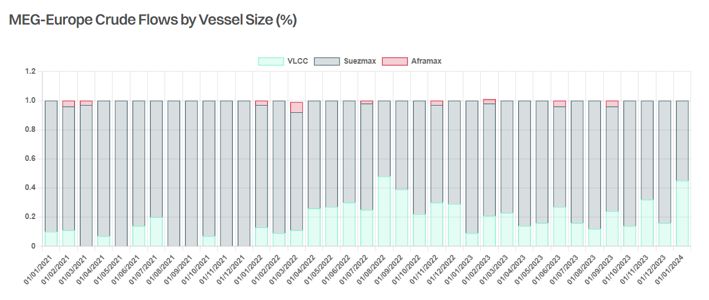

# Red Sea – Key Tanker Flows

**Date:** February 14, 2024  
**Publisher:** Breakwave Advisors | **Category:** Market Insights  
**Original URL:** [https://www.breakwaveadvisors.com/insights/2024/2/14/red-sea-key-tanker-flows](https://www.breakwaveadvisors.com/insights/2024/2/14/red-sea-key-tanker-flows)  

---

> **Figure 1: Gibson Report 3**  
> **Interactive Data & Source:** [Gibsons Co](https://www.gibsons.co.uk/market-reports) | [Local Asset](file:///C:/Users/Dell/Github/Shipping/corpus/03-breakwave/insights/2024/assets/2024-02-14_red-sea-key-tanker-flows_img_gibsonreport3_62842be147f5.jpg)

Hopes of a temporary ceasefire between Israel and Hamas, which potentially could help to improve the security situation in the Red Sea have been dashed in recent days, with further attacks reported on commercial vessels and Israel rejecting Hamas’s proposed ceasefire terms. As of now, there is very little change to tanker traffic transiting through the Red Sea compared to two weeks ago. Vessels with significant recent Russian trading history continue to transit en masse, both laden and in ballast, seemingly unaffected by escalating tensions and despite three attacks on vessels with connections to Russia (or Russian cargo). The majority of conventional tonnage continues to reroute via the Cape of Good Hope (COGH).

Perhaps the biggest tanker flow impacted by the Houthi attacks is the Middle East Gulf (MEG)/India clean products trade to Europe, which averaged circa 955kbd last year, but fell to just 690kbd in January, according to preliminary AIS data. Yet, despite lower volumes, we have seen a stunning spike in clean tanker rates, as most vessels opted for a safer COGH routing. Out of 19 LR2s, 13 LR1s and 4 MRs that loaded in January, 12 LR2s, 10 LR1s and 4 MRs routed via Cape. Furthermore, the drop in shipments to Europe was more than offset by increases in exports elsewhere, whilst the lack of LR ballasters from the West also contributed to extreme tightness in tonnage availability.

Another key tanker flow that traditionally relies on Suez transit is the crude trade from the MEG into Europe, which averaged 865kbd in January, down modestly from 910kbd in 2023 (but surprisingly up compared to shipments in Nov/Dec 2023). Out of 15 Suezmaxes and 8 VLCCs that loaded crude in the MEG in January for delivery into Europe, 10 Suezmaxes and 6 VLCCs opted for a COGH routing. In addition, circa 445kbd was exported from the MEG into Ain Sukhna on average last year, with the vast majority of these barrels destined for the European market. This trade collapsed to just 30kbd in January; however, it is too early to draw conclusions as monthly exports are often volatile, whilst there also was an increase in shipments into Ain Sukhna from West Coast Saudi Arabia in the Red Sea.

With most crude tankers avoiding the Red Sea, it is perhaps surprising that we haven’t seen the same response as in the clean market. This is particularly the case for Suezmaxes that dominate the MEG to Europe trade. There are several reasons for this. Firstly, although the affected volumes are broadly similar, bigger cargo sizes mean less tankers. Secondly, fleet size also matters. Whilst the Suezmax and VLCC fleet is over 660 and 900 units each, there are currently circa 250 LR2s and 260 LR1s trading clean, with the rest operating in the dirty segment. In addition, there is also a clear shift away from Suezmaxes, which accounted for 80% of all crude moved from the MEG to Europe last year but just 55% in January.

Yet, despite the muted response in the crude tanker market so far, if the current situation continues for any significant period of time, the impact of COGH routing will accumulate, offering support to tanker rates. Also, it will be interesting to see how many Mediterranean and CPC Kazakhstan barrels will continue flowing East, with shipments (mainly consisting of CPC and Libyan barrels) averaging 560kbd last year. Unless there is a dramatic decline in these volumes, GOGH routing will offer another boost to crude tanker tonne miles.

> **Figure 2: Screenshot 2024 02 14 11.41.14**  
> **Interactive Data & Source:** [Gibsons Co](https://www.gibsons.co.uk/market-reports) | [Local Asset](file:///C:/Users/Dell/Github/Shipping/corpus/03-breakwave/insights/2024/assets/2024-02-14_red-sea-key-tanker-flows_img_screenshot2024-02-14114114_01409556f503.png)

Data source:[Gibson Shipbrokers](https://www.gibsons.co.uk/market-reports)

---

**Tags:** Shipping, Tankers, Redsea  
