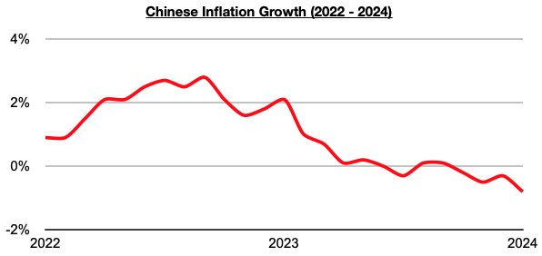
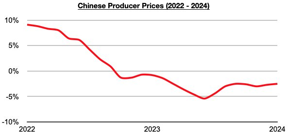
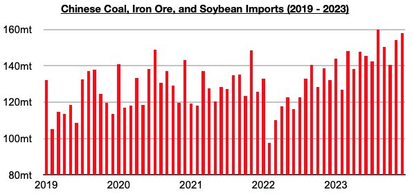
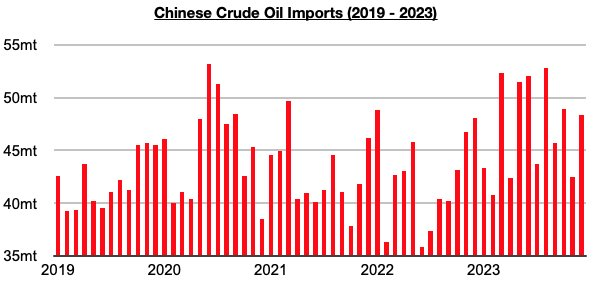

# China's Deflation Not Rooted on Consumer Side

**Date:** February 15, 2024  
**Publisher:** Breakwave Advisors | **Category:** Market Insights  
**Original URL:** [https://www.breakwaveadvisors.com/insights/2024/2/15/chinas-deflation-not-rooted-on-consumer-side](https://www.breakwaveadvisors.com/insights/2024/2/15/chinas-deflation-not-rooted-on-consumer-side)  

---

*By*[*Jeffrey Landsberg*](https://www.linkedin.com/in/jeffrey-landsberg-70ab957/)

While China’s retail sales data is still pending for January, of note is that inflation officially contracted year-on-year by 0.8%. China’s inflation has now contracted on a year-on-year basis during each of the last four months, with last month experiencing the largest contraction since 2009.

> **Figure 1: 241**  
> [Local Asset](file:///C:/Users/Dell/Github/Shipping/corpus/03-breakwave/insights/2024/assets/2024-02-15_chinas-deflation-not-rooted-on-consumer-side_img_241_faa247361601.jpg)

Remaining significant to us — and still not being widely reported — is that the weakness in Chinese inflation remains entirely rooted in producer prices, which commodity prices play a large part of. Consumer prices remain up on a year-on-year basis, and there is still no overall contraction on the consumer side in China. Producer prices in China most recently contracted year-on-year by 2.5% in January, and ongoing growth in consumer prices has continued to allow the nation’s overall inflation to at least remain in a relatively mild year-on-year contraction that is still above the -1% mark.

> **Figure 2: 242**  
> [Local Asset](file:///C:/Users/Dell/Github/Shipping/corpus/03-breakwave/insights/2024/assets/2024-02-15_chinas-deflation-not-rooted-on-consumer-side_img_242_8d166ec407ad.jpg)

Overall, not all is perfect in China, but the consumer side and retail spending continues to experience strength. It is producer prices — including commodity prices — that continue to cause deflation. As we have continued to stress in Commodore Research's Weekly Dry Bulk Reports and Weekly China Reports, though, China is of course the world’s largest consumer and importer of commodities and very significantly continues to benefit from any weakness in global commodity prices. China's commodity imports have continued to grow, and our analysts still see no sign that this strength will suddenly reverse. This continues to be analyzed for our clients in our weekly reports.

China's major dry bulk imports last year came in at record levels and grew year-on-year by 265 million tons (18%).

> **Figure 3: 243**  
> [Local Asset](file:///C:/Users/Dell/Github/Shipping/corpus/03-breakwave/insights/2024/assets/2024-02-15_chinas-deflation-not-rooted-on-consumer-side_img_243_caaaa637b4a7.jpg)

China's crude oil imports also came in at record levels last year and grew year-on-year by 56 million tons (11%).

> **Figure 4: 244**  
> [Local Asset](file:///C:/Users/Dell/Github/Shipping/corpus/03-breakwave/insights/2024/assets/2024-02-15_chinas-deflation-not-rooted-on-consumer-side_img_244_0f866e2be9da.jpg)

---

**Tags:** China, Economy, Commodities  
