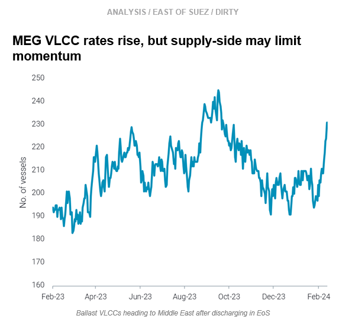
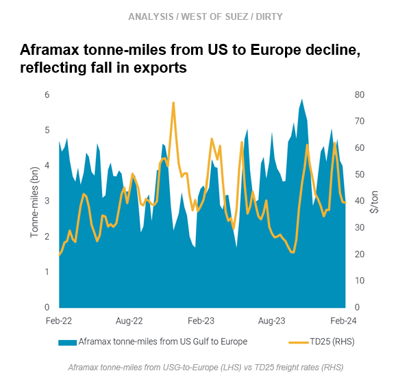

# MEG VLCC rates rise || USG Aframax demand declines

**Date:** February 15, 2024  
**Publisher:** Breakwave Advisors | **Category:** Market Insights  
**Original URL:** [https://www.breakwaveadvisors.com/insights/2024/2/15/meg-vlcc-rates-rise-usg-aframax-demand-declines](https://www.breakwaveadvisors.com/insights/2024/2/15/meg-vlcc-rates-rise-usg-aframax-demand-declines)  

---

**This week, in the East, we discuss rising VLCC rates in the Middle East. In the West, we look at cooling Aframax demand in the US Gulf.**

*By*[*Mary Melton*](https://www.linkedin.com/search/results/all/?fetchDeterministicClustersOnly=true&heroEntityKey=urn%3Ali%3Afsd_profile%3AACoAABXVyecBtg-pRnIrZe0BoWk0ygPiUfbvhsw&keywords=mary%20melton&origin=RICH_QUERY_SUGGESTION&position=0&searchId=40e8d7d2-c4d0-4022-81e7-176f6eba418b&sid=H_Y&spellCorrectionEnabled=false)

> **Figure 1: Screenshot 2024 02 15 13.08.12**  
> **Interactive Data & Source:** [Marketingmail Vortexa](https://marketingmail.vortexa.com/ODM3LU1aRS01NzgAAAGRR5v6qddXLFUg50r70__nVQNFvVcM7sjFPQ_JMQIQdHLswPUKZCNyHWicnpO2HTNe05YGCFw=) | [Local Asset](file:///C:/Users/Dell/Github/Shipping/corpus/03-breakwave/insights/2024/assets/2024-02-15_meg-vlcc-rates-rise-usg-aframax-demand-declines_img_screenshot2024-02-15130812_bcc2b8f44167.png)

- VLCC freight rates Middle East-to-China ([TD3C](https://marketingmail.vortexa.com/ODM3LU1aRS01NzgAAAGRR5v6qddXLFUg50r70__nVQNFvVcM7sjFPQ_JMQIQdHLswPUKZCNyHWicnpO2HTNe05YGCFw=)) have increased about 20% in the last two weeks. This follows Saudi Arabia’s decision to not increase March OSPs, which could be interpreted as Saudi Arabia trying to gain back lost market share in the NE Asia market from Russian and Atlantic Basin crudes (Argus).

- However, global VLCC ballast mileage was significantly lower in January, suggesting VLCCs were ballasting to the MEG after discharging in the East instead of going to the Atlantic Basin. This trend appears to be continuing in February, as the number of[ballasters heading to the MEG after discharging EoS](https://marketingmail.vortexa.com/ODM3LU1aRS01NzgAAAGRR5v6qtZppFaf9J0ghPSXo0ZRvn2r0672q76H8Xp0Lkn5RYqWwCoLwdLCcDQau8sSB6H8RoM=)is continuing to increase, approaching 4-month highs.
- The crude market is tight despite low demand: ongoing OPEC cuts have drastically reduced[onshore crude tank utilisation](https://marketingmail.vortexa.com/ODM3LU1aRS01NzgAAAGRR5v6ql_5_omS0YaG_bNcmi1q2OG4L-RiHWxC5uBNcZrkSTwaeY8aKgKfCrNWI2cxkfCFijw=), and January’s global seaborne crude exports were well below seasonal averages. These factors point to increased crude demand in the medium-term, but in the short-term vessel supply-side factors will likely cap significant upward momentum in VLCC rates in the Middle East.

> **Figure 2: Screenshot 2024 02 15 13.08.26**  
> **Interactive Data & Source:** [Marketingmail Vortexa](https://marketingmail.vortexa.com/ODM3LU1aRS01NzgAAAGRR5v6qqPV2A1Xx9GD3zNFJpQx24U6u5GAN6yiwQMri1Gs1p04jDD9_HzQcGfC_k6zRz1Xul0=) | [Local Asset](file:///C:/Users/Dell/Github/Shipping/corpus/03-breakwave/insights/2024/assets/2024-02-15_meg-vlcc-rates-rise-usg-aframax-demand-declines_img_screenshot2024-02-15130826_18916719f646.png)

- [US crude exports to Europe](https://marketingmail.vortexa.com/ODM3LU1aRS01NzgAAAGRR5v6qqPV2A1Xx9GD3zNFJpQx24U6u5GAN6yiwQMri1Gs1p04jDD9_HzQcGfC_k6zRz1Xul0=)increased in December due to tax implications from end-of-year crude in storage, which[increased Aframax tonne-mile demand](https://marketingmail.vortexa.com/ODM3LU1aRS01NzgAAAGRR5v6qotasJLaidQwvadquyRyiH6GyIvfsXkWnaNqmX-76WlTdoHE3Jyne-BDlmvQPkKawu0=)for Aframaxes in late December and into the first half of January. This has now cooled off from H2 of January onwards, and freight rates USG-to-Europe ([TD25](https://marketingmail.vortexa.com/ODM3LU1aRS01NzgAAAGRR5v6qcFivLjgGxt7eRABte0pN2BsTdBGSDQYEXyk0TpO-LYcwbSaps7Bii79VXQK03eND6I=)) have declined about 25% over the same period.

- The decline in TD25 also comes from supply-side factors. USG[prompt tonnage](https://marketingmail.vortexa.com/ODM3LU1aRS01NzgAAAGRR5v6qfYJIzrPUDW5pV3hz0gCTGhFQFlbI-hU8nmnCdUpo8SvdsXw82arRk70uQDDtDVJTvI=)increased in H2 January, with an influx of available vessels after the cold weather events at the same time as a decline in longer-haul departures to Europe.
- Moving forward, signs for continued European demand for US crude are evident. Our data indicates NW Europe’s refineries continue to run at high rates, with relatively high crude imports and crude inventories at low levels. Additionally, with continued Red Sea disruption, Europe could rely on the US to replace volumes from the MEG, which coincides with the US refinery maintenance season and more crude free for export.

Data Source:[Vortexa](https://www.vortexa.com//oil-gas-data-traders-analysts-data-scientists?gclid=Cj0KCQjw8_qRBhCXARIsAE2AtRZKOvMnbilZ_6_91d7huSFFy71pWLrnPwGwOHVzXsmsG-1a1mZnQw8aAt89EALw_wcB&hsa_acc=1782073842&hsa_ad=548425387665&hsa_cam=14746637662&hsa_grp=125038601902&hsa_kw=&hsa_mt=&hsa_net=adwords&hsa_src=g&hsa_tgt=dsa-1431852288425&hsa_ver=3&utm_campaign=%5BCD%5D%20-%20DSA%20-%20EMEA&utm_medium=cpc&utm_medium=ppc&utm_source=google&utm_source=adwords&utm_term=)

---

**Tags:** Tankers, Crude, Oil  
