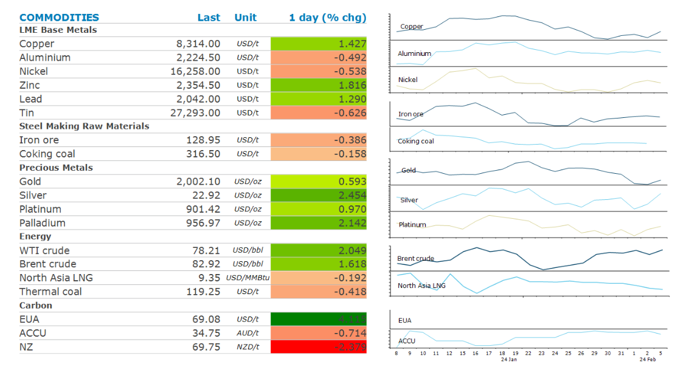

# Oil shrugs off bearish IEA comments to push higher

**Date:** February 16, 2024  
**Publisher:** Breakwave Advisors | **Category:** Market Insights  
**Original URL:** [https://www.breakwaveadvisors.com/insights/2024/2/16/oil-shrugs-off-bearish-iea-comments-to-push-higher](https://www.breakwaveadvisors.com/insights/2024/2/16/oil-shrugs-off-bearish-iea-comments-to-push-higher)  

---

**A risk-on tone across markets saw commodities push higher. This was aided by short covering in some markets.**

*By*[*Daniel Hynes*](https://www.linkedin.com/in/dahynes/)

> **Figure 1: Screenshot 2024 02 16 12.09.08**  
> [Local Asset](file:///C:/Users/Dell/Github/Shipping/corpus/03-breakwave/insights/2024/assets/2024-02-16_oil-shrugs-off-bearish-iea-comments-to-push-higher_img_screenshot2024-02-16120908_a2ccf75300ee.png)

**Crude oil**was down in early trade after the International Energy Agency painted a gloomy picture for demand. It said growth in world consumption had slowed by about 35% in Q4 2023 amid a deceleration in China. It stuck to its 2024 demand growth forecast of 1.2mb/d and projects the market will be in surplus this year. Nevertheless, improved risk-on sentiment across broader markets saw investors return to crude oil, ending the session higher. Tensions in the Middle East remain elevated, with Hezbollah strikes at Israel raising concerns over a wider war. However, this is being[**offset by OPEC spare capacity**](../pdfs/2024-02-16_oil-shrugs-off-bearish-iea-comments-to-push-higher_commodity-call-oil-risks-subdued_6d7e827ed972.pdf), which has hit its highest level (outside of the pandemic-induced adjustments) in eight years and is acting as a safeguard against rising concerns of supply disruption. While there are two major conflicts currently involving producers that control over 13% of world supply, OPEC would cover most levels of disruption with 6.4mb/d of spare capacity at its disposal. Nevertheless, we see the market largely balanced in the current quarter and expect fundamentals to improve as demand recovers which should see prices push higher.

**European gas**prices halted their recent slide lower after disruptions to Norwegian gas emerged. Capacity reductions at the Kollsnes processing plant deepened due to processing plants. Nevertheless, the gains are likely to be short lived, with mild weather and high inventories likely to weigh on sentiment in coming weeks.**North Asia LNG**spot prices tracked European markets higher. Lower prices are also attracting opportunistic buying by some consumers.

**Gold**pushed back above USD2,000/oz after mixed US economic data raised the prospect of rate cuts. US retail sales came in softer-than-expected leading traders to prices in more monetary easing, a tailwind for gold which doesn’t pay interest.

**Copper**led the**base metals**sector higher as growing expectations of tightness triggered a short covering rally. The metal has been under pressure in recent weeks amid a slowdown in China and strong economic conditions in the US helping keep interest rate higher for longer. However, production cuts at various producers are now expected to tighten the market significantly. This is also manifesting itself in China, where a tight concentrate market, is forcing Chinese smelters to reduce output.**Nickel**was relatively unchanged as the market contemplates the impact of recent supply side issues. Glencore announced earlier this week that it plans to mothball its loss-making Koniambo nickel operation in New Caledonia. BHP also announced it had taken a USD2.5bn impairment on the value of its Australian nickel assets and was reviewing their ongoing operation.

**Iron ore**future edged higher in Singapore despite supply side issues subsiding. BHP train drivers called off strike action after reaching agreement on pay and conditions.

Data source:[Commodities Wrap](https://www.linkedin.com/newsletters/commodities-wrap-6692196755876012032/?fbclid=IwAR3kiXJqZdxmp9ZcRwBNI7FsBySI-XSC0pfPur1qzjt7OZp7PTE59Tsl1QI)

---

**Tags:** Commodities, Crude, Ironore  
