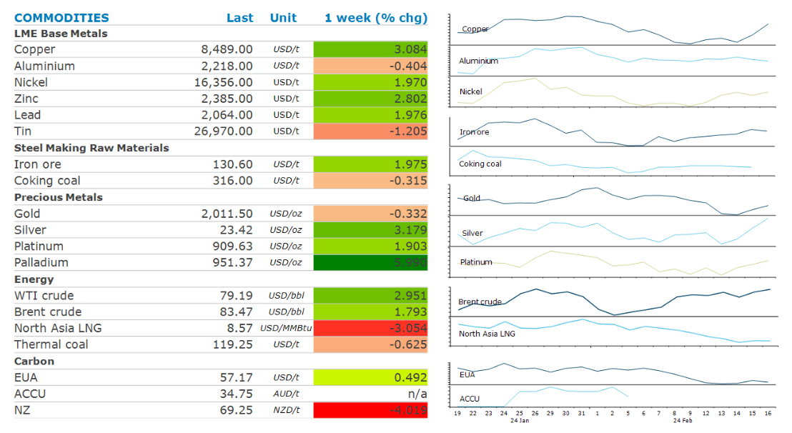

# Oil gains as tensions escalate in the Middle East

**Date:** February 19, 2024  
**Publisher:** Breakwave Advisors | **Category:** Market Insights  
**Original URL:** [https://www.breakwaveadvisors.com/insights/2024/2/19/oil-gains-as-tensions-escalate-in-the-middle-east](https://www.breakwaveadvisors.com/insights/2024/2/19/oil-gains-as-tensions-escalate-in-the-middle-east)  

---

**Optimism of stronger demand from China boosted sentiment in the metals sector. Rising geopolitical risks saw energy markets gain.**

*By*[*Daniel Hynes*](https://www.linkedin.com/in/dahynes/)

> **Figure 1: Screenshot 2024 02 19 13.11.44**  
> **Interactive Data & Source:** [Publications Anz](https://publications.anz.com/SingletrackCMS__DownloadDocument?docRef=c1d0a0ae-6e18-49b8-8b53-c4b19dcde9aa&uid=bd219b92-f5cc-400e-9646-4178791864b7&jobRef=c2bb98b2-4fca-4c07-a641-7b956bdcc9ea) | [Local Asset](file:///C:/Users/Dell/Github/Shipping/corpus/03-breakwave/insights/2024/assets/2024-02-19_oil-gains-as-tensions-escalate-in-the-middle-east_img_screenshot2024-02-19131144_a94c3fb3c0dc.png)

**Crude oil**ended the week higher, supported by rising tensions in the Middle East. The leader of Hezbollah, the Iran-backed militant group said it would escalate its fight against Israel amid increasing attacks between the two sides over recent weeks. However, the gains were limited due to the high levels of[**OPEC spare capacity**](https://publications.anz.com/SingletrackCMS__DownloadDocument?docRef=c1d0a0ae-6e18-49b8-8b53-c4b19dcde9aa&uid=bd219b92-f5cc-400e-9646-4178791864b7&jobRef=c2bb98b2-4fca-4c07-a641-7b956bdcc9ea), which has hit its highest level (outside of the pandemic-induced adjustments) in eight years. OPEC would cover most levels of disruption with 6.4mb/d of spare capacity at its disposal. The market was also reminded of the uncertain outlook for demand, with the International Energy Agency warning that growth is expected to lose its steam in 2024. Its subsequently forecasting the market to be in a surplus all year. This was in stark contrast to OPEC, who see more robust consumption amid ongoing supply constraints to support prices in its monthly oil market report. Prices also found some support from data showing that Russia had almost reached its target for voluntary supply reductions for the first time since making the pledge last year.

**Global gas**prices fell sharply last week amid weakening fundamentals. European gas plunged early in the week after weather forecasts predicted mild weather over the next two weeks. This comes amid high inventories, with storage sites in the region over 66% full.**North Asia LNG**spot prices tracked European markets lower. However, data showing India’s LNG consumption was up 14% y/y in January limited the losses.

**Gold**recorded its second straight weekly loss as expectations of an imminent rate cut by the Fed faded. Sticky inflation is unlikely to force the Fed to ease monetary policy, despite recent weak economic data.**Platinum group metals**bucked the trend to move higher amid improving fundamentals. Constrained mine supply has been a theme for platinum since 2022 and[**is likely to continue**](https://publications.anz.com/SingletrackCMS__DownloadDocument?docRef=70091883-d32e-4dc0-b29f-9ba0319460da&uid=bd219b92-f5cc-400e-9646-4178791864b7&jobRef=c2bb98b2-4fca-4c07-a641-7b956bdcc9ea). In addition, strong auto sales and higher loadings to reduce emissions, is benefiting platinum demand. The growing hydrogen economy as a demand source is garnering much excitement.

**Copper**recorded its biggest weekly gain in months as expectations of stronger demand in China rose. Construction activity should rise in coming weeks as the seasonal winter lull draws to an end. Chinese markets reopen today following the week-long Lunar New Year holidays. Stronger consumption will be met by tight supplies, following a series of mine closures late last year. This has already seen smelter processing fees fall sharply in China.**Nickel**prices gained amid supply tightness. Six nickel facilities in Australia have reduced operations or closed over the past two months because of the collapse in nickel prices. This has also seen the Australian government place the metal on its critical mineral list, which provides financing and grants.

Data source:[Commodities Wrap](https://www.linkedin.com/newsletters/commodities-wrap-6692196755876012032/?fbclid=IwAR3kiXJqZdxmp9ZcRwBNI7FsBySI-XSC0pfPur1qzjt7OZp7PTE59Tsl1QI)

---

**Tags:** Commodities, Crude, Oil  
