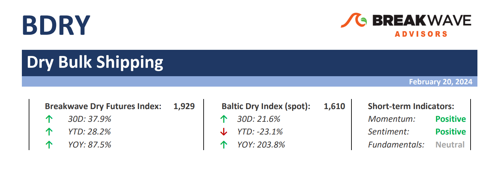
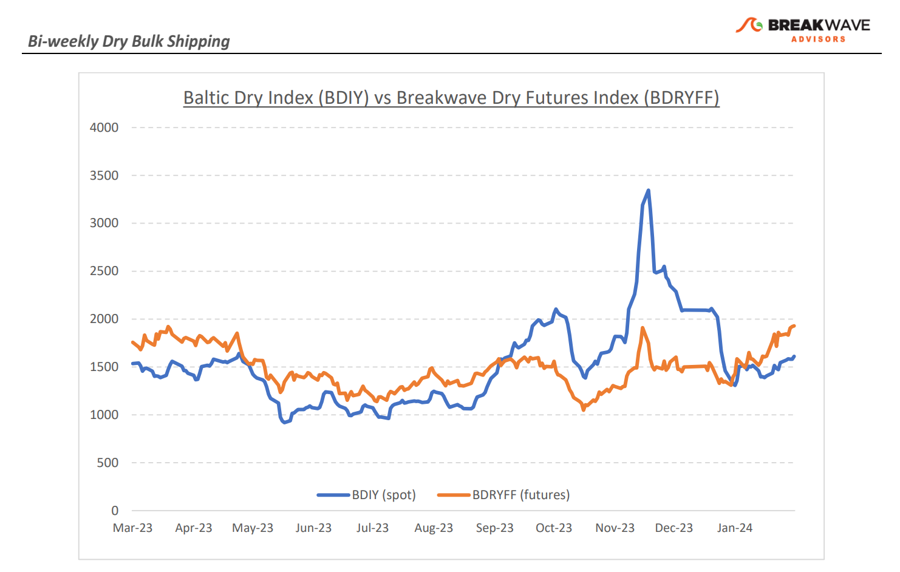
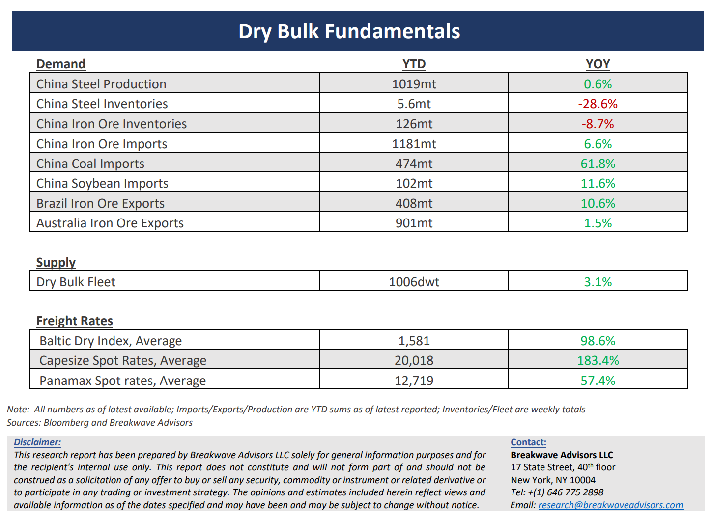

# Breakwave Bi-Weekly Dry Bulk Report - February 20, 2024

**Date:** February 20, 2024  
**Publisher:** Breakwave Advisors | **Category:** Market Insights  
**Original URL:** [https://www.breakwaveadvisors.com/insights/2024220dry](https://www.breakwaveadvisors.com/insights/2024220dry)  

---

> **Figure 1: Dryreporttop**  
> [Local Asset](file:///C:/Users/Dell/Github/Shipping/corpus/03-breakwave/insights/2024/assets/2024-02-20_2024220dry_img_dryreporttop_ef52b1616365.png)

**·****Best February for Capesizes in 15 years raises hopes for a solid full year –**A confluence of events around the globe has once again demonstrated the significant volatility, but also upside potential, the dry bulk has to offer, with a current outlook pointing to one of**the best years in recent memory**. Freight futures clearly demonstrate such optimism, with the 9-month forward curve for**Capesizes now north of 24,000**. The argument for such positivity is simple: If the worst month of the year (February) manages to average 20,000 for Capesizes, the rest of the year should clearly be priced higher. The above relatively simplistic argument is also**fundamentally supported**by several events, including**transit disruptions**due to the now well-known issues in the**two main Canals (Suez and Panama),**tightening vessel availability mainly in the Atlantic basin but also providing considerable**psychological optimism**to owners. Although bulk demand has so far not shown any signs of strength, with Chinese growth still at best moderate,**supply constraints**have been enough to tighten the market balance. There is no reason to doubt the current argument for a particularly strong year, and it will take a considerable spot market correction to change the mind of freight traders and analysts alike, a scenario that for now seems remote. Smaller size vessels also remain well supported for similar reasons, and**2024 is shaping up to be one of the best years for dry bulk**in quite sometime (2021 was also exceptionally strong, but the Covid-19 issues were to credit for such strength). As we look at the**risks**for such an optimistic outlook, one should not forget that**China drives dry bulk demand**, and with the current uninspiring economic activity, one should closely monitor developments there combined with the fluid geopolitical issues.

**·****Verbal interventions on the Chinese economy continue, but little concrete steps are offered –**Once again, the Chinese leadership provided some forceful words regarding potential support of a tepid economic recovery, but little in terms of solid and tangible information was given. This time around it was the**Chinese Premier**that talked about**“pragmatic and forceful”**action to boost confidence in the economy, although the PBOC chose to keep interest rates steady in its latest meeting. The challenge between acting and talking about acting is becoming evident as there seems to be**little appetite**amongst government officials to implement a**bazooka-like stimulus**, something that investors have been hoping for. Bulk commodities have been relative stable in terms of price so far this year, with iron ore trading at the low end of the recent range reflecting relatively weak steel demand offset by some signs of a**stabilization**in China’s property market (secondhand home sales during the Chinese New Year were particularly strong although new home sales came in well below last year’s level).

**·****Our long-term view –**The last few years have been characterized by increased geopolitical uncertainty. Going forward, we expect such events to continue to affect global trade and have a meaningful impact on effective vessel supply. Combined with the potential for a multi-year rebound in China’s economic activity following the recent economic turmoil, dry bulk shipping should experience higher volatility on top of a secular tightness driven by increasing bulk commodity demand and a slower fleet growth as a result of a relatively low orderbook.

> **Figure 2: Dryreportchart**  
> [Local Asset](file:///C:/Users/Dell/Github/Shipping/corpus/03-breakwave/insights/2024/assets/2024-02-20_2024220dry_img_dryreportchart_d3b45159de76.png)

> **Figure 3: Dryreportbottom**  
> [Local Asset](file:///C:/Users/Dell/Github/Shipping/corpus/03-breakwave/insights/2024/assets/2024-02-20_2024220dry_img_dryreportbottom_f8dba4efb31e.png)

### Subscribe:
