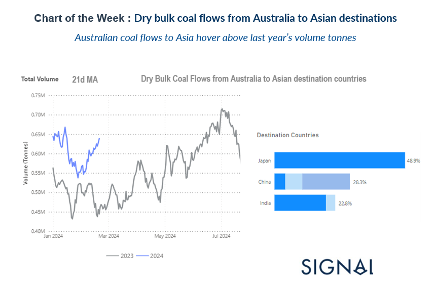
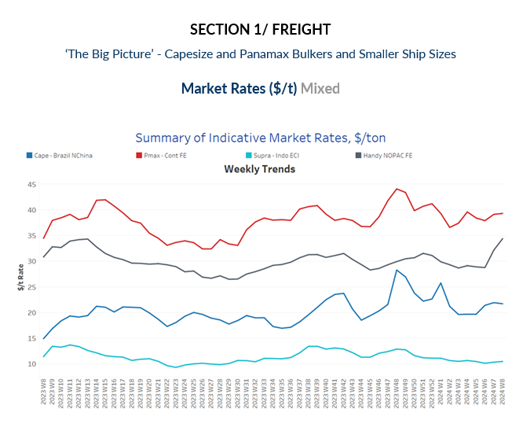
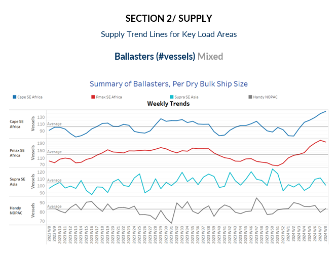
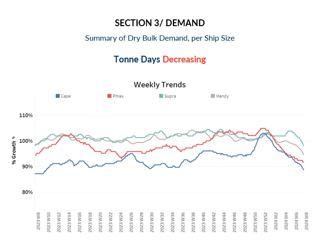
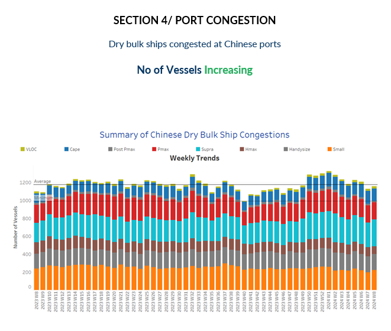

# Dry Weekly Market Monitor

**Date:** February 21, 2024  
**Publisher:** Breakwave Advisors | **Category:** Market Insights  
**Original URL:** [https://www.breakwaveadvisors.com/insights/2024/2/21/dry-weekly-market-monitor](https://www.breakwaveadvisors.com/insights/2024/2/21/dry-weekly-market-monitor)  

---

> **Figure 1: Screenshot 2024 02 21 16.26.52**  
> **Interactive Data & Source:** [Signal Ocean Platform](https://www.thesignalgroup.com/signal-ocean-platform) | [Local Asset](file:///C:/Users/Dell/Github/Shipping/corpus/03-breakwave/insights/2024/assets/2024-02-21_dry-weekly-market-monitor_img_screenshot2024-02-21162652_903e9bbf4941.png)

In the final days of February, the dry bulk freight market appeared to maintain a relatively stable momentum, particularly evident in the large vessel size categories where rates remained close to the highs reached in the third week, notably on the Capesize Brazil to North China route and Panamax Continent to Far East route. However, there remains cause for concern regarding the recent market momentum, as the weekly growth rates in demand tonne days continue to decline significantly compared to the peaks observed at the end of last year.

The performance of the Chinese economy post-Lunar New Year is of paramount importance, as the country grapples with the challenge of revitalising its economy. This challenge comes amid critical times, prompting the Central Bank to announce cuts in key interest rates aimed at bolstering the ailing property sector.

Meanwhile, in the Panamax vessel size segment, there is a noticeable resurgence in Australian coal flows to key destinations such as China, India, and Japan. This resurgence is evidenced by the 21-day moving average, which has surpassed last year's levels for the first two months of the year.

> **Figure 2: Screenshot 2024 02 21 16.27.11**  
> **Interactive Data & Source:** [Signal Ocean Platform](https://www.thesignalgroup.com/signal-ocean-platform) | [Local Asset](file:///C:/Users/Dell/Github/Shipping/corpus/03-breakwave/insights/2024/assets/2024-02-21_dry-weekly-market-monitor_img_screenshot2024-02-21162711_15fdd1c75440.png)

The Capesize Brazil to North China rates maintained the strength seen in the previous week. Meanwhile, there appears to be a notable increase in the Panamax Continent to Far East rates. Conversely, Supramax Indo ECI rates have remained consistently weak since the beginning of the year.

- **Capesize**vessel freight rates for shipments from Brazil to North China have held steady just below $22 per ton, showcasing a significant 50% increase compared to the rates observed during the same week last year.
- **Panamax**vessel freight rates from the Continent to the Far East have maintained a level of approximately $39 per ton from mid-February, marking a 20% increase compared to the rates recorded during the same week last year.
- **Supramax**vessel freight rates on the Indo-ECI route continue to show a downward trend same in recent weeks, settling at around $10 per tonne.
- **Handysize**freight rates for the NOPAC Far East route have maintained stability at approximately $39 per tonne in the last two weeks, while rates now are 20% higher than a month ago.

> **Figure 3: Screenshot 2024 02 21 16.27.20**  
> **Interactive Data & Source:** [Signal Ocean Platform](https://www.thesignalgroup.com/signal-ocean-platform) | [Local Asset](file:///C:/Users/Dell/Github/Shipping/corpus/03-breakwave/insights/2024/assets/2024-02-21_dry-weekly-market-monitor_img_screenshot2024-02-21162720_f2fd96ba6c36.png)

The trend in terms of the number of ballast vessels is still accelerating for Capesize and Panamax vessels in South East Africa for more than four weeks, while for Supramax SE we see a decreasing trend below the annual average.

- **Capesize SE Africa**: The number of ballast ships has risen to 147, 17 more than in the previous week and 96% above the low of the second week of January.
- **Panamax SE Africa**: Despite some declines, the number of ballast ships has fallen below 200, which is still in stark contrast to the record low of 70 recorded before the end of the previous year.
- **Supramax SE Asia**: The number of ballast ships fell slightly below the annual average of 100 a few days before the end of the month, although it remains to be seen whether the decline in the last few days of the month will match the current picture.
- **Handysize NOPAC**: The count of ballast ships increased to more than 80, marking a trend of rise above the annual average for the end of the month.

> **Figure 4: Screenshot 2024 02 21 16.27.29**  
> **Interactive Data & Source:** [Signal Ocean Platform](https://www.thesignalgroup.com/signal-ocean-platform) | [Local Asset](file:///C:/Users/Dell/Github/Shipping/corpus/03-breakwave/insights/2024/assets/2024-02-21_dry-weekly-market-monitor_img_screenshot2024-02-21162729_9273ebb0e6c9.png)

The trend of declining demand tonne days across all vessel size categories continued for another week, with the peaks observed at the end of last year for the Capesize and Panamax vessel segments to be a far cry from today's levels in the first quarter of this year.

- **Capesize**: Current levels have now fallen below the weak growth recorded in a similar week a year ago.
- **Panamax**: The decline still reflects the steep downward trend seen in the Capesize category since the beginning of the year, with the lowest growth rates in a year, while February is nearing the end of the weakest growth rate compared to the peak recorded in week 50 in 2023.
- **Supramax**: The growth rate remained at its lowest level since the beginning of the year, but appeared to be firmer than for the other ship size categories.
- **Handysize**: The growth rate of the smaller vessel sizes has not yet shown any prospects other than weakness since the beginning of the month.

> **Figure 5: Screenshot 2024 02 21 16.27.39**  
> **Interactive Data & Source:** [Signal Ocean Platform](https://www.thesignalgroup.com/signal-ocean-platform) | [Local Asset](file:///C:/Users/Dell/Github/Shipping/corpus/03-breakwave/insights/2024/assets/2024-02-21_dry-weekly-market-monitor_img_screenshot2024-02-21162739_47fe8c951235.png)

There appears to be an increase in the number of vessel congestion stemming from a rise in the activity of the Supramax vessel size category.

- **Capesize**: Capesize ship congestion fell below the 140 mark, indicating a decline in the last days of February.
- **Panamax**: In the case of Panamax vessels, the number has been reduced to around 190 compared to the peak of more than 200 three weeks ago.
- **Supramax**: Congestion increased again and approached the 300 mark after there had been signs of a drop below the 290 mark in the previous week.
- **Handysize**: Congestion levels have remained consistently below 180 since the end of the previous week, although there has been some volatility with fluctuations between 180 and 190 over the last three weeks. It remains to be seen whether there will be a downward trend by the end of the month.

Data Source:[Signal Ocean Platform](https://www.thesignalgroup.com/signal-ocean-platform)

---

**Tags:** Drybulk, Shipping, Freightrates  
