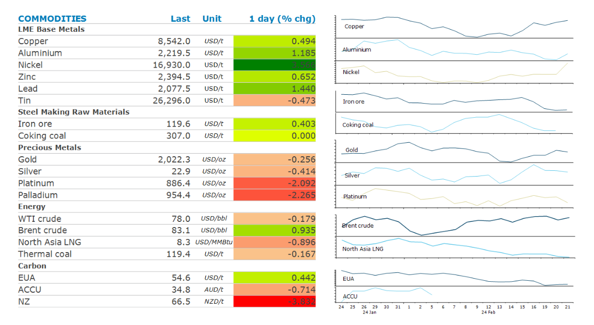

# Rising geopolitical risks push metals higher

**Date:** February 22, 2024  
**Publisher:** Breakwave Advisors | **Category:** Market Insights  
**Original URL:** [https://www.breakwaveadvisors.com/insights/2024/2/22/rising-geopolitical-risks-push-metals-higher](https://www.breakwaveadvisors.com/insights/2024/2/22/rising-geopolitical-risks-push-metals-higher)  

---

**A risk off tone across markets created headwinds for commodity markets. Nevertheless, supply side issues and geopolitical risks pushed energy and metals higher.**

*By*[*Daniel Hynes*](https://www.linkedin.com/in/dahynes/)

> **Figure 1: Screenshot 2024 02 22 11.17.59**  
> **Interactive Data & Source:** [Linkedin](https://www.linkedin.com/newsletters/commodities-wrap-6692196755876012032/?fbclid=IwAR3kiXJqZdxmp9ZcRwBNI7FsBySI-XSC0pfPur1qzjt7OZp7PTE59Tsl1QI) | [Local Asset](file:///C:/Users/Dell/Github/Shipping/corpus/03-breakwave/insights/2024/assets/2024-02-22_rising-geopolitical-risks-push-metals-higher_img_screenshot2024-02-22111759_18a9244b35b5.png)

**Aluminium**and**nickel**led the base metals higher amid speculation of renewed US sanctions against Russia. US President Joe Biden said the US plans to unveil a major sanctions package against Moscow on Friday. This could involve metals, which are a major source of revenue for the country. The UK moved to ban its citizens trading Russian metal late last year and had hinted at coordinated action with international partners. Copper gained as further supply side issues surfaced. Antofagasta said it will have to sink more money than previously thought into its Los Pelambres copper mine to offset lower quality ore as part of an industry trend. This comes amid a surge in costs across the industry that is forcing many producers to shut operations and mothball new projects.

A collapse in**lithium**prices continues to reverberate through the industry. Albemarle, a key player in the battery metals market, is re-evaluating its plans for a USD1.3bn lithium processing plant in South Carolina. The company also lowered its 2030 demand outlook to reflect slower adaption of electric cars in the US and Europe. It now only expects demand to reach 3.3mt by the end of the decade, a 10% reduction in its previous estimate.

**Iron ore**extended recent losses amid doubts over consumption in China. Despite Beijing taking further steps to address the issues in the property sector, the market doesn’t expect demand to recover anytime soon. The latest figures from China’s Iron & Steel Association showed a 24% jump in industry inventories at major mills this month.

**Gold**edged higher as traders await more clarity on the path of interest rates. FOMC minutes highlighted most Fed officials were concerned of the risk of cutting rates too early. Thomas Barkin said the latest economic data highlighted how price pressures were still too high.

**Crude oil**recovered from early losses to end the session higher amid signs of tightening in the physical market. The premium of spot prices over near-date futures has been widening over recent weeks, indicating a robust demand outlook in the near term. Shortages in the refined fuel market are also emerging. BP said its refinery in Indiana will need until at least the end of February to restore normal operations after an abrupt loss of power earlier this month. Prices have also been supported in recent weeks amid increasing tensions in the Middle East. Houthi rebels continue to attack merchant ships in the Red Sea while Israel continues to push back on proposed ceasefire agreements.

**European gas**prices resumed their slide as the risk of winter shortages fades.**North Asia LNG**was also lower amid lacklustre activity on the spot market.

Data source:[Commodities Wrap](https://www.linkedin.com/newsletters/commodities-wrap-6692196755876012032/?fbclid=IwAR3kiXJqZdxmp9ZcRwBNI7FsBySI-XSC0pfPur1qzjt7OZp7PTE59Tsl1QI)

---

**Tags:** Commodities, Crude Oil, Ironore  
