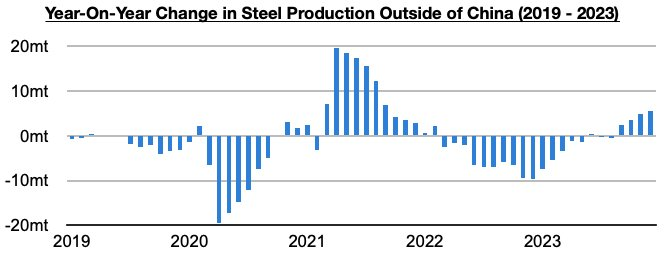
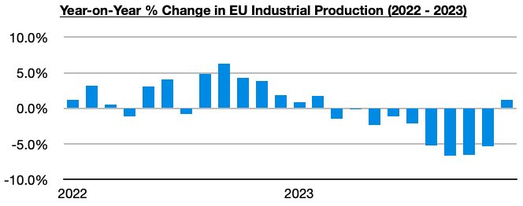
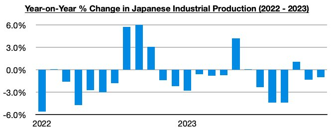

# Improvement in Global Industrial Production

**Date:** February 23, 2024  
**Publisher:** Breakwave Advisors | **Category:** Market Insights  
**Original URL:** [https://www.breakwaveadvisors.com/insights/2024/2/23/improvement-in-global-industrial-production](https://www.breakwaveadvisors.com/insights/2024/2/23/improvement-in-global-industrial-production)  

---

*By*[*Jeffrey Landsberg*](https://www.linkedin.com/in/jeffrey-landsberg-70ab957/)

As we have been examining in Commodore Research's Weekly Dry Bulk Reports during the last several months, the world outside of China has been showing important signs of recovery including steel production ex-China reverting back to growth.

> **Figure 1: 244**  
> [Local Asset](file:///C:/Users/Dell/Github/Shipping/corpus/03-breakwave/insights/2024/assets/2024-02-23_improvement-in-global-industrial-production_img_244_fbf8627b3ed4.jpg)

Also notable is that overall industrial production has returned to growth in most major economies. The European Union, in particular, has finally seen a return of growth. The most recently released data shows that industrial production in the European Union increased on a year-on-year basis in December by 1.2%. Previously, industrial production in the European Union had contracted on a year-on-year basis for nine straight months.

> **Figure 2: 245**  
> [Local Asset](file:///C:/Users/Dell/Github/Shipping/corpus/03-breakwave/insights/2024/assets/2024-02-23_improvement-in-global-industrial-production_img_245_19786b87f87c.jpg)

Overall, it is only Japan among the world’s major economies where industrial production has most recently remained in a contraction. This has been discussed in much greater detail in our most recent Weekly Dry Bulk Report. The most recently released data shows that industrial production in Japan contracted on a year-on-year basis in December by 1%. Japan’s industrial production has now contracted on a year-on-year basis during eleven of the last fourteen months.

> **Figure 3: 246**  
> [Local Asset](file:///C:/Users/Dell/Github/Shipping/corpus/03-breakwave/insights/2024/assets/2024-02-23_improvement-in-global-industrial-production_img_246_bea8f4d748d8.jpg)

---

**Tags:** Global, Economy, Steel  
