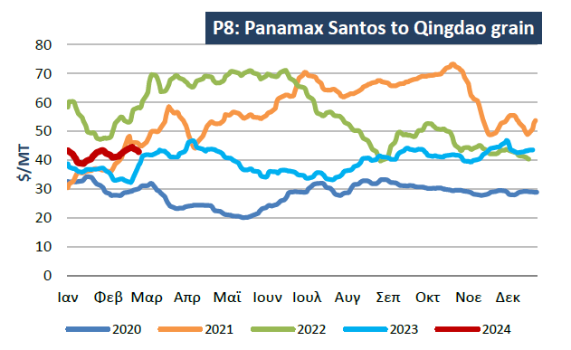
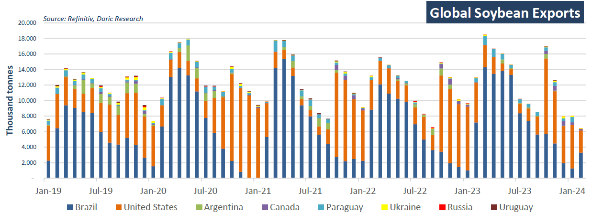

# Global Soybean Exports

**Date:** February 26, 2024  
**Publisher:** Breakwave Advisors | **Category:** Market Insights  
**Original URL:** [https://www.breakwaveadvisors.com/insights/2024/2/26/global-soybean-exports](https://www.breakwaveadvisors.com/insights/2024/2/26/global-soybean-exports)  

---

**Despite concerns about the outlook for grain and coal trades, on period deals, well-described Kamsarmaxes have been commanding premiums well above the average rates seen in 2023.**

*By*[*Michalis Voutsinas*](https://www.linkedin.com/in/michalis-voutsinas-587544163/)

The slowdown in Chinese soybean imports is notable as a significant factor contributing to the deceleration in Brazilian soybean exports, although the figures remain remarkably high. Brazil's soybean exports in January decreased to 2.9 million metric tonnes, down from December's 3.8 million metric tonnes, according to Brazil Customs. Trade flow data from LSEG shows a cumulative total of 96.8 million metric tonnes for the 2022/23 Brazil soybean export season, marking the highest export season in the country's history.

US soybean exports, on the other hand, increased month-to-month, but they continue to struggle to reach average levels. In January, soybean exports from the United States amounted to 5.6 million metric tonnes, up from the 4.8 million metric tonnes exported in December, which is 16.1 percent below the five-year average for the month. US soybean exports to China this season have declined by almost half compared to the previous season. Outstanding sales for US soybeans for the 2023/24 season totaled 9.5 million metric tonnes as of February 01, a decrease from the 10.3 million metric tonnes the previous year but slightly above the 9.2 million metric tonnes in 2021. The USDA continues to lower their 2023/24 US soybean export estimate to 46.8 million metric tonnes, while LSEG maintains the estimate at 46.9 million metric tonnes.

Amid ample global supplies, US soybean prices have sustained a downward trend over the past three weeks, hitting their lowest levels since December 2020. Traders attribute this decline to technical selling, improved South American harvest prospects, and concerns about demand for the oilseed, as observed in the Chicago Board of Trade soybean futures, which plunged to their lowest point in over three years on Thursday. In contrast, Brazil's domestic soybean basis has seen an uptick amidst sluggish sales and dormant logistics. Market sources relayed to Agricensus that Brazil's domestic soybean spot basis saw a rise in February due to farmers' hesitancy to sell, resulting in a notable surplus of idle logistics capacity, starkly different from the previous year's outlook. Given the aforementioned, Brazil’s grain exporters' association Anec adjusted its forecasts for February exports, lowering projections for corn and soymeal while maintaining the soybean estimate. Notably, Brazilian soybean exports reached 2.9 million tonnes in the first three weeks of February.

Against this backdrop, the key P6 (ECSA RV) index reported an average of $15,127 daily so far this year, compared to a respective average of $10,415 daily the year before. However, market tendencies were vastly different in these two years. In late February 2023, the leading granary of the east coast of South America was witnessing strong gains day by day. Twelve months later, in spite of a generous week start, the last few trading days were marked by severe pressure, with early March ECSA candidates fixing well below index levels. This stark contrast illustrates the volatile nature of the market and the rapid shifts in trading dynamics within a relatively short period. Similarly, the Baltic voyage P8 index (Santos/Qingdao) concluded today at $42.85 per metric tonne, marking a substantial increase compared to the previous year. However, it's important to note that the Baltic index experienced a loss of approximately $1.6 within just a few days, underscoring the volatility and unpredictability inherent in the shipping market.

> **Figure 1: Screenshot 2024 02 26 12.15.05**  
> **Interactive Data & Source:** [Doric](https://www.doric.gr/) | [Local Asset](file:///C:/Users/Dell/Github/Shipping/corpus/03-breakwave/insights/2024/assets/2024-02-26_global-soybean-exports_img_screenshot2024-02-26121505_35fb58f0e9b9.png)

Looking forward, following a robust year with 101.7 million tonnes of Chinese imports, soybean demand from the leading importer may experience a slight decrease in the current trading year. LSEG commodity analysts emphasized that China's soybean crushing margins have continued to decline from last summer's high levels, as domestic soybean meal prices hit three-year lows this January. Furthermore, massive corn imports and high inventory levels have also partially offset the feed demand for soybean meal. Additionally, China is expected to guide farmers to reduce hog production capacity, which could result in decreasing hog stocks and, consequently, lower feed demand for soybean meal. These factors collectively suggest a potential moderation in soybean demand from China in the near term.

It appears that despite concerns about the outlook for grain and coal trades, there has been significant activity in the Panamax period desks in the early part of this year. This suggests optimism for a quite robust spot market throughout the remainder of 2024. Well-described vessels have been commanding premiums well above the average rates seen in 2023, indicating strong demand and confidence in the market.

> **Figure 2: Screenshot 2024 02 26 12.15.15**  
> **Interactive Data & Source:** [Doric](https://www.doric.gr/) | [Local Asset](file:///C:/Users/Dell/Github/Shipping/corpus/03-breakwave/insights/2024/assets/2024-02-26_global-soybean-exports_img_screenshot2024-02-26121515_58c23bd2dbad.png)

Data source:[Doric](https://www.doric.gr/)

---

**Tags:** Soybeans, Drybulk, Grains  
