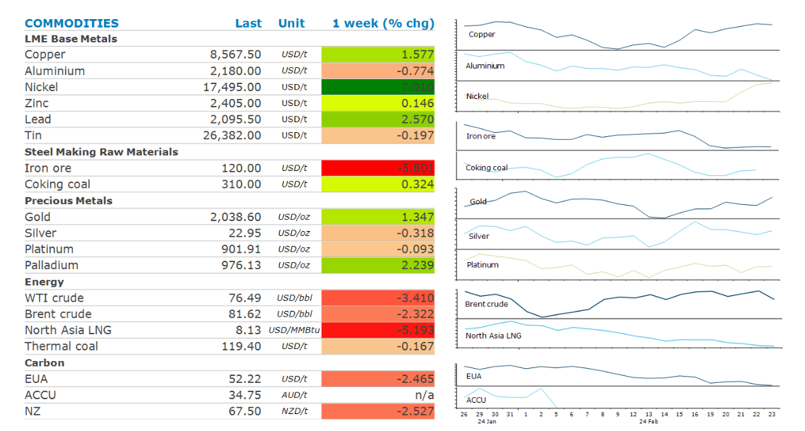

# Metals decline as threat of supply disruptions ease

**Date:** February 26, 2024  
**Publisher:** Breakwave Advisors | **Category:** Market Insights  
**Original URL:** [https://www.breakwaveadvisors.com/insights/2024/2/26/metals-decline-as-threat-of-supply-disruptions-ease](https://www.breakwaveadvisors.com/insights/2024/2/26/metals-decline-as-threat-of-supply-disruptions-ease)  

---

**Concerns over Chinese demand weighed in sentiment, but this was countered by ongoing supply side issues.**

*By*[*Daniel Hynes*](https://www.linkedin.com/in/dahynes/)

> **Figure 1: Screenshot 2024 02 26 12.33.17**  
> [Local Asset](file:///C:/Users/Dell/Github/Shipping/corpus/03-breakwave/insights/2024/assets/2024-02-26_metals-decline-as-threat-of-supply-disruptions-ease_img_screenshot2024-02-26123317_fbd04d318f97.png)

**Nickel and aluminium**fell as fears of supply disruptions eased. The two metals escaped any direct impact from the new US package of sanctions on Russia. Instead, the Biden administration focused on entities from the chemical and technology sectors, as well as various less well-known military officials. Both metals saw gains earlier in the week after US President Biden warned of new sanctions in response to the death of Russia’s opposition leader Alexey Navalny.**Copper**ended the week higher as fundamentals continue to improve. Inventories at the LME fell 6% last week and are down 27% this year. Demand has remained strong amid an increased focus on electrification and decarbonisation,[**a trend we expect to continue this year**](../pdfs/2024-02-26_metals-decline-as-threat-of-supply-disruptions-ease_commodity-call-copper-conducts-turna_ddca250eb558.pdf). This comes amid increasing supply side issues. Which will push the market into deficit this year.

**Iron ore**futures fell more than 5% last week as signs of further weakness in demand continue to mount. Inventories of iron ore at major Chinese ports rose. Supply concerns also eased, with a cyclone threatening WA ports now tracking away from the state’s iron ore hub.

**Gold**managed to eke out a small weekly gain despite policy makers remaining hawkish. Fed officials warned patience is needed before they start cutting rates. This has seen investors dump holdings in the world’s largest gold-backed ETF. However, haven buying remains supportive due to geopolitical risks in Ukraine and the Middle East.

**Crude oil**prices declined for want of fresh drivers. Oil has been caught between bullish factors such as lower OPEC output and elevated geopolitical risks and bearish concerns about weak demand in China. Attacks on merchant ships by Houthi rebels continue, but, the Israel-Hamas war hasn’t significantly broadened or impacted supply. US crude oil inventories also rose last week, although it was a much smaller gain than expected. Stockpiles may start to diminish in the weeks ahead as refineries return from maintenance. Expectations of strong growth in the US shale industry is waning, with the number of horizontal drill rigs operating in shale oil basins insufficient to replace dry wells in coming months.

**European gas**fell below levels seen before the energy shortages emerged in May 2021 amid weak demand and ample storage levels. This also weighed on**North Asia LNG**prices. However, the recent selloff has seen interest from price-sensitive buyers from China, India and Thailand emerge in recent days. If this develops into something more substantial, it could see European buyers more nervous. Several German firms have warned there is still not enough LNG secured on term deals to become too comfortable with the current situation.

Data source:[Commodities Wrap](https://www.linkedin.com/newsletters/commodities-wrap-6692196755876012032/?fbclid=IwAR3kiXJqZdxmp9ZcRwBNI7FsBySI-XSC0pfPur1qzjt7OZp7PTE59Tsl1QI)

---

**Tags:** Commodities, Ironore, Crude Oil  
