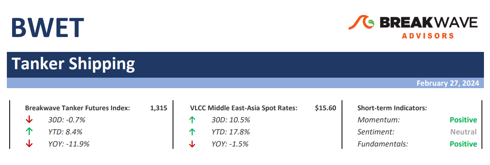
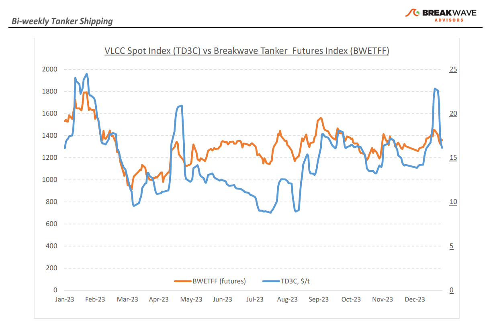
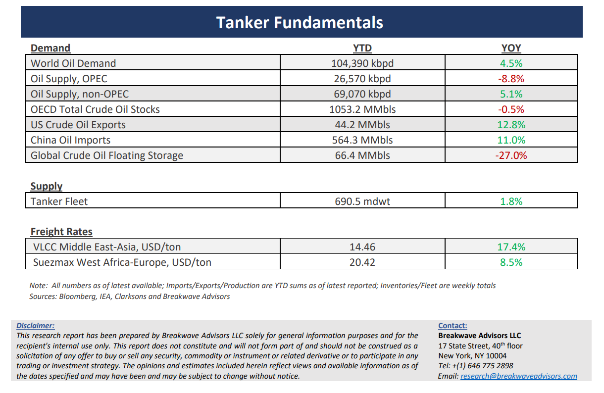

# Breakwave Bi-Weekly Tanker Report - February 27, 2024

**Date:** February 27, 2024  
**Publisher:** Breakwave Advisors | **Category:** Market Insights  
**Original URL:** [https://www.breakwaveadvisors.com/insights/2024227wet](https://www.breakwaveadvisors.com/insights/2024227wet)  

---

> **Figure 1: Tankerreporttop**  
> [Local Asset](file:///C:/Users/Dell/Github/Shipping/corpus/03-breakwave/insights/2024/assets/2024-02-27_2024227wet_img_tankerreporttop_b0a1c571b7f3.png)

**·****VLCCs on a rollercoaster ride amidst uncertainty and shifting sentiment –**Once again, VLCC owners experienced a rollercoaster ride during the second half of February, a familiar narrative similar to previous market temporary peaks. Following the recent sharp increases in spot VLCC freight rates,**the market took a tumble**, led by players in the Middle East region, despite the fact the vessel supply saw only a modest uptick and thus the reaction seems quite aggressive in hindsight. Nevertheless, numerous operators have been eagerly pursuing cargo, with some managing to secure double-digit vessel numbers in the process. Charterers have astutely seized the opportunity presented by the shifting sentiment and lingering uncertainty that has characterized the final stretch of the month, in the process pushing rates back to earth. As February draws to a close,**charterers are proceeding cautiously**on all fronts, while owners are striving to establish a stable position amidst the ongoing turmoil. In the**Atlantic market there are signs of optimism**, with discussions intensifying about the economic outlook in Europe and the Far East. Despite the recent correction in freight rates,**market sentiment amongst shipping participants has notably improved**, while fundamentals for the crude tanker market continue to support such optimism with a miniscule orderbook slated for delivery this year. We continue to believe that the**supply/demand**for crude tankers remains**thinly balanced**, and any marginal change, either through a supply squeeze (see recent Red Sea disruptions) or a demand spike (stronger Chinese economic data), can potentially**lead to sharply higher spot freight rates**, an optionality that the futures curve is currently not fully pricing in.

**·****Crude oil prices trade at the high end of the recent range, as supply issues overcome demand concerns**– With little new data,**oil prices remain subject to supply worries**as the recent shipping disruptions in the**Red Sea**now begin to impact on-land commercial inventories, leading to a tightening market balance despite lingering doubts over OECD oil demand. As**oil on water increased**due to shipping divergences away from the Red Sea passage, commercial stocks have begun to decline faster than previously anticipated.**Crude oil has reacted positively**, with WTI moving towards the $80/bbl mark. We continue to expect the recent five-month range of roughly $70-$80/bbl to remain in place for the foreseeable future, although we see higher risk of prices breaking the high end of the range reflecting a resilient global economy and ongoing strength on Chinese oil demand (in 2023,**oil demand grew by most on record**, at ~2mbpd yoy). With global oil demand at all time highs, the tanker industry should continue to benefit from strong oil flows from further away (Brazil, US), adding to**tonne-mile demand growth**at a time of limited new vessel deliveries, a particularly attractive setup for tanker owners.

**·****Our long-term view –**The tanker market is recovering from a long period of staggered rates as the growth in new vessel supply shrinks while oil demand is recovering in line with the global economy. A historically low orderbook combined with favorable demand fundamentals should continue to support increased spot rate volatility, which combined with the ongoing geopolitical turmoil, should support freight rates in the medium to long term.

> **Figure 2: Tankerreportchart**  
> [Local Asset](file:///C:/Users/Dell/Github/Shipping/corpus/03-breakwave/insights/2024/assets/2024-02-27_2024227wet_img_tankerreportchart_a4cbce6521e2.png)

> **Figure 3: Tankerreportbottom**  
> [Local Asset](file:///C:/Users/Dell/Github/Shipping/corpus/03-breakwave/insights/2024/assets/2024-02-27_2024227wet_img_tankerreportbottom_b872742cd5d5.png)

### Subscribe:
