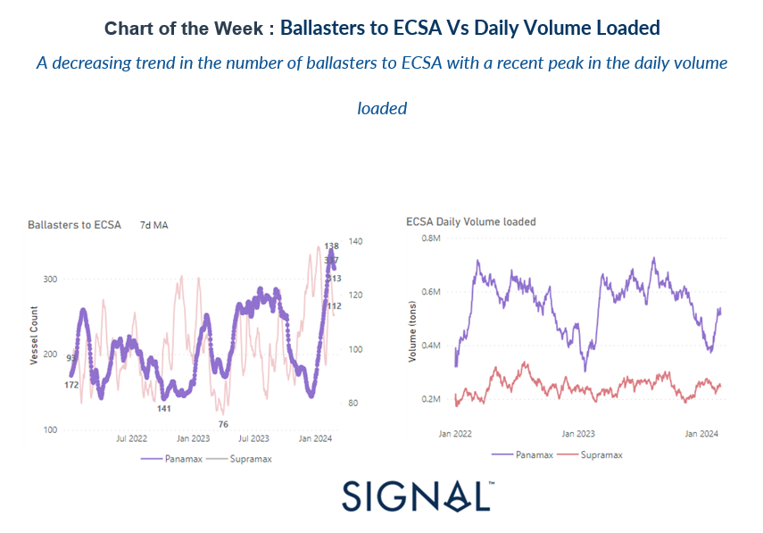
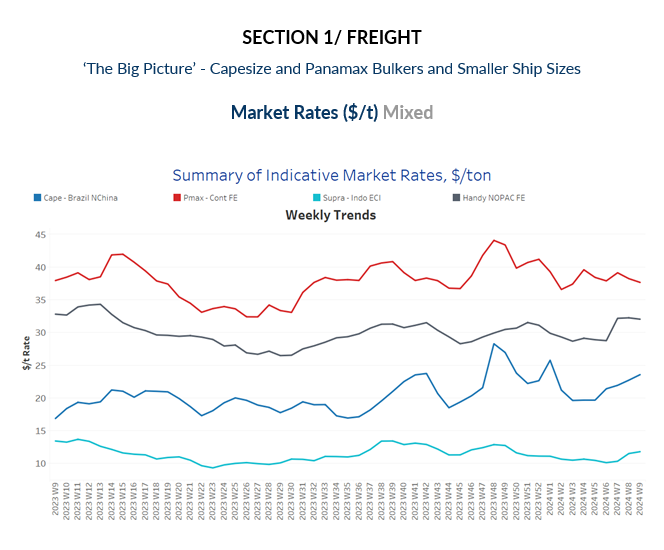
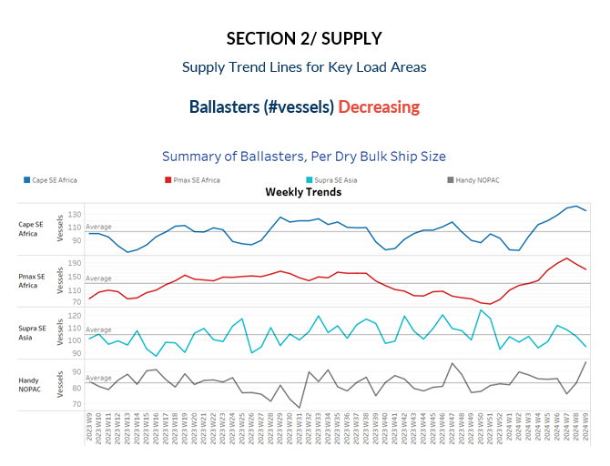
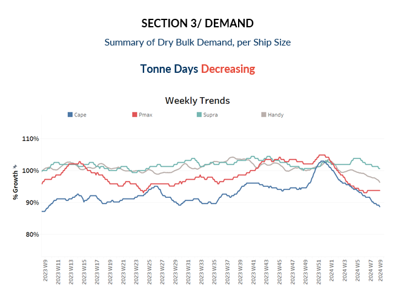
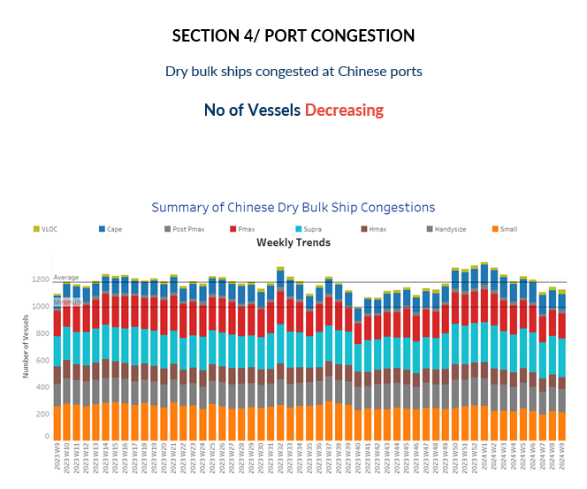

# Dry Weekly Market Monitor

**Date:** February 28, 2024  
**Publisher:** Breakwave Advisors | **Category:** Market Insights  
**Original URL:** [https://www.breakwaveadvisors.com/insights/2024/2/28/dry-weekly-market-monitor](https://www.breakwaveadvisors.com/insights/2024/2/28/dry-weekly-market-monitor)  

---

> **Figure 1: Screenshot 2024 02 28 12.34.01**  
> **Interactive Data & Source:** [Signal Ocean Platform](https://www.thesignalgroup.com/signal-ocean-platform) | [Local Asset](file:///C:/Users/Dell/Github/Shipping/corpus/03-breakwave/insights/2024/assets/2024-02-28_dry-weekly-market-monitor_img_screenshot2024-02-28123401_8416c7dd0760.png)

At the end of the month, there's a notable upturn in the Capesize Brazil to N China route, with rates reaching new highs since the year's outset. However, it remains uncertain whether this firmness will persist into March. Interestingly, despite signs of a stronger freight market sentiment, there's a decrease in the growth of tonne days, particularly notable in the Handysize segment. Additionally, there's a decrease in the number of ballasters for large vessel size categories, following several weeks of peaks lasting over a month. In the Panamax segment, there's a noteworthy record in the P6 route for ballasters to ECSA, showing a recent decline after consistently peaking for many weeks until the end of February, while there's a recovery in the growth of ECSA daily volume loaded. (see image above)

In the realm of the world's second-largest economy, China, this week saw intriguing developments regarding the setting of economic growth targets by the country's provincial-level regions for 2024. These targets vary, ranging from 4.5 to 8 percent, with over 20 regions aiming to surpass 5 percent GDP growth. Particularly noteworthy is that these provinces share common priorities, including the development of "new productive forces," the stimulation of consumption, and enhancements to the business environment.

> **Figure 2: Screenshot 2024 02 28 12.35.12**  
> **Interactive Data & Source:** [Signal Ocean Platform](https://www.thesignalgroup.com/signal-ocean-platform) | [Local Asset](file:///C:/Users/Dell/Github/Shipping/corpus/03-breakwave/insights/2024/assets/2024-02-28_dry-weekly-market-monitor_img_screenshot2024-02-28123512_a906baa9bf29.png)

The Capesize Brazil to North China rates experienced an uptick towards the end of the month, with indications suggesting a continual increase over the past four weeks. Conversely, there appears to be a downward correction in the Panamax rates during the same period.

- **Capesize**vessel freight rates for shipments from Brazil to North China rose to $24 per ton, showcasing a 20% increase compared to the rates observed a month ago.
- **Panamax**vessel freight rates from the Continent to the Far East dropped below $38 per ton, marking a 6% decrease compared to the rates recorded during the same week last year.
- **Supramax**vessel freight rates on the Indo-ECI route rose for the first time following three weeks ago levels and rates now stood at $12/ton, 13% higher than a month ago.
- **Handysize**freight rates for the NOPAC Far East route fell to $32 per ton, marking a $6 per ton decrease from the previous week, yet remaining 12% stronger than rates observed a month ago.

> **Figure 3: Screenshot 2024 02 28 12.35.21**  
> **Interactive Data & Source:** [Signal Ocean Platform](https://www.thesignalgroup.com/signal-ocean-platform) | [Local Asset](file:///C:/Users/Dell/Github/Shipping/corpus/03-breakwave/insights/2024/assets/2024-02-28_dry-weekly-market-monitor_img_screenshot2024-02-28123521_e9021dc3c77f.png)

The number of ballast vessels exhibited a declining trend leading up to the month's end; nevertheless, levels persistently surged well beyond the annual average for both Capesize and Panamax vessels.

- **Capesize SE Africa**: The number of ballast ships fell below the 140 mark, 7 lower than in the previous week and 80% above the low of the second week of January.
- **Panamax SE Africa**: The count of ballast ships decreased to 170, marking a notable drop of 30 from the peak observed in week 7, with indications of a continued downward trend in the coming days.
- **Supramax SE Asia**: The count of ballast ships has recently dipped slightly below the annual average of 100 over the past three weeks, with projections indicating that the month's end will mark levels reminiscent of those seen at the beginning of the year.
- **Handysize NOPAC**: The count of ballast ships surged to 96, marking an increase of 16 from the previous week and reaching one of the highest points recorded, nearing the peak observed during week 47 of the previous year.

> **Figure 4: Screenshot 2024 02 28 12.35.29**  
> **Interactive Data & Source:** [Signal Ocean Platform](https://www.thesignalgroup.com/signal-ocean-platform) | [Local Asset](file:///C:/Users/Dell/Github/Shipping/corpus/03-breakwave/insights/2024/assets/2024-02-28_dry-weekly-market-monitor_img_screenshot2024-02-28123529_a30376387156.png)

The downward trajectory in demand tonne days persisted across all vessel size categories until the end of the month. However, there are indications of a potential upswing in the freight market, though it remains to be seen whether this will translate into an overall increase in dry bulk demand.

- **Capesize**: The current levels maintained the weakness observed in previous weeks, with today's growth appearing to be at its lowest point in a year.

- **Panamax**: The decline appeared to have paused towards the end of the month, maintaining the same pace of growth as observed two weeks ago. However, it's worth noting that the peak reached before the end of the previous year remains out of reach.
- **Supramax**: The growth rate remained nearly stagnant compared to previous weeks, yet it continued to exhibit a stronger resilience compared to other ship size categories.
- **Handysize**: The growth rate of smaller vessel sizes continues to show little promise beyond weakness, albeit standing higher than the growth recorded in the Panamax segment.

> **Figure 5: Screenshot 2024 02 28 12.35.37**  
> **Interactive Data & Source:** [Signal Ocean Platform](https://www.thesignalgroup.com/signal-ocean-platform) | [Local Asset](file:///C:/Users/Dell/Github/Shipping/corpus/03-breakwave/insights/2024/assets/2024-02-28_dry-weekly-market-monitor_img_screenshot2024-02-28123537_10c0a2456226.png)

Towards the end of February, there appears to be a subtle decline in the congestion of Chinese vessels, albeit with levels remaining elevated in the Supramax segment.

- **Capesize**: Capesize ship congestion dipped below the 120 mark, signalling a 10% decrease from the levels observed in the previous week.
- **Panamax**: In the case of Panamax vessels, the number has been reduced to 186, still lower than the peak of more than 200 four weeks ago.
- **Supramax**: Congestion has remained elevated, hovering just below the 300 mark for the past two weeks.
- **Handysize**: Congestion levels settled around 170, marking a decrease of 7 compared to the previous week and nearly 20 vessels fewer than three weeks prior.

Data Source:[Signal Ocean Platform](https://www.thesignalgroup.com/signal-ocean-platform)

---

**Tags:** Drybulk, Shipping, Freightrates  
