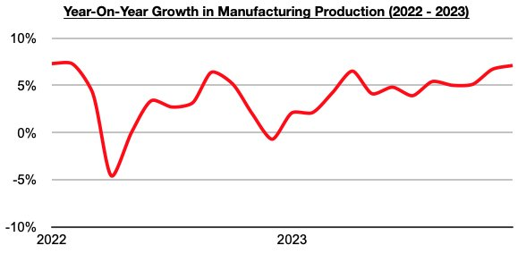
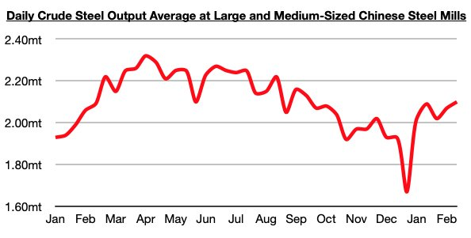

# Ongoing Industrial Improvement in China

**Date:** February 28, 2024  
**Publisher:** Breakwave Advisors | **Category:** Market Insights  
**Original URL:** [https://www.breakwaveadvisors.com/insights/2024/2/28/ongoing-industrial-improvement-in-china](https://www.breakwaveadvisors.com/insights/2024/2/28/ongoing-industrial-improvement-in-china)  

---

*By*[*Jeffrey Landsberg*](https://www.linkedin.com/in/jeffrey-landsberg-70ab957/)

The most recently released data shows that China’s manufacturing production rose year-on-year in December by 7.1% (manufacturing is defined as the creation or production of goods with the help of equipment, labor, machines, tools, and chemical or biological processing or formulation). This has marked the largest growth seen since February 2022. Significant is that manufacturing contributes to significant steel consumption, and in China it has vitally continued to help offset the weakness in the housing market and demand/construction for new homes.

> **Figure 1: 241**  
> [Local Asset](file:///C:/Users/Dell/Github/Shipping/corpus/03-breakwave/insights/2024/assets/2024-02-28_ongoing-industrial-improvement-in-china_img_241_b2c871cfedae.jpg)

Also of note is that the most recently released steel production data shows that daily crude steel production at large and medium-sized mills in China averaged approximately 2.10 million tons during February 11 - February 20 (China's steel production data is released much more frequently than manufacturing production data). This steel production average is 1% higher than was seen during the first ten days of February, is up year-on-year by 0.5%, and marks the highest level seen since the middle of September.

> **Figure 2: 242**  
> [Local Asset](file:///C:/Users/Dell/Github/Shipping/corpus/03-breakwave/insights/2024/assets/2024-02-28_ongoing-industrial-improvement-in-china_img_242_e8993c89dd62.jpg)

Overall, it remains very significant to us that China's steel production continues to climb and also continues to experience year-on-year growth. Prior to this current period of growth, the last time that there was any sustained year-on-year growth in China's steel production was back in September. As we have been discussing in Commodore Research's Weekly Dry Bulk Reports and Weekly China Reports, we remain of our view that a further climb in China's steel production is likely for the near term.

---

**Tags:** China, Economy, Growth  
