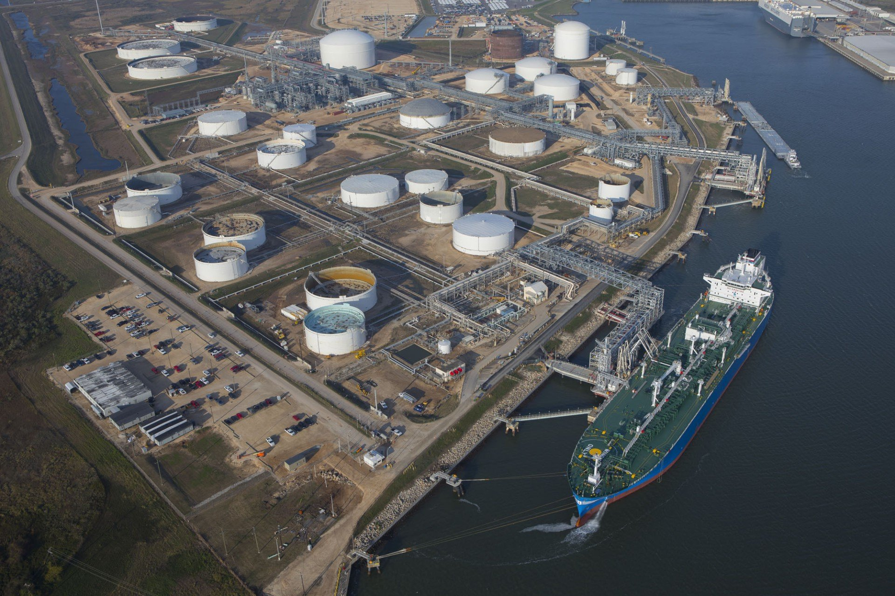
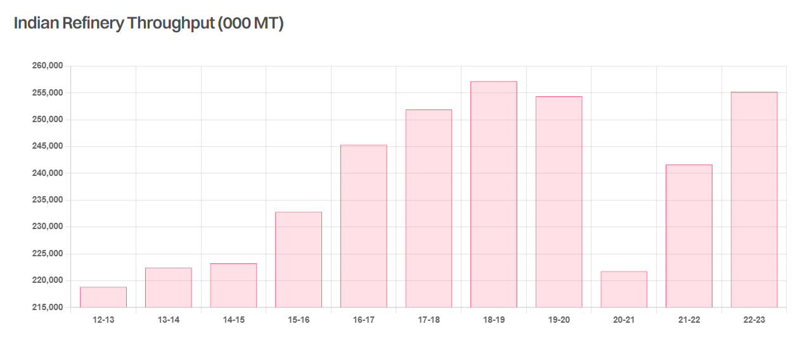

# The 9 million barrel question

**Date:** February 28, 2024  
**Publisher:** Breakwave Advisors | **Category:** Market Insights  
**Original URL:** [https://www.breakwaveadvisors.com/insights/2024/2/28/the-9-million-barrel-question](https://www.breakwaveadvisors.com/insights/2024/2/28/the-9-million-barrel-question)  

---

> **Figure 1: 241**  
> **Interactive Data & Source:** [Gibsons Co](https://www.gibsons.co.uk/market-reports) | [Local Asset](file:///C:/Users/Dell/Github/Shipping/corpus/03-breakwave/insights/2024/assets/2024-02-28_the-9-million-barrel-question_img_241_7054288bd4a6.jpg)

Whilst there is significant debate as to the strength of long-term oil demand growth, there is little debate as to where much of that growth will come from; India. The world’s most populous country sits far behind China in terms of its oil demand per capita, underscoring how much potential remains. Indeed, the country is set to be the largest single source of demand growth between now and 2030. Prime Minister Narendra Modi recently announced a plan to raise domestic refining capacity to 9mbd by 2030; however, for this goal to be achieved, significant new investment will be required.

Currently, the country is home to 5.8mbd of refining capacity and is planning to add another 1.1mbd by 2028. No new refineries have come online since Indian Oil Corp’s (IOC) 300kbd Paradip refinery in 2016. The greenfield Hindustan Petroleum Corporation’s (HPCL) 180kbd Rajasthan refinery is due to start operations in January 2025, whilst Chennai Petroleum Corp (CPCL) is also building a 180kbd refinery at Nagapattinam in the South East of the country, with completion expected sometime around 2028. The remainder of the 1.1mbd expected to come online by 2028 will be delivered through debottlenecking and expansions at existing facilities.

For now, however, the stated goal of 9mbd by 2030 appears out of reach. For this dream to be realised, the expansion of existing facilities will not be enough. For many years, Middle Eastern NOCs have explored building a mega refinery to rival Reliance’s 1.4mbd facility on India’s West Coast. As recently as September, Saudi Arabia and India jointly agreed to develop such a project; yet, so far the NOCs have focused on projects in China where greenfield developments have been easier to plan and execute. Such projects in India have been plagued by issues such as land acquisition, whilst it is unclear whether Abu Dhabi’s NOC is still interested in the project. Nevertheless, with Chinese oil demand expected to peak this decade, downstream foreign investment in India is likely to increase.

In the near term, existing refinery investment would seem sufficient to both meet domestic demand and maintain export volumes; an important consideration for clean tanker demand. Likewise, with little change in crude production the country will see continued growth in feedstock imports and is likely to become increasingly active in the Atlantic basin crude market as production in the West expands. If the country can succeed in achieving its stated aim of 9mbd, then its impact on tanker markets will be even more pronounced.

> **Figure 2: Screenshot 2024 02 28 12.21.57**  
> **Interactive Data & Source:** [Gibsons Co](https://www.gibsons.co.uk/market-reports) | [Local Asset](file:///C:/Users/Dell/Github/Shipping/corpus/03-breakwave/insights/2024/assets/2024-02-28_the-9-million-barrel-question_img_screenshot2024-02-28122157_9795cbbfc827.png)

Data source:[Gibson Shipbrokers](https://www.gibsons.co.uk/market-reports)

---

**Tags:** India, Crude Oil, Tankers  
