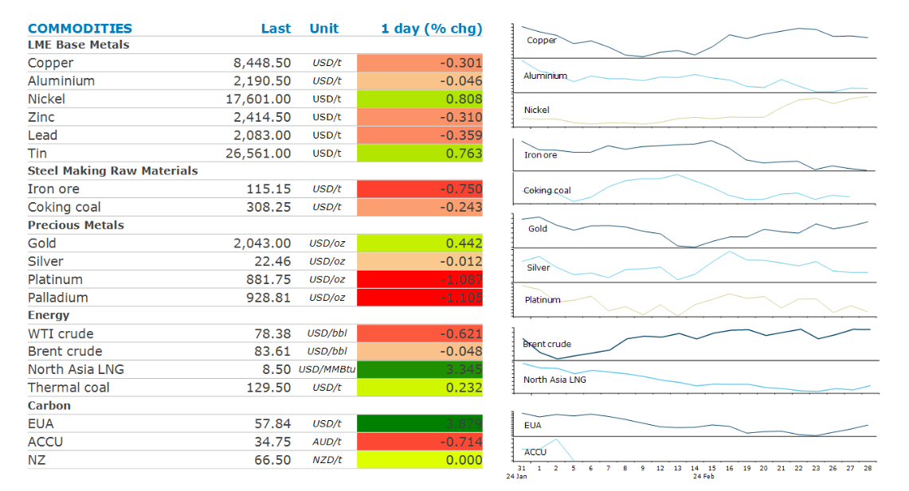

# Global gas rallies amid signs of stronger demand

**Date:** February 29, 2024  
**Publisher:** Breakwave Advisors | **Category:** Market Insights  
**Original URL:** [https://www.breakwaveadvisors.com/insights/2024/2/29/global-gas-rallies-amid-signs-of-stronger-demand](https://www.breakwaveadvisors.com/insights/2024/2/29/global-gas-rallies-amid-signs-of-stronger-demand)  

---

**Mixed economic data left commodity markets uncertain about the demand outlook. Metals fell while energy and bulks made small gains.**

*By*[*Daniel Hynes*](https://www.linkedin.com/in/dahynes/)

> **Figure 1: Iron Orefutures Resumed Their Slide**  
> *Iron orefutures resumed their slide, as doubts over a rebound in China persist. The country is entering its peak construction period, but there is little sign of steelmakers increasing output. The state-backed newspaper,Economic Dailycalled for authorities to use monetary and financial regulatory tools to support the economy, in a sign that growth remains weak.*  
> **Interactive Data & Source:** [Linkedin](https://www.linkedin.com/newsletters/commodities-wrap-6692196755876012032/?fbclid=IwAR3kiXJqZdxmp9ZcRwBNI7FsBySI-XSC0pfPur1qzjt7OZp7PTE59Tsl1QI) | [Local Asset](file:///C:/Users/Dell/Github/Shipping/corpus/03-breakwave/insights/2024/assets/2024-02-29_global-gas-rallies-amid-signs-of-stronger-demand_img_screenshot2024-02-29095826_d59a589d8af1.png)

**Crude oil**was little changed as higher inventories tempered optimism of tighter supplies in recent weeks. US crude oil inventories rose 4.2mbbl last week, according to Energy Information Administration data. While this was smaller than the 8.4mbbl increase another industry report projected earlier in the week, it still indicates the market may not be as tight as originally thought. Prices have been steadily climbing in recent weeks amid signs of tightness. In a bullish signal, physical spot prices are rising faster than longer dated futures. The recent moves have also been supported by supply cuts from OPEC and its allies. A Bloomberg survey indicates most are expecting the group to extend the current supply agreement into the second quarter. The group is scheduled to meet in early March to discuss its strategy. Concerns over Chinese demand may help it make that decision. China National Petroleum Corp said it expects China’s consumption to rise only 1% this year to 764mt on a softer economy.

**Global gas**prices extended recent gains as low prices spur interest in the spot market. North Asian LNG prices led the sector higher amid increasing interest from China. The country’s largest energy producer, CNPC, expects gas imports to climb 8.2% to 179.1bn cubic metres this year. That will largely be driven by LNG, with pipeline gas making up the rest. The LNG import terminal expansion is continuing, and capacity is estimated to hit a record 50mt/y in 2024. Supply side issues are compounding the issue. Freeport LNG extended maintenance work on its Train 3 and expects the unit will be out for another two weeks. This comes as US LNG exports become more profitable into Asia than Europe. This spurred concerns in the**European gas market**, with benchmark futures advancing for a third day. Temperatures are also expected to fall sharply in March, while renewable energy output has been below expectations in recent days.

**Base metals**were mixed on the LME. Copper and zinc declined while nickel managed to end the session higher. Sentiment in the aluminium market was dented by forecasts from China that demand will remain subdued amid woes in the property sector. State-backed firm Beijing Antaike Information Development Co said consumption will rise only 1.7% this year. Demand from the construction sector will drop 2.5%, offsetting gains in auto and renewable energy sectors.

**Gold**was little changed ahead of the US inflation data.

Data source:[Commodities Wrap](https://www.linkedin.com/newsletters/commodities-wrap-6692196755876012032/?fbclid=IwAR3kiXJqZdxmp9ZcRwBNI7FsBySI-XSC0pfPur1qzjt7OZp7PTE59Tsl1QI)

---

**Tags:** Commodities, Crude Oil, Ironore  
