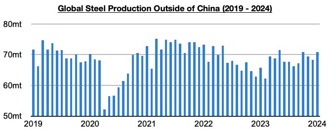
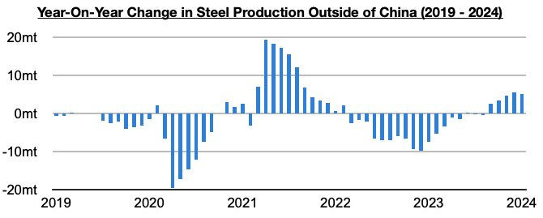

# June Inflection Point Remains Significant

**Date:** February 29, 2024  
**Publisher:** Breakwave Advisors | **Category:** Market Insights  
**Original URL:** [https://www.breakwaveadvisors.com/insights/2024/2/29/june-inflection-point-remains-significant](https://www.breakwaveadvisors.com/insights/2024/2/29/june-inflection-point-remains-significant)  

---

*By*[*Jeffrey Landsberg*](https://www.linkedin.com/in/jeffrey-landsberg-70ab957/)

Overall dry bulk rates increased as we anticipated last week, with only panamax rates declining. China’s commodity demand has remained strong, a surge of Indonesian spot coal cargoes has emerged and has been only the latest surge in a specific spot cargo volume, canal issues have continued to help reduce spot supply, and the industrial sector has continued to improve globally, The capesize panamax ratio has also been far too narrow in previous weeks, and this has also been a factor for capesize rates increasing and panamax rates decreasing as we have discussed in Commodore Research's most recent Weekly Dry Bulk Report.

As we also have been discussing in our Weekly Dry Bulk Reports, we remain bullish for the dry bulk market. Both China and the world outside of China continue to show important signs of industrial growth, and remaining particularly helpful is that steel production outside of China has continued to strengthen and enjoy long-awaited growth. Most recently, steel production outside of China totaled approximately 70.9 million tons in January, which has marked a month-on-month increase of 2.6 million tons (4%) and a year-on-year increase of 5.1 million tons (8%). Steel production outside of China has now increased on a year-on-year basis for five straight months, with the growth particularly robust during each of the last three months.

> **Figure 1: 241**  
> [Local Asset](file:///C:/Users/Dell/Github/Shipping/corpus/03-breakwave/insights/2024/assets/2024-02-29_june-inflection-point-remains-significant_img_241_09c167e093b1.jpg)

As we have been stressing in our Weekly Dry Bulk Reports, June last year saw an inflection point of sorts as there was finally growth in steel production outside of China. Prior to June, steel production outside of China had fallen on a year-on-year basis for fifteen straight months (during those fifteen months, production outside of China contracted year-on-year by 77 million tons). The turnaround in the market has not only continued but has also intensified.

> **Figure 2: 242**  
> [Local Asset](file:///C:/Users/Dell/Github/Shipping/corpus/03-breakwave/insights/2024/assets/2024-02-29_june-inflection-point-remains-significant_img_242_3f0cbbcfb739.jpg)

---

**Tags:** China, Steel, Economy  
