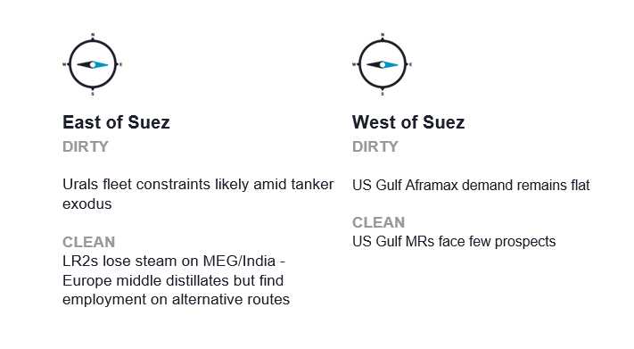
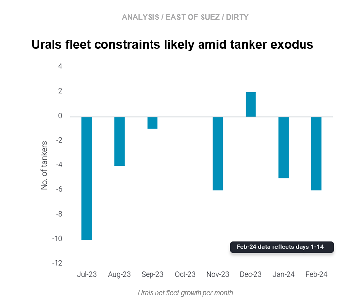
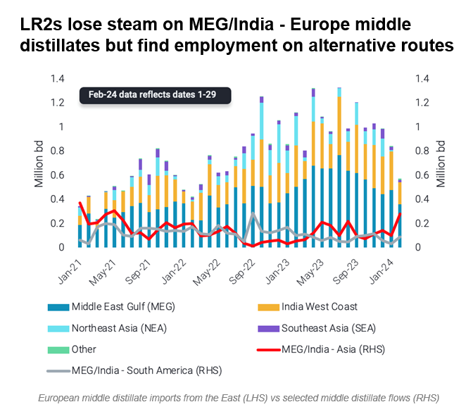
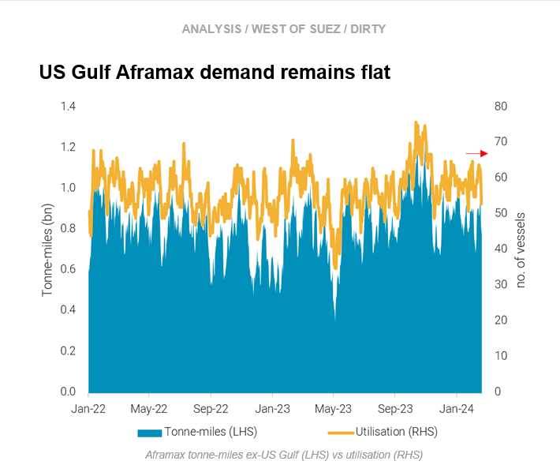
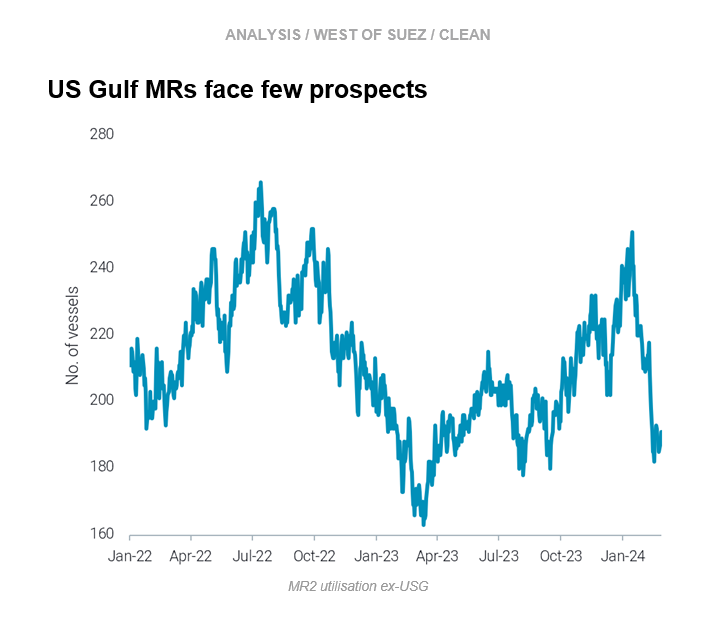

# Urals fleet constraints likely || LR2s lose steam but find alternative employment

**Date:** March 01, 2024  
**Publisher:** Breakwave Advisors | **Category:** Market Insights  
**Original URL:** [https://www.breakwaveadvisors.com/insights/2024/3/1/urals-fleet-constraints-likely-lr2s-lose-steam-but-find-alternative-employment](https://www.breakwaveadvisors.com/insights/2024/3/1/urals-fleet-constraints-likely-lr2s-lose-steam-but-find-alternative-employment)  

---

**This week, in the East, we discuss why capacity restraints look increasingly likely for the fleet trading Russian Urals. On the clean side, we explore where LR2s in the EoS are seeking alternative employment as a result of falling European middle distillate imports from the East. In the West, we focus on muted tanker demand in the US Gulf for both Aframaxes and MRs.**

*By*[*Mary Melton*](https://www.linkedin.com/search/results/all/?fetchDeterministicClustersOnly=true&heroEntityKey=urn%3Ali%3Afsd_profile%3AACoAABXVyecBtg-pRnIrZe0BoWk0ygPiUfbvhsw&keywords=mary%20melton&origin=RICH_QUERY_SUGGESTION&position=0&searchId=40e8d7d2-c4d0-4022-81e7-176f6eba418b&sid=H_Y&spellCorrectionEnabled=false)

> **Figure 1: Screenshot 2024 02 29 09.50.46**  
> **Interactive Data & Source:** [Marketingmail Vortexa](https://marketingmail.vortexa.com/ODM3LU1aRS01NzgAAAGRjsf2kSNGiKWbBeEaOjD1Ie2QXM4xIzXsLtg0ZSJr5qY0izgKPS1n_CnL7nR_wkiGzum5fHg=) | [Local Asset](file:///C:/Users/Dell/Github/Shipping/corpus/03-breakwave/insights/2024/assets/2024-03-01_urals-fleet-constraints-likely-lr2s-lose-steam-but-find-alternative-employment_img_screenshot2024-02-29095046_849db21ab1b5.png)

> **Figure 2: Screenshot 2024 02 29 09.48.39**  
> **Interactive Data & Source:** [Marketingmail Vortexa](https://marketingmail.vortexa.com/ODM3LU1aRS01NzgAAAGRjsf2kSNGiKWbBeEaOjD1Ie2QXM4xIzXsLtg0ZSJr5qY0izgKPS1n_CnL7nR_wkiGzum5fHg=) | [Local Asset](file:///C:/Users/Dell/Github/Shipping/corpus/03-breakwave/insights/2024/assets/2024-03-01_urals-fleet-constraints-likely-lr2s-lose-steam-but-find-alternative-employment_img_screenshot2024-02-29094839_43069d73c75a.png)

- Last week was a busy one on the Russia sanctions front. New rules on the price cap scheme came into effect whereby tanker operators must submit attestation documents per voyage instead of annually to prove compliance. Also, the UK announced sanctions for key operators in the Russian trades, and the US announced sanctions on Sovcomflot and its tankers.
- Since Urals was first assessed above the $60/barrel price cap in mid-July 2023 (Argus Media), the number of tankers leaving the Urals trade and not returning increased considerably, averaging 20 tankers each month through January. At the same time, this is not matched by new tankers joining the Urals trade, meaning that the Urals fleet has suffered a net loss of an average of 3.5 tankers every month through January. The notable exception was December 2023, resulting from an influx of sanctioned tankers coming from the Iranian and Venezuelan trades.
- Difficulties in remaining sanctions-compliant has led to an exodus of EU operators (currently 19% Greek-operated tankers have loaded vs 39% before from Dec22-Jul23). The change in fleet composition plus the overall fleet shrinking points to increasing constraints on fleet capacity, especially as India has recently indicated an unwillingness to accept cargoes from sanctioned tankers.

> **Figure 3: Screenshot 2024 02 29 09.49.33**  
> **Interactive Data & Source:** [Marketingmail Vortexa](https://marketingmail.vortexa.com/ODM3LU1aRS01NzgAAAGRjsf2kSNGiKWbBeEaOjD1Ie2QXM4xIzXsLtg0ZSJr5qY0izgKPS1n_CnL7nR_wkiGzum5fHg=) | [Local Asset](file:///C:/Users/Dell/Github/Shipping/corpus/03-breakwave/insights/2024/assets/2024-03-01_urals-fleet-constraints-likely-lr2s-lose-steam-but-find-alternative-employment_img_screenshot2024-02-29094933_a5deac73ddc5.png)

- East of Suez middle distillates (mainly from India and Middle East Gulf) flows to Europe[have declined](https://marketingmail.vortexa.com/ODM3LU1aRS01NzgAAAGRjsf2kSNGiKWbBeEaOjD1Ie2QXM4xIzXsLtg0ZSJr5qY0izgKPS1n_CnL7nR_wkiGzum5fHg=), but still continue via the Cape of Good Hope. This is especially the case for Jet/Kero flows irrespective of any outcomes on the Red Sea, as Europe does not have other possible regions to source supply.

- The Red Sea attacks, however, have sparked[marginal reshuffling of flows to Asia](https://marketingmail.vortexa.com/ODM3LU1aRS01NzgAAAGRjsf2kpC3_ueBVsDmKp4z3DgvQP2DZL6bIDj1E-IGhjVNQ7QJO7YT12y59Id12bxPir4F4Lw=)as well as[South America](https://marketingmail.vortexa.com/ODM3LU1aRS01NzgAAAGRjsf2kuOMt1_rvXaTymrNLAzB6upoJrgZB07KGkTGzmYs1comHqOzMaqK8j6zAPU9WeN2WMs=), which is materialising mostly on LRs. Similarly,[Red Sea-to-Europe flows](https://marketingmail.vortexa.com/ODM3LU1aRS01NzgAAAGRjsf2kUIp_3BaXiwEro0dMZdnRl24nYa56-89vdGCvSCncK6_mkL6WlSCCbCW4rqbdrkD1d8=)which bypass the Bab-el Mandeb have also picked-up, benefitting the vessel class.
- According to our new[voyage dynamics screen](https://marketingmail.vortexa.com/ODM3LU1aRS01NzgAAAGRjsf2keezddjWeLro_vo6j18Rzl4Iv4kxDKNvwqmk6RIWqcyqNI_IRWQ3MN4dQ53zfLkl05E=), the developments unfolded following the Red Sea attacks have driven laden LR voyage mileage to 14-month highs.

> **Figure 4: Screenshot 2024 02 29 09.49.42**  
> **Interactive Data & Source:** [Marketingmail Vortexa](https://marketingmail.vortexa.com/ODM3LU1aRS01NzgAAAGRjsf2ksR0FIjv3cePpZy_YnsFdBO9wUaM_oIVqETNdyt2-PZCM2RIZ3VYmWUn5JCoI7A21HQ=) | [Local Asset](file:///C:/Users/Dell/Github/Shipping/corpus/03-breakwave/insights/2024/assets/2024-03-01_urals-fleet-constraints-likely-lr2s-lose-steam-but-find-alternative-employment_img_screenshot2024-02-29094942_23747fe71d58.png)

- [Aframax tonne-miles](https://marketingmail.vortexa.com/ODM3LU1aRS01NzgAAAGRjsf2ksR0FIjv3cePpZy_YnsFdBO9wUaM_oIVqETNdyt2-PZCM2RIZ3VYmWUn5JCoI7A21HQ=)out of the US Gulf remain muted, keeping freight rates USG-to-Europe[(TD25)](https://marketingmail.vortexa.com/ODM3LU1aRS01NzgAAAGRjsf2kRUdx8Bq2yOPZYVp3W7RQqwqUbykogBT_vote2PrSlDw6T6ftv7dCWYLr-hfup2xPng=)in check.

- A 35% m-o-m Increase in[STS activity](https://marketingmail.vortexa.com/ODM3LU1aRS01NzgAAAGRjsf2kdKoR6MSJOJZyPcHNDuBzRYje1bs07tMGh8yo4eopM4dZkYm8Fnp4gKj2d8nZ52rjvs=)so far in February points towards increased employment of larger vessels for longer haul voyages, with Aframaxes relegated to lightering roles and some Transatlantic flows. This is also keeping[prompt vessel supply](https://marketingmail.vortexa.com/ODM3LU1aRS01NzgAAAGRjsf2ka6RZxCKmKiSsfPQCu0NZU9Y5XhLwJ9XteiarEc9IQYhEUCAh68ICPTxkqAr--UiWfE=)relatively high in the region.
- Looking ahead, March is expected to see some slowdown in US crude exports due to upcoming refinery maintenance season in Europe, further pressuring Aframax demand out of the US Gulf.

> **Figure 5: Screenshot 2024 02 29 09.49.51**  
> **Interactive Data & Source:** [Marketingmail Vortexa](https://marketingmail.vortexa.com/ODM3LU1aRS01NzgAAAGRjsf2kcmzXeSJLrjZelRjJO8eMuLWI5MnDofiXIRcsBqtNUvnRJxPDwP27dCb1CEuTaRqNmU=) | [Local Asset](file:///C:/Users/Dell/Github/Shipping/corpus/03-breakwave/insights/2024/assets/2024-03-01_urals-fleet-constraints-likely-lr2s-lose-steam-but-find-alternative-employment_img_screenshot2024-02-29094951_08b9144bb012.png)

- As the US refinery maintenance season continues in full-swing,[MR demand out of the US Gulf](https://marketingmail.vortexa.com/ODM3LU1aRS01NzgAAAGRjsf2kcmzXeSJLrjZelRjJO8eMuLWI5MnDofiXIRcsBqtNUvnRJxPDwP27dCb1CEuTaRqNmU=)continues to decline, with both utilisation and tonne-mile demand falling since early January. Our data points to[slightly tightening availability](https://marketingmail.vortexa.com/ODM3LU1aRS01NzgAAAGRjsf2kUml-gJZILTKVxW6ZK-xeTAZMxdRyr2pOyEdwjIeF_tOHtcIeLmxrNInrBChS2AHGCg=)in natural fixing windows, but this has not translated into support for freight rates ([TC14](https://marketingmail.vortexa.com/ODM3LU1aRS01NzgAAAGRjsf2kSA3ja3lpJMaradEBUyAcs8i_ibO9YXtVyDXDFAnV-AIBvIs8q6iIuKrFP6rsk_GmTQ=),[TC18](https://marketingmail.vortexa.com/ODM3LU1aRS01NzgAAAGRjsf2kmorW_-GAiEqIRfOzoyb1UV4zPm6qmyiO_r99OAG95cPlPp-IBtlUsoi_XcwfGGzoPQ=)) due to the low demand environment.

- Though weather conditions and available transit slots through the Panama Canal have recovered some,[southbound MR transits from the US Gulf](https://marketingmail.vortexa.com/ODM3LU1aRS01NzgAAAGRjsf2kS8ibwGtCP44RbgD3BXCgnLgsmpuCC-K2NCpzRr7feOCx6jvk9yRSyW2xZTWRW4LUH0=)remain low. This occurs at a time when South America West Coast demand has slowed down, and the region is relying more on US PADD 5 for product imports.
- Weaker demand in Brazil plus the continued displacement of US Gulf diesel by Russian and now some MEG barrels will continue to suppress tanker demand USG-to-South America East Coast.[USG-to-NW Europe diesel exports](https://marketingmail.vortexa.com/ODM3LU1aRS01NzgAAAGRjsf2kcKV1S1MAER0EnL66ZGGYRGtpZe5zY9_Jr4QN5OJ4hODtA3zRkHnfPmHcPLlewPeUmM=)have increased over 15% m-o-m (Feb days 1-26) as Europe’s refinery maintenance season ramps up and Red Sea disruptions of East of Suez origin middle distillates continue. As a result, this may be the only bright spot for USG MRs in the medium-term.

Data Source:[Vortexa](https://www.vortexa.com//oil-gas-data-traders-analysts-data-scientists?gclid=Cj0KCQjw8_qRBhCXARIsAE2AtRZKOvMnbilZ_6_91d7huSFFy71pWLrnPwGwOHVzXsmsG-1a1mZnQw8aAt89EALw_wcB&hsa_acc=1782073842&hsa_ad=548425387665&hsa_cam=14746637662&hsa_grp=125038601902&hsa_kw=&hsa_mt=&hsa_net=adwords&hsa_src=g&hsa_tgt=dsa-1431852288425&hsa_ver=3&utm_campaign=%5BCD%5D%20-%20DSA%20-%20EMEA&utm_medium=cpc&utm_medium=ppc&utm_source=google&utm_source=adwords&utm_term=)

---

**Tags:** Shipping, Crude Oil, Tankers  
