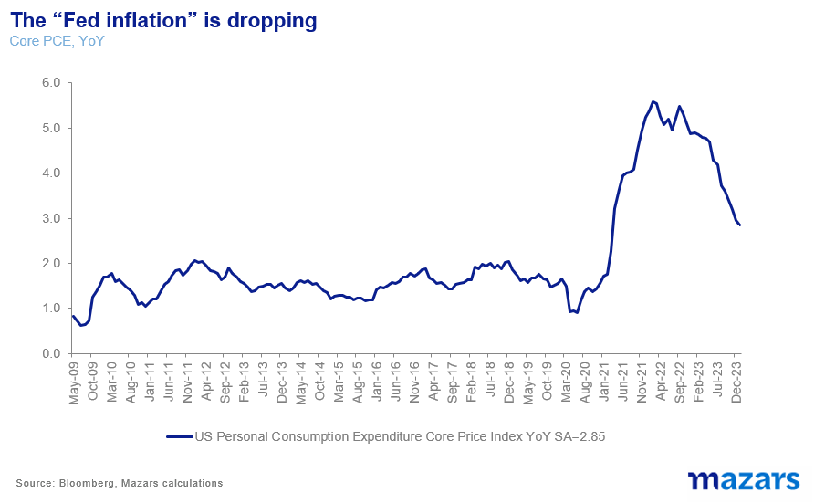
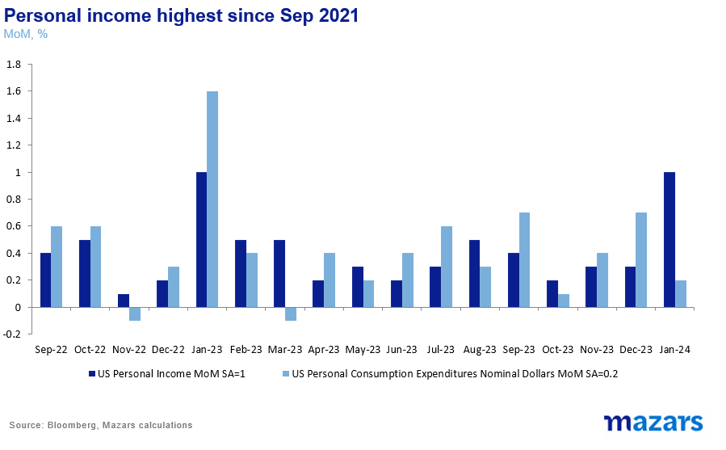
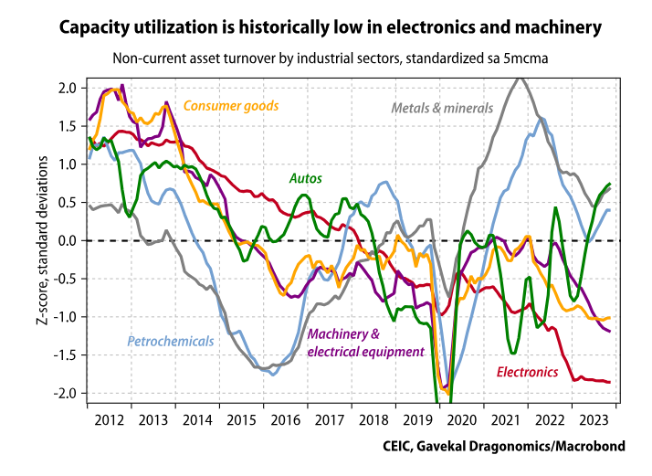
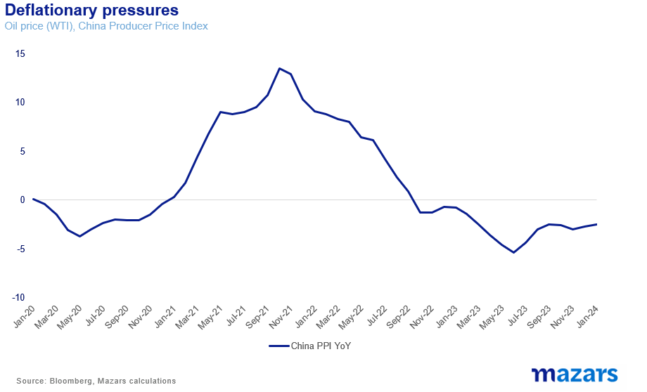
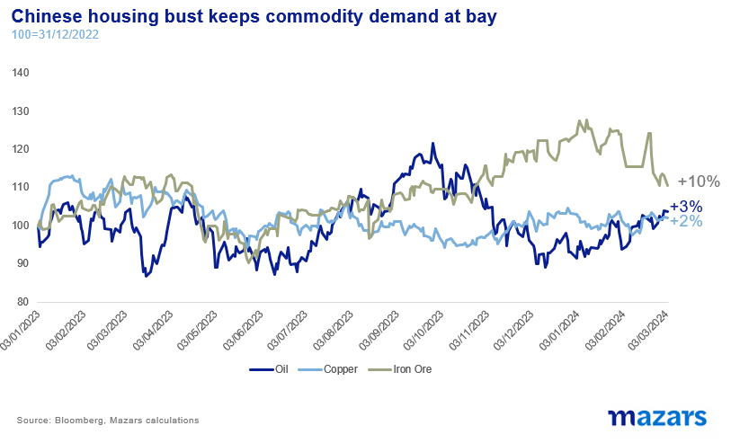

# How China is reducing inflation, and America is stoking it

**Date:** March 04, 2024  
**Publisher:** Breakwave Advisors | **Category:** Market Insights  
**Original URL:** [https://www.breakwaveadvisors.com/insights/2024/3/4/how-china-is-reducing-inflation-and-america-is-stoking-it](https://www.breakwaveadvisors.com/insights/2024/3/4/how-china-is-reducing-inflation-and-america-is-stoking-it)  

---

### The Three Things Investors Need to Know This Week:

1. *US inflation is coming down, but marginally. Meanwhile, services inflation remains a concern. This is why the Fed is still expressing scepticism about the sustainability of deflationary forces and refrains from putting a time-stamp on rate cuts.*
2. *There are two competing inflation forces currently. Increasing prices is US fiscal expansion and geopolitical approach, as well as capital expenditure relating to supply chain re-ordering and ESG. On the other hand, China’s slow recovery is proving a disinflationary force.*
3. *These trends are expected to continue. China will continue to produce cheap goods allowing US consumers and governments to spend without much fear of further inflation. But unlike the past, when they were the result of a balance and mutual understanding, now they happen in the context of antagonism towards more global influence. So expect volatility. And with volatility expect higher rates.*

*By*[*George Lagarias*](https://www.linkedin.com/in/george-lagarias-mba-3baa769/)

Last week’s Core Personal Expenditure number, the Fed’s preferred gauge of inflation, continued to fall, to 2.8% for the year.

> **Figure 1: 241**  
> **Interactive Data & Source:** [Fxstreet](https://www.fxstreet.com/news/feds-mester-we-cant-expect-last-years-disinflation-to-continue-202402292111) | [Local Asset](file:///C:/Users/Dell/Github/Shipping/corpus/03-breakwave/insights/2024/assets/2024-03-04_how-china-is-reducing-inflation-and-america-is-stoking-it_img_241_d99045f643ce.png)

If we add this super-core inflation number, which is projected to be around 2.5% by the end of the year, and growth of about 2% (building in some downside risk), then US interest rates by the end of 2024 should be around one percentage point lower than their present 5.5%. Yet the Fed is set to deliver three (instead of four) quarter-point rate cuts, and officials have been expressing[doubts](https://www.fxstreet.com/news/feds-mester-we-cant-expect-last-years-disinflation-to-continue-202402292111)as to whether last year’s disinflationary trend can continue.

While we understand the Fed’s political conundrum, that it can’t risk its credibility as an inflation-fighter, especially in a polarised election year, we can’t ignore that prices are coming down at a fast pace. So we need to understand for ourselves, whether disinflation can indeed continue.

The way we see it, there are two opposite forces to global inflation. The first is US fiscal and industrial policy which may be driving prices higher. The other force, the disinflationary one, is China.

### How America Is Contributing to Inflation

Let’s begin with the former. The latest Personal Income release was a surprise for economists. Personal income in the US rose 1%, the highest in a year, mostly due to generous social security benefits and resilient labour negotiating power.

> **Figure 2: 242**  
> **Interactive Data & Source:** [Ft](https://www.ft.com/content/f08e7f24-0e60-40e5-bd3a-1fb75686b030) | [Local Asset](file:///C:/Users/Dell/Github/Shipping/corpus/03-breakwave/insights/2024/assets/2024-03-04_how-china-is-reducing-inflation-and-america-is-stoking-it_img_242_73873b2693f4.png)

US consumers have decent savings rates and benefit from a tight labour market, the result of demographics, high levels of entrepreneurship and the increasing skills gap. They also benefit from generous fiscal support.

Additionally, the US government’s “America First” policy is inherently inflationary. By dividing the world into “friendly” and “non-friendly” economies, America has forced (or been forced) to de-optimise supply chains and incentivise on-shoring. For the time being, this is creating higher capital expenditure (in the future it will create massive operating slack). The US forced the EU to part with cheap, Russian gas, which has thrown Germany’s economy into a recession. In return, it vowed to increase the flow of Liquified Natural Gas to Europe, in a bid to replace cheap Russian energy with more expensive, but more dependable and “ethical” energy.

But a few weeks ago, the Biden administration decided to[reduce](https://www.ft.com/content/f08e7f24-0e60-40e5-bd3a-1fb75686b030)LNG shipments to the EU, on the back of a report which suggested that LNG escaping to the environment may be as harmful as burning coal. Apart from the obvious, that geopolitical influence and ESG concerns are now competing targets, this would further decrease European productivity and increase costs.

### And How China Is Decreasing Inflation

Even as US fiscal and geopolitical policies are contributing to inflation, the world’s major deflationary force, China, is back with a vengeance.

This time last year, economists were waking up to the possibility that China’s abrupt departure from its zero-Covid strategy would mitigate what was predicted to be a global recession, a natural part of the cycle following the sharp rebound in demand after the pandemic. Fiscal easing, especially in the US also helped, and the world’s largest economy -and interest rate leader, avoided not only a recession but a landing altogether.

A year later, we are now seeing more good news from the world’s largest manufacturer: not only did China contribute enough to Global GDP to help with global growth, but it is also contributing to bringing inflation, and thus interest rates, down. This is happening due to a variety of factors:

**a) Slack.**As China saw its economic growth stunted by a real estate bubble (a typical phenomenon after a period of fast-paced economic growth), it once again turned to its core skill: manufacturing. Xi’s government has, for now, abandoned plans to empower Eastern Asian consumers, in a bid to stop the economy from tipping over. Instead, it’s focused on manufacturing. As banks turned the tap off for real estate investment, they turned it on for industrial investment. This has created rising slack in manufacturing, to the point where the West is now[warning](https://www.ft.com/content/96dc71be-b795-47dc-a1cc-cccc7aa6a481)China against dumping goods in the market. More slack, it goes without saying, equals lower prices. Economists are[noticing](https://www.reuters.com/world/china/china-expected-take-gradual-approach-prop-up-economy-further-say-analysts-2024-02-23/)that China entered 2024 with a significant output gap.

> **Figure 3: 243**  
> [Local Asset](file:///C:/Users/Dell/Github/Shipping/corpus/03-breakwave/insights/2024/assets/2024-03-04_how-china-is-reducing-inflation-and-america-is-stoking-it_img_243_c72ecc17b961.png)

**b) The “cheap chip” price wars.**As Nvidia and other US Semiconductors are rising due to AI demand, a rift is created between the cutting-edge microchips and the “utility” microchips. High-end microchips, used towards the creation of AI applications, are very much in demand, while supply is, naturally, limited. They are 3-5 nanometres big. China has only been able to produce chips as small as 15-28nm at least in scale*. Due to trade restrictions, the West is improving its cutting-edge capabilities faster. (It may be, of course, dangerous that 90% of the production of high-end chips is taking place in Taiwan, 81 miles away from Mainland China).

While the cutting-edge chips are becoming more expensive, the lower-end chips, which go into our toasters, laptops and everyday use electronics, are getting cheaper, because of the capacity build-up mentioned in the previous paragraph. According to the Semiconductor Industry Association, 42 microchip manufacturing plants are expected to start production in 2024, 18 of which are in China. So, electronics will continue to be made cheaply available to consumers.

**c) Low input costs:**In the past few years, Chinese wages have been increasing faster than Western manufacturing wages. However, the pandemic and the following increased slack reversed that trend. Fewer jobs in construction have also likely contributed to a higher labour supply for manufacturing jobs. Add lower factory build-up costs to the mix, and we can arrive at the conclusion that input costs for China’s manufacturing will remain low for the foreseeable future.

**d) Housing:**While China has been evidently disinflationary over the past twenty five years, some of that impact has been offset by higher commodity prices due to demand for construction. However, with the real estate sector still in free fall (and possibly in the doldrums for a few more years), the demand for commodities is waning.

> **Figure 4: 244**  
> [Local Asset](file:///C:/Users/Dell/Github/Shipping/corpus/03-breakwave/insights/2024/assets/2024-03-04_how-china-is-reducing-inflation-and-america-is-stoking-it_img_244_4a66dcb74af3.png)

This is why the resurgence of China has failed to be accompanied by a surge in commodity prices, which was widely expected.

> **Figure 5: $5,png**  
> [Local Asset](file:///C:/Users/Dell/Github/Shipping/corpus/03-breakwave/insights/2024/assets/2024-03-04_how-china-is-reducing-inflation-and-america-is-stoking-it_img_2452cpng_c59d73033a27.png)

### This May Last

It is evident that the US is taking advantage of China’s slower growth and exporting deflation to implement more fiscal policy with less fear of re-stoking inflation. For the time being, we believe that both the inflationary factors (increased capital expenditure due to ESG, re-alignment of global supply chains, US fiscal expansion) and the disinflationary ones (careful consumers, Chinese slack and re-focus on manufacturing) will continue over at least the middle-term.

However, it’s not indefinite. Chinese cheap manufacturing has benefitted Western consumers and governments in the past. But whereas this balance used to happen within the boundaries of co-dependence and mutual understanding, it is now happening in a much more antagonistic environment.

So our central thesis, since early 2023, that the macroeconomy will become more volatile, still stands. And in a more volatile environment, we expect central banks to exercise more caution with interest rates.

*Just to give an idea of how small these sizes are, consider that a virus is about 300nm big. The smallest breathable particle of the Covid-19 virus is 9,300 nm big.

---

**Tags:** Markets, Economy, Macro  
