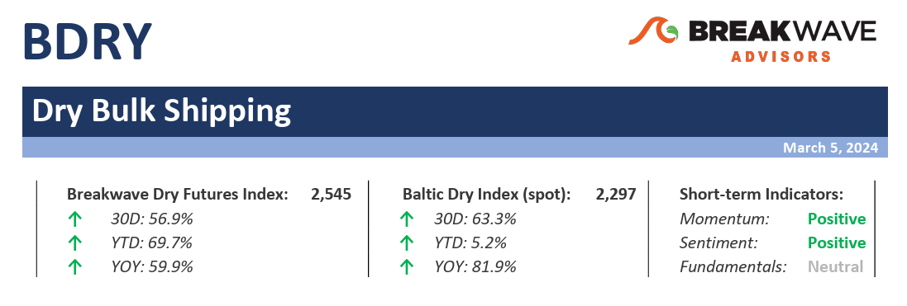
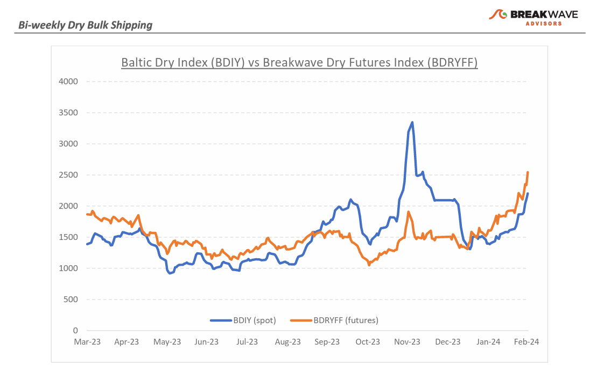
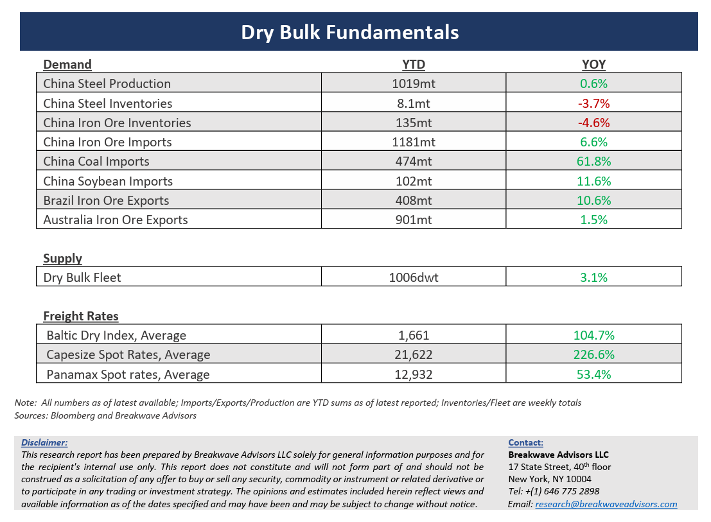

# Breakwave Bi-Weekly Dry Bulk Report - March 5, 2024

**Date:** March 05, 2024  
**Publisher:** Breakwave Advisors | **Category:** Market Insights  
**Original URL:** [https://www.breakwaveadvisors.com/insights/202435dry](https://www.breakwaveadvisors.com/insights/202435dry)  

---

> **Figure 1: Dryreporttop**  
> [Local Asset](file:///C:/Users/Dell/Github/Shipping/corpus/03-breakwave/insights/2024/assets/2024-03-05_202435dry_img_dryreporttop_36878cc95634.png)

**·****As spot price records fall one after another, sentiment in dry bulk is reaching new highs –**With February average Capesize rates reaching more than 21,000, market participants remain extremely bullish for the progression of the year. And rightly so: if the weakest month of the year managed to average such a strong level, the rest of the year should see rates well above that level. Such logic seems valid as long as the factors that brought us to such a strength remain in place. Geopolitics and weather are two factors that greatly affect shipping but are also extremely unpredictable. For now, the dry bulk sector is betting on a continuation of shipping disruptions, especially in the two main Canals (Suez and Panama) as well as tightness around ports and production facilities due to inclement weather patterns. Sentiment feels particularly bullish, not only in the freight futures market, but also in secondhand vessel transactions that are taking place at prices not seen in decades. If one was to back off the implied rate assumption on those secondhand transactions, a new upcycle for dry bulk is upon us. Is such an outlook supported by fundamentals? Chinese bulk commodity demand growth seems relatively weak versus history, the global dry bulk fleet will grow by about 3% this year, and the market balance appears at best flattish. Yet, the elevated freight rate expectations are not really a reflection of such unexciting outlook, rather it is the perceived tight supply due to the recent geopolitical developments that is causing owners to remain very positive on the future developments of dry bulk earnings, a complex view with various non-shipping related factors that we can not model and thus a view we can not share.

**·****Iron ore inventories back to average levels, as spot prices take a hit –**With Chinese port iron ore inventories hitting a seven-year low last October, it was a matter of time for a buying spree and restocking to take place, in the process also contributing to the strength the Capesize spot rate market has recently experienced. As levels have now reached the five-year average, it was time for iron ore prices to take a hit as demand for steel seems still lukewarm during a period that historically has signified the peak of annual consumption. With meaningful iron ore in the water still to be delivered, we expect the trend to continue, unless demand peaks up as part of a broader economic rebound in China, a scenario that remains the best case for this year. China’s PMI numbers continue to point to contraction and there is little appetite from the government to boost stimulus beyond reasonable levels that so far have proved insufficient to boost construction spending. On the other hand, manufacturing activity as well as steel exports have provided some cushion for overall steel demand, which should remain the case for the rest of the year, and we anticipate a flattish steel demand growth environment and, as a result, flattish iron ore imports to China.

**·****Our long-term view –**The last few years have been characterized by increased geopolitical uncertainty. Going forward, we expect such events to continue to affect global trade and have a meaningful impact on effective vessel supply. Combined with the potential for a multi-year rebound in China’s economic activity following the recent economic turmoil, dry bulk shipping should experience higher volatility on top of a secular tightness driven by increasing bulk commodity demand and a slower fleet growth as a result of a relatively low orderbook.

> **Figure 2: Dryreportchart**  
> [Local Asset](file:///C:/Users/Dell/Github/Shipping/corpus/03-breakwave/insights/2024/assets/2024-03-05_202435dry_img_dryreportchart_d1bb467e4071.png)

> **Figure 3: Dryreportbottom**  
> [Local Asset](file:///C:/Users/Dell/Github/Shipping/corpus/03-breakwave/insights/2024/assets/2024-03-05_202435dry_img_dryreportbottom_f54dc5d51830.png)

### Subscribe:
