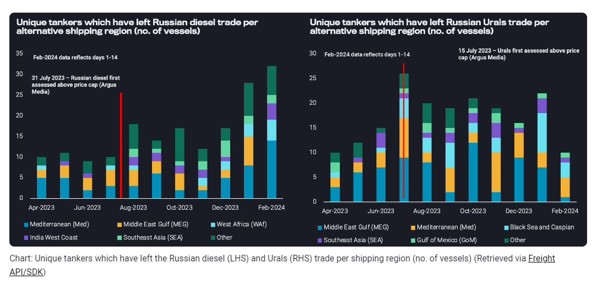
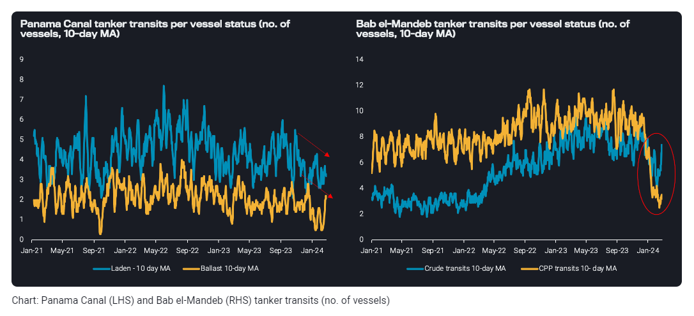
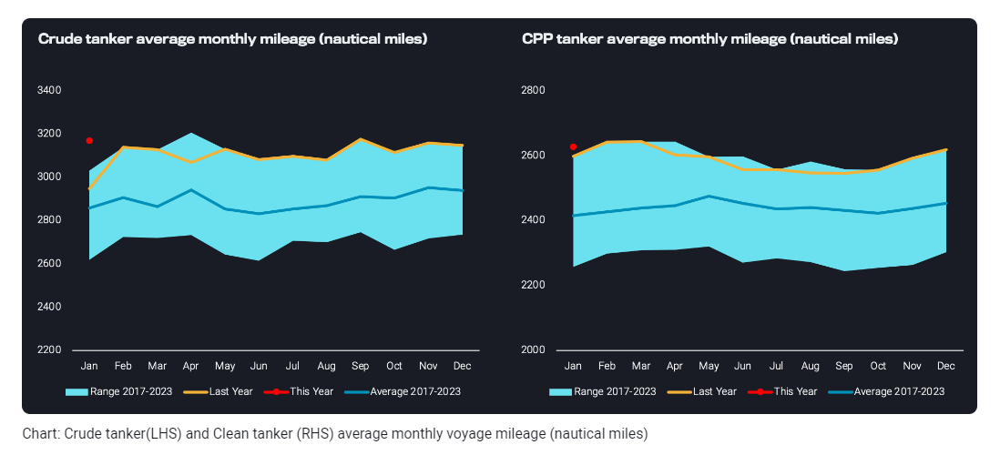

# Tanker rates stand their ground against ailing trade demand

**Date:** March 06, 2024  
**Publisher:** Breakwave Advisors | **Category:** Market Insights  
**Original URL:** [https://www.breakwaveadvisors.com/insights/2024/3/6/tanker-rates-stand-their-ground-against-ailing-trade-demand](https://www.breakwaveadvisors.com/insights/2024/3/6/tanker-rates-stand-their-ground-against-ailing-trade-demand)  

---

**Despite weak trade demand, two distinct vessel supply-factors are keeping rates at healthy levels.**

*By*[*Ioannis Papadimitriou*](https://www.linkedin.com/search/results/all/?fetchDeterministicClustersOnly=true&heroEntityKey=urn%3Ali%3Afsd_profile%3AACoAAB3dQrYBbffaDWLWh_dRcHGHYBOwNhhatgs&keywords=ioannis%20papadimitriou&origin=RICH_QUERY_SUGGESTION&position=0&searchId=b18342f9-eb69-4796-a846-7da4e508373b&sid=mNb&spellCorrectionEnabled=false)

Despite the weaker trade fundamentals that have been observed over the past 4 months, tanker freight rates across all segments remain at stubbornly healthy levels. This can be mostly attributed to the weather and geopolitical climate which has fostered two distinct characteristics on the global vessel supply-side: lack of tonnage fluidity and longer voyage mileage.

### Eu Operators Are Exiting the Russian Trade, But Could Continued Sanctioning of the Dark Fleet Reverse the Trend?

The most recent fleet behaviour of vessels linked with the Russian trade – detailed in this[blog](https://www.vortexa.com/insights/freight/urals-fleet-constraints-more-likely-as-sanctions-enforcement-ramps-up/)– indicates that vessels with Western links are exiting the Russian trades, wary of sanctions. Naturally, this instigates a rigidity between tiers, creating increasing difficulty for tankers to shift between Russian and non-Russian oil trades. This can be a double-edged sword in the tanker market as tonnage cannot easily move back to the mainstream trade to uplift tonnage availability and vice versa.

> **Figure 1: Screenshot 2024 03 06 11.57.31**  
> **Interactive Data & Source:** [Vortexa](https://www.vortexa.com//oil-gas-data-traders-analysts-data-scientists?gclid=Cj0KCQjw8_qRBhCXARIsAE2AtRZKOvMnbilZ_6_91d7huSFFy71pWLrnPwGwOHVzXsmsG-1a1mZnQw8aAt89EALw_wcB&hsa_acc=1782073842&hsa_ad=548425387665&hsa_cam=14746637662&hsa_grp=125038601902&hsa_kw=&hsa_mt=&hsa_net=adwords&hsa_src=g&hsa_tgt=dsa-1431852288425&hsa_ver=3&utm_campaign=%5BCD%5D%20-%20DSA%20-%20EMEA&utm_medium=cpc&utm_medium=ppc&utm_source=google&utm_source=adwords&utm_term=) | [Local Asset](file:///C:/Users/Dell/Github/Shipping/corpus/03-breakwave/insights/2024/assets/2024-03-06_tanker-rates-stand-their-ground-against-ailing-trade-demand_img_screenshot2024-03-06115731_9f6bf40750a1.png)

Yet a shift might be on the cards. Based on recent sanction activity led by the US and the UK it increasingly seems that the relevant authorities are aiming to force Russia to make use of Western operators under the cap mechanism whilst simultaneously sanctioning “dark” fleet entities (with Sovcomflot as the latest example). In this case, Russian crude would be carried by Western operators below the price cap, benefitting employment of Western-linked fleets and financially weakening Russia by severely constraining alternatives for seaborne transportation. It would also provide for much better insurance coverage and reduced environmental risks. Such a scenario would ultimately tighten the mainstream fleet further, providing support for freight rates.

### Key Waypoint Transits Are Remaining Low, Disrupting the Fluidity of Tonnage and Sparking Rerouting Between Markets

Another type of tonnage rigidity – a geographical one – is taking place in the Panama Canal. Transits via the waypoint remain at low levels, effectively restricting tonnage flows between the Atlantic and Pacific Basins. Though this low number of transits was initially driven by a severe drought up until the end of 2023, an uplift has not materialised despite some improvement in weather conditions. This is mainly due to the softer demand environment currently observed in South America West Coast. Furthermore, as the dry season in the region is not over until June/July, there are no guarantees that weather-related logistical issues will not arise once again, sustaining this lack of vessel fluidity in the market.

> **Figure 2: Screenshot 2024 03 06 11.57.40**  
> **Interactive Data & Source:** [Vortexa](https://www.vortexa.com//oil-gas-data-traders-analysts-data-scientists?gclid=Cj0KCQjw8_qRBhCXARIsAE2AtRZKOvMnbilZ_6_91d7huSFFy71pWLrnPwGwOHVzXsmsG-1a1mZnQw8aAt89EALw_wcB&hsa_acc=1782073842&hsa_ad=548425387665&hsa_cam=14746637662&hsa_grp=125038601902&hsa_kw=&hsa_mt=&hsa_net=adwords&hsa_src=g&hsa_tgt=dsa-1431852288425&hsa_ver=3&utm_campaign=%5BCD%5D%20-%20DSA%20-%20EMEA&utm_medium=cpc&utm_medium=ppc&utm_source=google&utm_source=adwords&utm_term=) | [Local Asset](file:///C:/Users/Dell/Github/Shipping/corpus/03-breakwave/insights/2024/assets/2024-03-06_tanker-rates-stand-their-ground-against-ailing-trade-demand_img_screenshot2024-03-06115740_ddefd24813b9.png)

For completely different reasons, a similar picture is painted with respect to transits in the Bab-el Mandeb strait. There is a slight disconnect between clean and crude tanker transits numbers, as the profile of operators passing via the strait (Russian, Chinese, Middle Eastern-linked entities) are largely involved in the crude trade. Nevertheless, the majority of vessels that choose to do the East to West of Suez (or reverse) trip continue to transit via the Cape of Good Hope.

### Reshuffling Patterns From Geopolitical and Weather Events Are Boosting Voyage Distances Above Seasonal Norms

As a result, the weather and geopolitical events, which triggered the Russian invasion reshuffling, the Red Sea rerouting, or the Panama Canal congestion, have boosted voyage distances to new highs across both crude and clean tankers.

> **Figure 3: Screenshot 2024 03 06 11.57.48**  
> **Interactive Data & Source:** [Vortexa](https://www.vortexa.com//oil-gas-data-traders-analysts-data-scientists?gclid=Cj0KCQjw8_qRBhCXARIsAE2AtRZKOvMnbilZ_6_91d7huSFFy71pWLrnPwGwOHVzXsmsG-1a1mZnQw8aAt89EALw_wcB&hsa_acc=1782073842&hsa_ad=548425387665&hsa_cam=14746637662&hsa_grp=125038601902&hsa_kw=&hsa_mt=&hsa_net=adwords&hsa_src=g&hsa_tgt=dsa-1431852288425&hsa_ver=3&utm_campaign=%5BCD%5D%20-%20DSA%20-%20EMEA&utm_medium=cpc&utm_medium=ppc&utm_source=google&utm_source=adwords&utm_term=) | [Local Asset](file:///C:/Users/Dell/Github/Shipping/corpus/03-breakwave/insights/2024/assets/2024-03-06_tanker-rates-stand-their-ground-against-ailing-trade-demand_img_screenshot2024-03-06115748_a7853344ad7c.png)

It is worth noting that these longer voyages occur at a time of lower tonnage fluidity between regions and between tiers, whilst scheduled tonnage deliveries for 2024 are projected to hover around historical low levels. These indications point to a tighter tonnage supply which must fulfil higher supply requirements, hence these drivers are poised to support tanker freight rates in the short to medium term, despite ailing trade dynamics. Any upside in cargo demand momentum, as expected by many in the market, would tighten the picture further.

Data Source:[Vortexa](https://www.vortexa.com//oil-gas-data-traders-analysts-data-scientists?gclid=Cj0KCQjw8_qRBhCXARIsAE2AtRZKOvMnbilZ_6_91d7huSFFy71pWLrnPwGwOHVzXsmsG-1a1mZnQw8aAt89EALw_wcB&hsa_acc=1782073842&hsa_ad=548425387665&hsa_cam=14746637662&hsa_grp=125038601902&hsa_kw=&hsa_mt=&hsa_net=adwords&hsa_src=g&hsa_tgt=dsa-1431852288425&hsa_ver=3&utm_campaign=%5BCD%5D%20-%20DSA%20-%20EMEA&utm_medium=cpc&utm_medium=ppc&utm_source=google&utm_source=adwords&utm_term=)

---

**Tags:** Tankers, Shipping, Freightrates  
