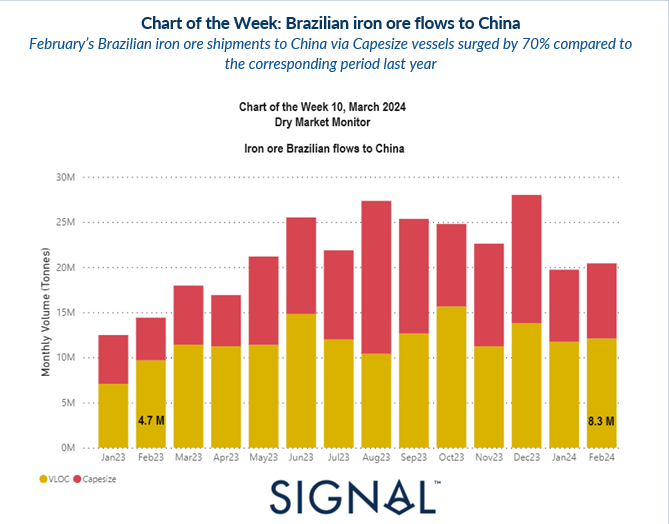
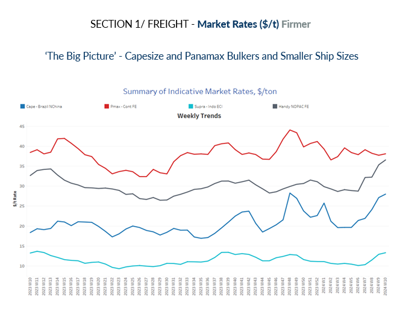
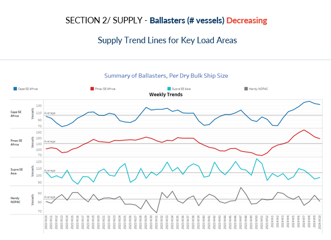
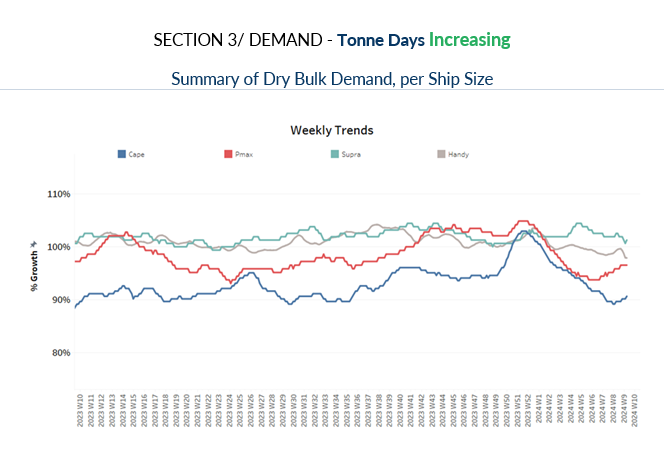
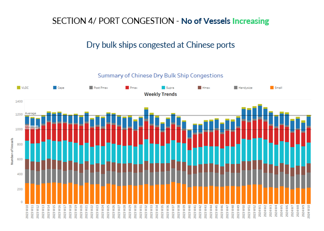

# Brazilian iron ore flows to China

**Date:** March 07, 2024  
**Publisher:** Breakwave Advisors | **Category:** Market Insights  
**Original URL:** [https://www.breakwaveadvisors.com/insights/2024/3/7/brazilian-iron-ore-flows-to-china](https://www.breakwaveadvisors.com/insights/2024/3/7/brazilian-iron-ore-flows-to-china)  

---

> **Figure 1: Screenshot 2024 03 07 10.11.08**  
> **Interactive Data & Source:** [Signal Ocean Platform](https://www.thesignalgroup.com/signal-ocean-platform) | [Local Asset](file:///C:/Users/Dell/Github/Shipping/corpus/03-breakwave/insights/2024/assets/2024-03-07_brazilian-iron-ore-flows-to-china_img_screenshot2024-03-07101108_4b35ee3fd1f8.png)

The onset of March has brought firmness in freight rates not only for large vessel size categories but also for smaller ones, with the Handysize NOPAC Far East route recording remarkable increases from the previous month. Meanwhile, in the Capesize Brazil to N China route, rates have reached the highest point for the year at $23/ton at the week's outset. However, the sustainability of this upward trend remains uncertain as the Chinese economic environment continues to grapple with significant challenges. Positive signs emerge from the decreasing trend in ballast views for the SE Africa region after weeks of persistent highs, coupled with a notable growth in tonne days within the Capesize segment for the first time this year. Additionally, Brazilian iron ore exports to China have surged by 70% compared to the corresponding period last year.

Despite entering the peak construction season, there are few indications of output growth, reflecting the broader weaknesses in the Chinese economy. Iron ore prices have been on a downward trajectory since mid-February, contrasting with the historically high demand for Chinese steel during the spring season. The Chinese government aims for a 5% economic growth, similar to last year, with a 3% budget deficit compared to 3.8% last year.

​​​

> **Figure 2: Screenshot 2024 03 07 10.11.17**  
> **Interactive Data & Source:** [Signal Ocean Platform](https://www.thesignalgroup.com/signal-ocean-platform) | [Local Asset](file:///C:/Users/Dell/Github/Shipping/corpus/03-breakwave/insights/2024/assets/2024-03-07_brazilian-iron-ore-flows-to-china_img_screenshot2024-03-07101117_1f4c58142e14.png)

​​​​​​In the initial days of March, there was notable firmness observed, particularly with remarkable increases noted in the Capesize Brazil to NChina and Handy NOPAC FE routes.

- **Capesize**vessel freight rates for shipments from Brazil to North China rose to $28 per ton, showcasing a 40% increase compared to the rates observed a month ago.
- **Panamax**vessel freight rates from the Continent to the Far East stayed nearly $38 per ton, marking almost similar levels compared to the rates recorded during the same week last year.
- **Supramax**vessel freight rates on the Indo-ECI route maintained their strength from the previous days, registering a $13/ton increase, which marks a significant 30% rise compared to rates observed a month ago.

- **Handysize**freight rates for the NOPAC Far East route surged to $37 per ton, marking a $5 increase from the previous week and representing a remarkable 30% upturn from rates observed a month ago.

> **Figure 3: Screenshot 2024 03 07 10.11.23**  
> **Interactive Data & Source:** [Signal Ocean Platform](https://www.thesignalgroup.com/signal-ocean-platform) | [Local Asset](file:///C:/Users/Dell/Github/Shipping/corpus/03-breakwave/insights/2024/assets/2024-03-07_brazilian-iron-ore-flows-to-china_img_screenshot2024-03-07101123_1ec3370d5a92.png)

The number of ballast vessels continued its downward trend from the previous two weeks, yet it remains above the annual average for large vessel size categories.

- **Capesize SE Africa:**The number of ballast ships stood at just above 130, nearly 10 fewer than the previous week, yet it remains approximately 30% higher than the annual average.

- **Panamax SE Africa**: The count of ballast ships has decreased to 158, marking a 20% decrease from the peak observed in week 7. There are indications of a continued downward trend in the remaining days of March.
- **Supramax SE Asia**: The count of ballast ships has consistently stayed below the annual average of 100 since the end of the previous week, currently hovering around 97. It remains to be seen whether this downward trend will continue into the second week of March.

- **Handysize NOPAC:**The count of ballast ships dipped to 81, signalling a decrease of 7 from the previous week and reaching a similar low point as recorded in week 7.

> **Figure 4: Screenshot 2024 03 07 10.11.29**  
> **Interactive Data & Source:** [Signal Ocean Platform](https://www.thesignalgroup.com/signal-ocean-platform) | [Local Asset](file:///C:/Users/Dell/Github/Shipping/corpus/03-breakwave/insights/2024/assets/2024-03-07_brazilian-iron-ore-flows-to-china_img_screenshot2024-03-07101129_c6003d6b3501.png)

The sustained decline in demand for tonne days across all vessel size categories throughout the month appears to be shifting, as initial indications of an upturn emerge in the Capesize and Panamax vessel segments.

- **Capesize:**The recent uptick in growth exhibited a positive trend in early March, yet it remains notably subdued compared to the robust pace observed at the outset of the year.

- **Panamax:**There has been a notable increase, reaching one of the highest points observed for the first time since the lows recorded four weeks ago.
- **Supramax:**The growth rate has remained stagnant for the past five weeks, showing stronger resilience compared to other ship size categories, yet exhibiting a downward revision trend from its peak in week 5.
- **Handysize:**The growth rate of smaller vessel sizes has persisted with a weaker trend over the last two weeks, although it remains higher than the growth recorded in the Panamax segment.The sustained decline in demand for tonne days across all vessel size categories throughout the month appears to be shifting, as initial indications of an upturn emerge in the Capesize and Panamax vessel segments.

> **Figure 5: Screenshot 2024 03 07 10.11.37**  
> **Interactive Data & Source:** [Signal Ocean Platform](https://www.thesignalgroup.com/signal-ocean-platform) | [Local Asset](file:///C:/Users/Dell/Github/Shipping/corpus/03-breakwave/insights/2024/assets/2024-03-07_brazilian-iron-ore-flows-to-china_img_screenshot2024-03-07101137_d4df9cf12a10.png)

Chinese congestion levels have once again begun to rise following the previous weekly drop, with the increase primarily driven by the Supramax segment.

- **Capesize:**Capesize ship congestion started again to increase above 120 mark, signalling an increase of about 10 vessels from the levels observed in the previous week.

- **Panamax:**In the case of Panamax vessels, the count has surged to 199, coming within striking distance of the peak of over 200 recorded four weeks ago.
- **Supramax:**Congestion surged to 277, marking a 10-vessel increase compared to the previous week, and approaching the 300 mark recorded during week 6.
- **Handysize:**Congestion levels soared to the 200 mark, reflecting a notable increase of 20 compared to the previous week, although they remained lower than levels observed three weeks ago.

Data Source:[Signal Ocean Platform](https://www.thesignalgroup.com/signal-ocean-platform)

---

**Tags:** Drybulk, Shipping, Freightrates  
