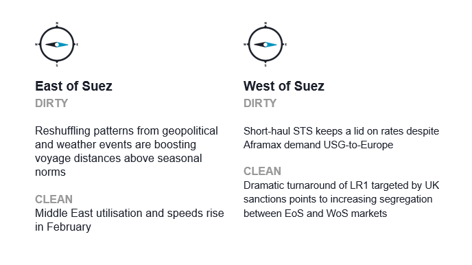
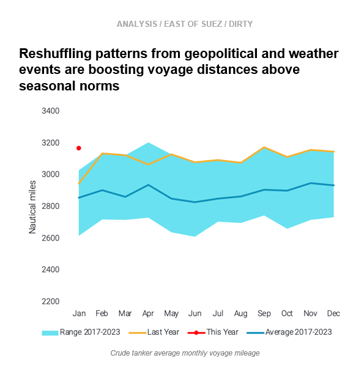
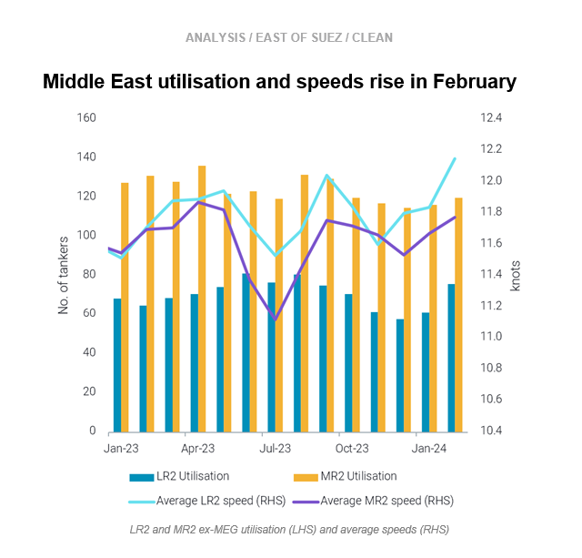
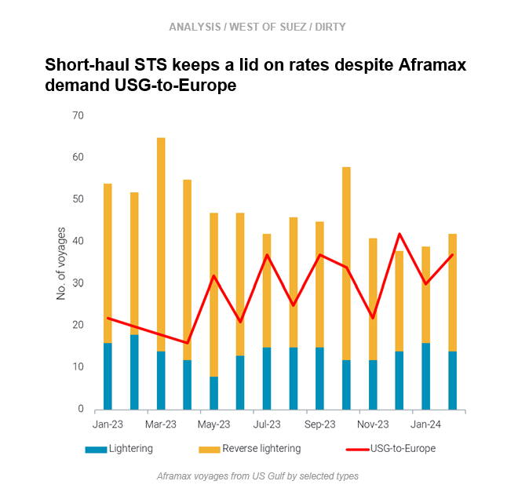
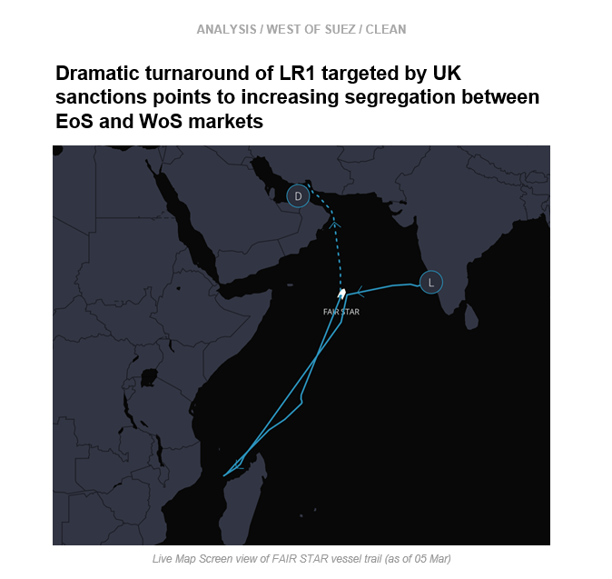

# High crude voyage distances due to reshuffling || MEG utilisation and speeds rise

**Date:** March 07, 2024  
**Publisher:** Breakwave Advisors | **Category:** Market Insights  
**Original URL:** [https://www.breakwaveadvisors.com/insights/2024/3/7/high-crude-voyage-distances-due-to-reshuffling-meg-utilisation-and-speeds-rise](https://www.breakwaveadvisors.com/insights/2024/3/7/high-crude-voyage-distances-due-to-reshuffling-meg-utilisation-and-speeds-rise)  

---

**This week, in the East, we discuss why reshuffling patterns are driving crude voyage distances above seasonal norms. On the clean side, we look at increasing LR2 and MR2 utilisation and speeds out of the Middle East. In the West, we explore why increased STS in the US Gulf is keeping a lid on TD25 rates, and we investigate an unusual manoeuvre by an LR1 that was en route to Europe via the Cape of Good Hope.**

*By*[*Mary Melton*](https://www.linkedin.com/search/results/all/?fetchDeterministicClustersOnly=true&heroEntityKey=urn%3Ali%3Afsd_profile%3AACoAABXVyecBtg-pRnIrZe0BoWk0ygPiUfbvhsw&keywords=mary%20melton&origin=RICH_QUERY_SUGGESTION&position=0&searchId=40e8d7d2-c4d0-4022-81e7-176f6eba418b&sid=H_Y&spellCorrectionEnabled=false)

> **Figure 1: Screenshot 2024 03 07 07.31.56**  
> **Interactive Data & Source:** [Marketingmail Vortexa](https://marketingmail.vortexa.com/ODM3LU1aRS01NzgAAAGRs05I7sqcZ8jYMGpAgncOHZuDBFgA8Bev3G8Uyf1CIYDIgzLkYLMvkVK0ur218z6soE4nAWE=) | [Local Asset](file:///C:/Users/Dell/Github/Shipping/corpus/03-breakwave/insights/2024/assets/2024-03-07_high-crude-voyage-distances-due-to-reshuffling-meg-utilisation-and-speeds-rise_img_screenshot2024-03-07073156_d5f5f1b8ef5b.png)

> **Figure 2: Screenshot 2024 03 07 07.32.44**  
> **Interactive Data & Source:** [Marketingmail Vortexa](https://marketingmail.vortexa.com/ODM3LU1aRS01NzgAAAGRs05I7sqcZ8jYMGpAgncOHZuDBFgA8Bev3G8Uyf1CIYDIgzLkYLMvkVK0ur218z6soE4nAWE=) | [Local Asset](file:///C:/Users/Dell/Github/Shipping/corpus/03-breakwave/insights/2024/assets/2024-03-07_high-crude-voyage-distances-due-to-reshuffling-meg-utilisation-and-speeds-rise_img_screenshot2024-03-07073244_01d749298a1c.png)

- The weather and geopolitical events, which triggered the Russian invasion reshuffling, the Red Sea rerouting, and Panama Canal congestion, have[boosted voyage distances](https://marketingmail.vortexa.com/ODM3LU1aRS01NzgAAAGRs05I7sqcZ8jYMGpAgncOHZuDBFgA8Bev3G8Uyf1CIYDIgzLkYLMvkVK0ur218z6soE4nAWE=)to new highs across crude tankers.

- It is worth noting that these longer voyages occur at a time of lower tonnage fluidity between regions and between tiers, whilst scheduled tonnage deliveries for 2024 are projected to hover around historical low levels.
- These indications point to a tighter tonnage supply which must fulfil higher supply requirements, hence these drivers are poised to support tanker freight rates in the short to medium term, despite ailing trade dynamics. Any upside in cargo demand momentum, as expected by many in the market, would tighten the picture further. (Read more[here](https://marketingmail.vortexa.com/ODM3LU1aRS01NzgAAAGRs05I8F28pHEj4I25JTEJR-UlVJ51WTIALFQvCzIEc9707u-YIN9FwEn6FkBps1wIErUh6_4=))

> **Figure 3: Screenshot 2024 03 07 07.32.53**  
> **Interactive Data & Source:** [Marketingmail Vortexa](https://marketingmail.vortexa.com/ODM3LU1aRS01NzgAAAGRs05I76VbjXiVHryb-nU9_j7JoEaGuyePFzxCWVNwKGr2Ga4Z5pD0QW-8eI88A5Jl-sChl3M=) | [Local Asset](file:///C:/Users/Dell/Github/Shipping/corpus/03-breakwave/insights/2024/assets/2024-03-07_high-crude-voyage-distances-due-to-reshuffling-meg-utilisation-and-speeds-rise_img_screenshot2024-03-07073253_26a4071a3efa.png)

- In February,[LR2 utilisation from the Middle East](https://marketingmail.vortexa.com/ODM3LU1aRS01NzgAAAGRs05I76VbjXiVHryb-nU9_j7JoEaGuyePFzxCWVNwKGr2Ga4Z5pD0QW-8eI88A5Jl-sChl3M=)(excluding Iran) reached its highest monthly value since August 2023, while[MR2 utilisation](https://marketingmail.vortexa.com/ODM3LU1aRS01NzgAAAGRs05I74doqCxxFostUsFqOeapb0Zod9FLmDiFS6QHYTRGFK1Y0AVo5qhscSnZnzpP6pPc1Ts=)also rose m-o-m on the back of rising CPP exports from the region as well as longer distances.

- This increase in utilisation coincides with higher speeds, but the rise is most prominent for LR2s seeking to save time on the long journey around the Cape of Good Hope to reach west of Suez destinations. An increase of 1 knot saves approximately 3 days in voyage time for MEG-to-NW Europe.
- Looking ahead, rising refinery output in the Middle East due to a combination of maintenance ending and new project ramp ups will likely support tanker utilisation. However, speeds could plateau due to the increased operational costs (fuel, emissions) at a time when LR2 rates are returning to normal levels.

> **Figure 4: Screenshot 2024 03 07 07.33.02**  
> **Interactive Data & Source:** [Marketingmail Vortexa](https://marketingmail.vortexa.com/ODM3LU1aRS01NzgAAAGRs05I7_4ZkwhQFkjlT3-ZNy4-Khz_EY4kGnZ9FSq1XJc6c2SfPukiwFMl_96txG66ppPfwlw=) | [Local Asset](file:///C:/Users/Dell/Github/Shipping/corpus/03-breakwave/insights/2024/assets/2024-03-07_high-crude-voyage-distances-due-to-reshuffling-meg-utilisation-and-speeds-rise_img_screenshot2024-03-07073302_50f4a010e99c.png)

- [VLCC utilisation out of the US Gulf](https://marketingmail.vortexa.com/ODM3LU1aRS01NzgAAAGRs05I7_4ZkwhQFkjlT3-ZNy4-Khz_EY4kGnZ9FSq1XJc6c2SfPukiwFMl_96txG66ppPfwlw=)is relatively flat and muted, though[Aframax reverse lightering](https://marketingmail.vortexa.com/ODM3LU1aRS01NzgAAAGRs05I79bOCItWPxTxJMj-qSBZGuo9M63lYISMOFx8b5rp-7WD-MNz53QK3fZzLf7E6zuZCXQ=)has picked up about 20% m-o-m, suggesting VLCC loadings may pick up soon.[Aframax utilisation US Gulf-to-Europe](https://marketingmail.vortexa.com/ODM3LU1aRS01NzgAAAGRs05I74_nQjmwLnCnNTCGByrmxS8haDjg6DguP9HYx5_6gOvP8A-ysFNjFUCGtvuXt3OE5RM=)is currently high, but more Aframaxes in the US Gulf are employed in STS operations rather than the[transatlantic route](https://marketingmail.vortexa.com/ODM3LU1aRS01NzgAAAGRs05I71t77pXtGgPhZz2iM4KNcmHhI4dNPyuIMpYDakNva1ZEbWPgnmNWRyWwldhS6EZ_3sA=), keeping vessel supply elevated. This is keeping a lid on[TD25](https://marketingmail.vortexa.com/ODM3LU1aRS01NzgAAAGRs05I7tKT5I6m3gEJH7ergI4DdZLBRDdpMZoxyw3ttV7BwXu-6FXV8MX-e_O6sDxSQVXyT84=)rates.

- Transatlantic Aframax demand will likely cool as Europe’s refinery maintenance season continues, capping demand for US crude. Additionally, as US refineries come back online after maintenance, there will be more crude consumed domestically.
- Moving forward,[availability within natural fixing windows](https://marketingmail.vortexa.com/ODM3LU1aRS01NzgAAAGRs05I7yORD70KoXstXGi7FvgTG_g2C_ILmndGC00YbRhfUmCgW5YT4lN-VsG5iIr8npDmF_o=)is set to rise sharply, likely preventing any rally in rates.

> **Figure 5: Screenshot 2024 03 07 07.33.17**  
> **Interactive Data & Source:** [Marketingmail Vortexa](https://marketingmail.vortexa.com/ODM3LU1aRS01NzgAAAGRs05I7uEtzCRD95bmG6g82xCv9pcmGQf56secHMdewUiMUPaE7MLml2YJP1PGQ0T8-kGTUkA=) | [Local Asset](file:///C:/Users/Dell/Github/Shipping/corpus/03-breakwave/insights/2024/assets/2024-03-07_high-crude-voyage-distances-due-to-reshuffling-meg-utilisation-and-speeds-rise_img_screenshot2024-03-07073317_41e2bf61a0cf.png)

- The LR1 tanker[FAIR STAR](https://marketingmail.vortexa.com/ODM3LU1aRS01NzgAAAGRs05I7uEtzCRD95bmG6g82xCv9pcmGQf56secHMdewUiMUPaE7MLml2YJP1PGQ0T8-kGTUkA=)loaded jet/kero in India on 17 February and initially signalled for Trieste, heading for the Cape of Good Hope instead of the Red Sea. By 23 February the tanker was declaring Rotterdam, as if the original buyer had backed out. On 26 February, the tanker abruptly turned around and is now signalling JEBEL ALI FOR ORDERS.

- Why did this highly unusual manoeuvre happen? The vessel is operated by one of the entities sanctioned by the UK on 22 February, and the vessel itself has previously carried Russian cargoes. Because increased due diligence for sanctions compliance is also the onus of the buyer, it is highly likely that the buyer cancelled the purchase.
- This points to an interesting dynamic at play. If European buyers will not deal with these entities, East of Suez markets could be seen as ‘safer’ for the vessels targeted by increased sanctions enforcement. This could lead to increased segregation between East of Suez and West of Suez markets and more tonnage tightness if repositioning is no longer as easy.

Data Source:[Vortexa](https://www.vortexa.com//oil-gas-data-traders-analysts-data-scientists?gclid=Cj0KCQjw8_qRBhCXARIsAE2AtRZKOvMnbilZ_6_91d7huSFFy71pWLrnPwGwOHVzXsmsG-1a1mZnQw8aAt89EALw_wcB&hsa_acc=1782073842&hsa_ad=548425387665&hsa_cam=14746637662&hsa_grp=125038601902&hsa_kw=&hsa_mt=&hsa_net=adwords&hsa_src=g&hsa_tgt=dsa-1431852288425&hsa_ver=3&utm_campaign=%5BCD%5D%20-%20DSA%20-%20EMEA&utm_medium=cpc&utm_medium=ppc&utm_source=google&utm_source=adwords&utm_term=)

---

**Tags:** Shipping, Crude Oil, Tankers  
