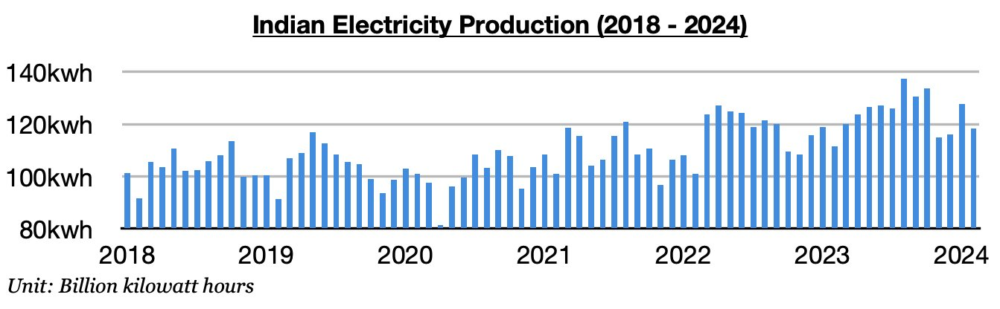
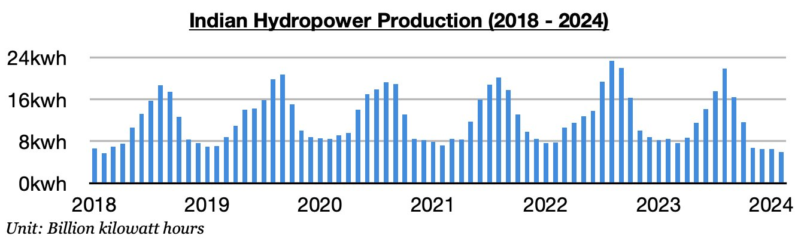
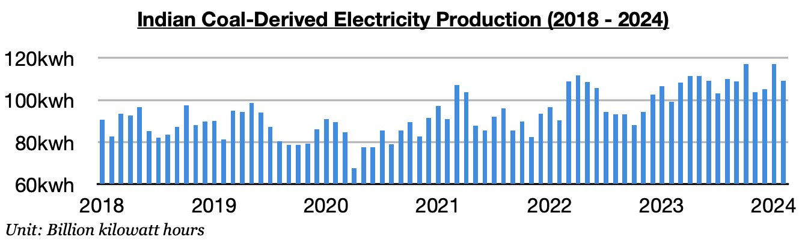

# India's Electricity Production Remains Strong

**Date:** March 08, 2024  
**Publisher:** Breakwave Advisors | **Category:** Market Insights  
**Original URL:** [https://www.breakwaveadvisors.com/insights/2024/3/8/indias-electricity-production-remains-strong](https://www.breakwaveadvisors.com/insights/2024/3/8/indias-electricity-production-remains-strong)  

---

*By*[*Jeffrey Landsberg*](https://www.linkedin.com/in/jeffrey-landsberg-70ab957/)

As we discussed in Commodore Research's most recent Weekly Dry Bulk Report, India produced approximately 118.3 billion kilowatt hours of electricity in February. This is down month-on-month by 9.5 billion kilowatt hours (-7%) but up year-on-year by 6.9 billion kilowatt hours (6%). India’s electricity output has remained strong as we have been predicting and has now increased on a year-on-year basis for ten straight months. Hydropower output continues to contract, but coal-derived electricity generation has continued to grow.

> **Figure 1: 241**  
> [Local Asset](file:///C:/Users/Dell/Github/Shipping/corpus/03-breakwave/insights/2024/assets/2024-03-08_indias-electricity-production-remains-strong_img_241_269204ee95ec.jpg)

Hydropower output totaled approximately 5.9 billion kilowatt hours last month. This is down month-on-month by 600 million kilowatt hours (-9%) and down year-on-year by 2.5 billion kilowatt hours (-29%). India’s hydropower output has now contracted on a year-on-year basis for eight straight months. Last month’s output again marked the smallest amount produced since February 2018.

> **Figure 2: 242**  
> [Local Asset](file:///C:/Users/Dell/Github/Shipping/corpus/03-breakwave/insights/2024/assets/2024-03-08_indias-electricity-production-remains-strong_img_242_436e99295b6a.jpg)

Coal-derived electricity generation totaled approximately 109 billion kilowatt hours last month. This is down month-on-month by 8.1 billion kilowatt hours (7%) but up year-on-year by 9.8 billion kilowatt hours (10%). India’s coal-derived electricity generation has now grown on a year-on-year basis during each of the last ten months. We remain of our view that strength will continue near term, and that several new overall electricity production and thermal coal-derived generation production records will also be set beginning this month.

> **Figure 3: 243**  
> [Local Asset](file:///C:/Users/Dell/Github/Shipping/corpus/03-breakwave/insights/2024/assets/2024-03-08_indias-electricity-production-remains-strong_img_243_aa5c841f8c2f.jpg)

---

**Tags:** India, Economy, Energy  
