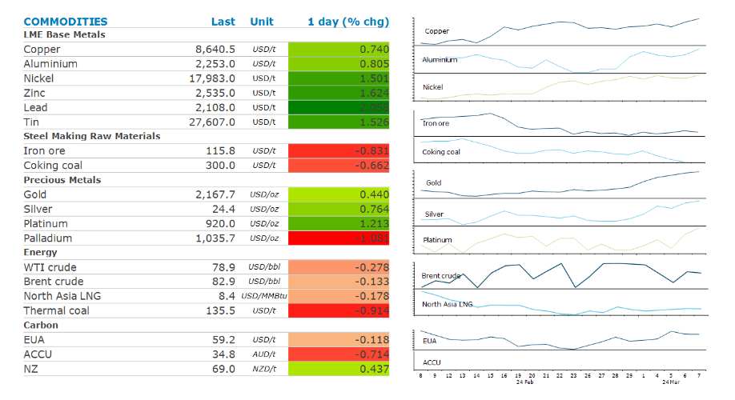

# Markets buoyed by strong Chinese imports

**Date:** March 08, 2024  
**Publisher:** Breakwave Advisors | **Category:** Market Insights  
**Original URL:** [https://www.breakwaveadvisors.com/insights/2024/3/8/markets-buoyed-by-strong-chinese-imports](https://www.breakwaveadvisors.com/insights/2024/3/8/markets-buoyed-by-strong-chinese-imports)  

---

**Dovish commentary from central bankers triggered a risk-on tone across markets, aided by signs of strong demand in China.**

*By*[*Daniel Hynes*](https://www.linkedin.com/in/dahynes/)

> **Figure 1: Screenshot 2024 03 08 08.54.07**  
> [Local Asset](file:///C:/Users/Dell/Github/Shipping/corpus/03-breakwave/insights/2024/assets/2024-03-08_markets-buoyed-by-strong-chinese-imports_img_screenshot2024-03-08085407_0c543af0512c.png)

**Gold**extended its record-breaking rally amid further dovish commentary from central bankers. Federal Reserve Chair, Jerome Powell, told a Senate panel the Fed is not far from being confident enough to cut rates. President, Christine Lagarde, indicated the ECB may ease in June. This came amid fresh projections showing inflation falling to 2% in 2025. Safe haven buying is also likely to be behind the move, after a Houthi attack on a ship in the Red Sea led to the first confirmed deaths of crew. While investors are still pulling metal out of gold-backed ETFs, central banks remain strong buyers. The PBoC added to its gold reserves for a 16th straight month in January, Total holdings rose by about 390koz to 72.58m.

The**base metals**sector rallied after strong import data suggested demand in China remains robust. China’s commodity imports[**continued to defy economic growth concerns**](../pdfs/2024-03-08_markets-buoyed-by-strong-chinese-imports_china-commodity-trade-data-january-f_153b762c9cb6.pdf), with shipments growing for many commodities. Refined**copper**monthly imports were 435-465kt in Jan-Feb 2024, a tad stronger than last year. Imports of copper ore & concentrates were up only marginally, highlighting the tightness in the international market following recent mine closures. Increased infrastructure spending for renewables should continue to support copper demand.**Zinc**led the sector higher as investors unwind bearish bets amid signs of tightness. Orders to withdraw metal from LME warehouses surged this month. This follows reports that South Korea’s Young Poong Corp has cut refined zinc production at its Seokpo smelter by 20%.

**Iron ore**futures rose after the PBoC’s Governor, Pan Gongsheng, said there is still room to cut the reserve requirement ratio for banks. Demand is also strong, with China’s imports rising 8% y/y in Jan-Feb. Replenishing depleted iron ore inventories supported these purchases.

**Crude oil**was largely unchanged as investors assess rising tension in the Middle East. A Houthi missile that struck a bulk carrier in the Gulf of Aden has seen shipping companies refusing to transit the Red Sea. The longer shipping times now required by many tankers is resulting in increased oil sitting on ships unavailable to the market. This comes as demand in the US looks to be improving. EIA’s weekly inventory report this week showed US gasoline inventories fell 4,460kbbl last week. Demand for distillate fuel was also stronger, with inventories falling 4,131kbbl. With the US driving season just in the horizon, the market could get even tighter in coming weeks. Chinese demand remains strong, with crude oil imports up by 5% y/y to 88mt in the first two months of the year.

**North Asia LNG**were steady despite confirmation Chinese demand has improved. Monthly gas imports were above 10mt during January-February, up 23% y/y. Improving industrial activity should keep gas demand healthy as winter heating demand wanes.

Data source:[Commodities Wrap](https://www.linkedin.com/newsletters/commodities-wrap-6692196755876012032/?fbclid=IwAR3kiXJqZdxmp9ZcRwBNI7FsBySI-XSC0pfPur1qzjt7OZp7PTE59Tsl1QI)

---

**Tags:** Commodities, Crude Oil, Ironore  
