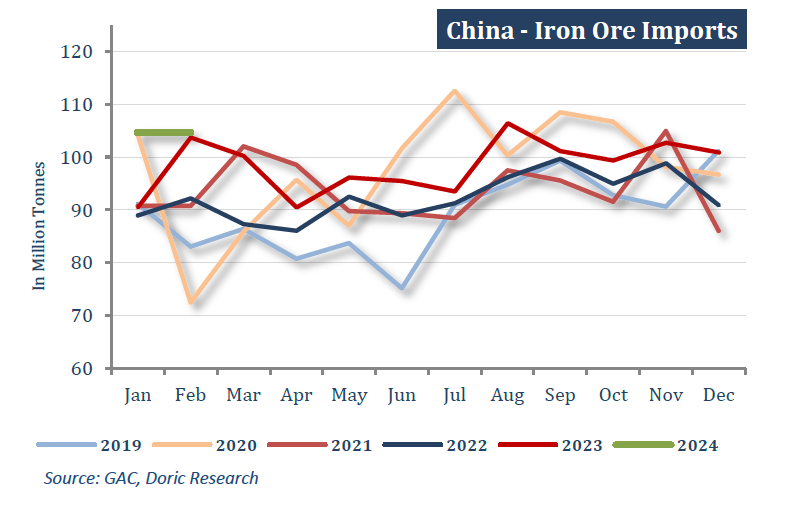
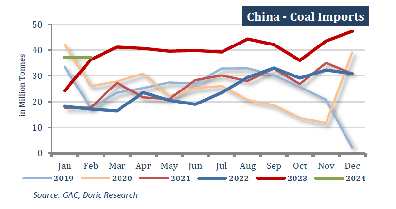

# China's imports and exports have surpassed expectations

**Date:** March 11, 2024  
**Publisher:** Breakwave Advisors | **Category:** Market Insights  
**Original URL:** [https://www.breakwaveadvisors.com/insights/2024/3/11/chinas-imports-and-exports-have-surpassed-expectations](https://www.breakwaveadvisors.com/insights/2024/3/11/chinas-imports-and-exports-have-surpassed-expectations)  

---

*By*[*Michalis Voutsinas*](https://www.linkedin.com/in/michalis-voutsinas-587544163/)

In a rather tumultuous week for the leading Capesizes, the Baltic Dry Index concluded today at a robust 2251 points. The most volatile among the segments experienced a significant downturn mid-week, injecting uncertainty into the market. However, the second half of the week saw a resurgence in momentum, with the BCI TCA reaching a fresh 2024 high of $35,201 daily in Friday's closing. The Panamax segment continued its upward trend for yet another week, boasting five consecutive daily gains and closing at $16,750 daily. Steaming further north, the Supramax sub-market is currently at its peak for the year, averaging $14,493 daily. In line with this positive trend, the less volatile Handy segment concluded the tenth week of the year at $13,714 daily, marking a 34 percent increase from the recent lows.

In a strikingly similar trend to the Baltic indices, China's imports and exports have surpassed expectations, indicating a positive shift in global trade flows for the January-February period compared to the previous year. Official data released on Thursday revealed an 8.7 percent year-on-year expansion in China's total goods imports and exports in yuan terms during the first two months of 2024. The customs agency releases combined January and February trade data to mitigate distortions stemming from the shifting timing of the Lunar New Year, which occurred in February this year. During the January-February period, China's foreign trade in goods reached 6.61 trillion yuan (equivalent to 930.96 billion US dollars). Exports surged by 10.3 percent year on year to 3.75 trillion yuan, while imports increased by 6.7 percent compared to the same period in 2023, totaling 2.86 trillion yuan. Lyu Daliang, an official from the General Administration of Customs, stressed that China's trade in goods has sustained the upward momentum observed in the fourth quarter of the previous year, marking the fifth consecutive month of year-on-year growth. However, there are concerns raised regarding the aforementioned growth percentages, as they might have been substantially influenced by a weak base effect from 2023. Thursday's data also highlighted an increase in China's imports and exports to the Association of Southeast Asian Nations and the United States. However, trade with the European Union, its second-largest trading partner, slightly decreased year-on-year.

Regarding the dry bulk trade, China's iron ore imports surged by 8.1 percent in the first two months of 2024 compared to the previous year, driven by steelmakers restocking. Customs data released on Thursday revealed that the world's largest iron ore consumer imported 209.45 million metric tonnes of the key steelmaking ingredient during this period, marking a record high. However, the recent increase in imports has resulted in a price decline and a significant rise in portside inventories, which are currently at a one-year high of 138.9 million tonnes.

> **Figure 1: Screenshot 2024 03 11 09.24.57**  
> **Interactive Data & Source:** [Doric](https://www.doric.gr/) | [Local Asset](file:///C:/Users/Dell/Github/Shipping/corpus/03-breakwave/insights/2024/assets/2024-03-11_chinas-imports-and-exports-have-surpassed-expectations_img_screenshot2024-03-11092457_4490bb142ad7.png)

In a similar trend, China's coal imports surged by 23 percent in the first two months of 2024 compared to the corresponding period a year earlier, contradicting analyst expectations and reaching the highest level recorded for this period. Imports during January and February amounted to 74.52 million metric tonnes, a notable increase from the 60.63 million tonnes imported during the same period in 2023. In December, China's cabinet reinstated coal import tariffs ranging from 3 to 6 percent on nations lacking two-way free trade agreements with Beijing. These tariffs took effect in January 2024, primarily impacting key suppliers such as Mongolia and Russia. Between January and November, the floor space of real estate development enterprises currently under construction reached 8,313.45 million square meters, experiencing a notable 7.2 percent decrease year-on-year. Within this category, the floor space of residential buildings under construction amounted to 5,853.09 million square meters, marking a 7.6 percent decrease over the same period. The floor space of newly initiated buildings stood at 874.56 million square meters, depicting a substantial 21.2 percent decline. Specifically, the floor space of newly initiated residential buildings measured 637.37 million square meters, representing a 21.5 percent decrease. Conversely, the floor space of completed buildings escalated to 652.37 million square meters, showcasing a significant uptick of 17.9 percent. Among these completions, residential buildings accounted for 475.81 million square meters, demonstrating an 18.5 percent increase compared to the same timeframe.

> **Figure 2: Screenshot 2024 03 11 09.25.11**  
> **Interactive Data & Source:** [Doric](https://www.doric.gr/) | [Local Asset](file:///C:/Users/Dell/Github/Shipping/corpus/03-breakwave/insights/2024/assets/2024-03-11_chinas-imports-and-exports-have-surpassed-expectations_img_screenshot2024-03-11092511_a4578021f9f6.png)

In stark contrast, soybean imports for China plummeted to a five-year low for the first two months of the year, primarily influenced by poor crushing margins and reduced ship arrivals during the Lunar New Year holidays. Combined imports for January and February amounted to just 13.04 million metric tonnes, marking an 8.8 percent decline from the same period a year ago. These imports represent the lowest level for the period since 2019, according to Reuters records. China's soybean demand for livestock feed could face challenges this year due to new regulations aimed at controlling the nation's pig production capacity. An aggressive expansion of farms has resulted in an oversupply of pigs and significant financial losses, prompting the implementation of measures to address the situation.

The resilience in imports of key commodities seems to contrast with the prevailing trend of softer outcomes in other sectors of the world's second-largest economy. This suggests a higher probability of additional stimulus measures. Whether these new initiatives will suffice, or if a more substantial stimulus akin to a "bazooka" approach is necessary to invigorate China's economy, remains uncertain. However, indications from commodity prices and the shape of dry bulk forward curves suggest that the recent trend of incremental measures rather than bold actions is more likely to persist.

Data source:[Doric](https://www.doric.gr/)

---

**Tags:** Drybulk, Shipping, China  
